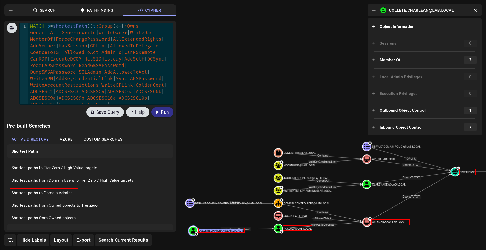

> Author : lineeralgebra
{:.prompt-tip}

Bloodhound make our job really **EASY but its not mean Bloodhound can see everything.**

Sometimes we have to check something with manually. Bloodhound never will touch anything that mean. We need manually is better.

First thing if i found creds or get shell on forest i always dump BH data first cause its pretty make everything **EASY**

## Bloodhound? where

There is 2 type i know about bloodhound → **Bloodhound CE** and **Bloodhound neo4j**

Bloohound neo4j is better tbh but **CE** is looking better so i will chose it for this part 😀

https://threatexpress.com/blogs/2025/install-bloodhound/

Its always changing but we can try here thats the easy part and here is i always use

```bash
➜  BHCE ls -al
total 12
drwxrwxr-x  2 elliot elliot 4096 Jul  9 02:02 .
drwxrwxr-x 47 elliot elliot 4096 Aug 19 16:24 ..
-rw-rw-r--  1 elliot elliot 3907 Jul  9 02:02 docker-compose.yml
```

Basic `yml` file for deploy it.

- It will give u creds firstly u have to change it after that u can use password u gave for all

```bash
sudo docker-compose up
```

Here is how i deploy and boot it


at [`http://localhost:8080/ui/login`](http://localhost:8080/ui/login)


and now we can login `admin:yourpasswordgoeshere` we can login.


and this page will appear. it says we have to upload data and lets see how we can upload

## Dump Bloodhound Data

There is tons way to dump Bloodhound data and i will try to show everything i know.

**BUT FIRSTLY WE MAY WANNA KNOW :**

- We can **DUMP** bloodhound data only from DC of domain.
- We can **DUMP** bloodhound data only from **LDAP** (if we have smb access but not **LDAP** thats not mean we can dump we need **LDAP** access).

First of all let verify if we have **LDAP** access.

```bash
➜  bloodhound nxc ldap 192.168.1.10 -u ldapuser -p 'Password123!'
LDAP        192.168.1.10    389    VALENOR-DC01     [*] Windows 10 / Server 2019 Build 17763 (name:VALENOR-DC01) (domain:lab.local)
LDAP        192.168.1.10    389    VALENOR-DC01     [+] lab.local\ldapuser:Password123! 
```

if its **NOT** that means we cannot dump Bloodhound Data.

### Dump Bloodhound Data with netexec

Nowadays [netexec](https://github.com/Pennyw0rth/NetExec) on fire 🔥 they are really supporting everything we need so we can also dump Bloodhoun data with netexec.

```bash
nxc ldap <DC_FQDN> or <DC_IP> -u ldapuser -p '<password>' --bloodhound --dns-server <DC_IP> --collection All
```

thats the command i always use the reason i used DC_FQDN instead of DC_IP

- Sometimes netexec cannot resolve IP adresses of DC so i highly reccommend DC_FQDN instead of DC_IP
    

    

with `--collection All` we gave command to dump All data(user,groups,computers etc.)

And yeah we got it we have our first BH data here but we can use different methods off course.!!!

### Dump Bloodhound Data with bloodhound.py

[bloodhound.py](https://github.com/dirkjanm/BloodHound.py) is also another great tool. At big domain i always use cause i will show at next 

Basic Usage is:

```bash
bloodhound-python -ns <DC_IP> --dns-tcp -u ldapuser -p '<password>' --zip -c All -d <domain>
```


### Dump Bloodhound Data with bloodhound.py and dnschef

At big forest we cannot use bloodhound directly. we have to disable pooling sometimes we have to use [dnschef](https://github.com/iphelix/dnschef). Use both at same time is better choise.

https://github.com/iphelix/dnschef

Here is usage

```bash
dnschef --fakeip <dc_ip> --fakedomains <domain_name> -q

bloodhound-python -u 'ldapuser' -d <domain_name> -p '<password>' -ns 127.0.0.1 --disable-pooling --zip -c all,loggedon --dns-timeout 50 -dc <DC_FQDN>
```


### Dump Bloodhound Data with SharpHound.exe

https://github.com/SpecterOps/SharpHound

Thats the father of tools of dump BH data xD i always use https://github.com/Flangvik/SharpCollection

 

I will dump with `execute-assembly`  i mean without put on disk but .\ will be okey if u wannt dump directly.

```bash
execute-assembly /home/elliot/tools/SharpCollection/NetFramework_4.7_Any/SharpHound.exe -c All
```


### Dump Bloodhound Data with SharpHound.exe with creds

Thats the main comamnd but its not mean it will always work maybe user we have got becon / shell dont have permission to dump so we may wanna add some comamnd to modify all command

```bash
execute-assembly /home/elliot/tools/SharpCollection/NetFramework_4.7_Any/SharpHound.exe --ldapusername "ldapuser" --ldappassword "Password123!" -c All
```


same thing.

### Dump Bloodhound Data with SharpHound.ps1

[SharpHound.ps1](https://raw.githubusercontent.com/BloodHoundAD/BloodHound/master/Collectors/SharpHound.ps1) another great tool to use

```bash
PS C:\Users\Administrator\Documents> . .\SharpHound.ps1

PS C:\Users\Administrator\Documents> Invoke-BloodHound -c All
2025-08-20T13:19:20.3690471-07:00|INFORMATION|This version of SharpHound is compatible with the 5.0.0 Release of BloodHound
2025-08-20T13:19:20.5876322-07:00|INFORMATION|Resolved Collection Methods: Group, LocalAdmin, GPOLocalGroup, Session, LoggedOn, Trusts, ACL, Container, RDP, ObjectProps, DCOM, SPNTargets, PSRemote, UserRights, CARegistry, DCRegistry, CertServices
2025-08-20T13:19:20.6190284-07:00|INFORMATION|Initializing SharpHound at 1:19 PM on 8/20/2025
2025-08-20T13:19:20.6501143-07:00|INFORMATION|Resolved current domain to lab.local
2025-08-20T13:19:20.7752752-07:00|INFORMATION|Flags: Group, LocalAdmin, GPOLocalGroup, Session, LoggedOn, Trusts, ACL, Container, RDP, ObjectProps, DCOM, SPNTargets, PSRemote, UserRights, CARegistry, DCRegistry, CertServices
2025-08-20T13:19:20.8688512-07:00|INFORMATION|Beginning LDAP search for lab.local
2025-08-20T13:19:20.9628548-07:00|INFORMATION|Beginning LDAP search for lab.local Configuration NC
2025-08-20T13:19:20.9941133-07:00|INFORMATION|Producer has finished, closing LDAP channel
2025-08-20T13:19:20.9941133-07:00|INFORMATION|LDAP channel closed, waiting for consumers
2025-08-20T13:19:21.4936050-07:00|INFORMATION|Consumers finished, closing output channel
2025-08-20T13:19:21.5251285-07:00|INFORMATION|Output channel closed, waiting for output task to complete
Closing writers
2025-08-20T13:19:21.6811902-07:00|INFORMATION|Status: 413 objects finished (+413 Infinity)/s -- Using 147 MB RAM
2025-08-20T13:19:21.6811902-07:00|INFORMATION|Enumeration finished in 00:00:00.8420376
2025-08-20T13:19:21.7594435-07:00|INFORMATION|Saving cache with stats: 27 ID to type mappings.
 2 name to SID mappings.
 1 machine sid mappings.
 4 sid to domain mappings.
 0 global catalog mappings.
2025-08-20T13:19:21.7905337-07:00|INFORMATION|SharpHound Enumeration Completed at 1:19 PM on 8/20/2025! Happy Graphing!
```

Same usage with exe one tho so i just wannt to show this and note here.

### Bonus : Rusthound

I barely used [rusthound](https://github.com/NH-RED-TEAM/RustHound) but yeah sometimes its required

```bash
➜  RustHound git:(main) ✗ rusthound -d <domain> -u 'ldapuser' -p '<password>' -o /tmp/demo -z
```

## Upload Bloodhound Data and Analyze

we can upload or files at [`http://localhost:8080/ui/administration/file-ingest`](http://localhost:8080/ui/administration/file-ingest)


We can upload `.zip` file directly.


When it done we got `Complete`

Now lets analyze!!!

## Users

### Analyze Users and give them Node

For example we dump BH data with ldapuser righ? so we can check for him and make `Add to owned`


and it will change as


for other user we can check for next step like


and we can saw what he / she can do 


if we wanna click Constrained delegation it will show us where we can go


if u wanna **LEFT CLICK u will see what u can do with commands.**


 **we can show Linux and Windows abuse we will look at thats later now we are only doing search.**

### The power of Outbound Object Control


we found there is something at **Outbound Object Control**


and we saw our user can change password of fay.lola if we can successfully abuse it what we can do? I mean if we have fay.lola what we can do??

### Pathfinding For The Win

At first step we found we can **OWN** fay.lola and we checked what fay.lola can do


and we found we can go **DC so instead of check one of one we can use pathfinding**


and now we know our all attack vector correctly.

## Groups

Groups are soo important to check something we talked about it before for check

| Group | Description | Attack Vectors / Risks |
|---|---|---|
| **Domain Admins** | The most powerful group in the domain. Members have administrative control over all domain controllers and, by inheritance, all domain-joined machines. | Full domain compromise: dump `NTDS.dit`, harvest credentials, modify any AD object and control infrastructure. |
| **Enterprise Admins** | Exists only in the forest root domain. Members have administrative rights across all domains in the Active Directory forest. | Forest-wide compromise: change forest-level settings and trusts, persist across all domains. |
| **Schema Admins** | Can modify the Active Directory schema (object classes and attributes). | Schema backdoors: alter default security descriptors to inject persistent backdoor accounts or attributes. |
| **Administrators** | The local Administrators group on domain controllers; typically contains Domain Admins and the built-in Administrator account. | Equivalent to Domain Admin on DCs — full local control of domain controllers and sensitive services. |
| **Server Operators** | Can administer domain controllers: log on locally, create/delete shares, start/stop services, and backup/restore files. | Replace service binaries, install malicious services or drivers, access sensitive files via shares, abuse backup tools to read locked files. |
| **Backup Operators** | Can log on to DCs and bypass file permissions to perform backups. | Tier-0 risk: use VSS or backup tools to extract `NTDS.dit` and `SYSTEM` hive for credential dumping and full compromise. |
| **Account Operators** | Can create and modify many account types (users, groups) but cannot modify high-privilege admin groups or log on to DCs by default. | Create or modify accounts for later escalation, change attributes (e.g., `scriptPath`) to execute payloads at logon. |
| **Print Operators** | Can log on to DCs and install printer drivers. | Abuse driver installation to load malicious DLLs (driver hijack) → remote code execution as `SYSTEM` on DCs. |
| **DNS Admins** | Manage DNS servers and zones. | Configure DNS service to load malicious DLLs or tamper with zone data for spoofing; may lead to SYSTEM code execution on DNS servers. |
| **Group Policy Creator Owners** | Can create Group Policy Objects (GPOs) in the domain. | If able to link GPOs, deploy malicious GPOs (startup/logon scripts, scheduled tasks) to achieve code execution and persistence. |
| **Remote Desktop Users** | Granted the "Allow log on through Remote Desktop Services" right; not privileged by itself. | If granted on high-value hosts or DCs, enables direct RDP access for lateral movement and persistence. |
| **Remote Management Users** | Granted rights to use WinRM / PowerShell Remoting (PSRemoting). | Enables lateral movement and remote execution via PowerShell; dangerous if applied to admin servers or DCs. |
| **Hyper-V Administrators** | Full control over Hyper-V management and virtual machines on hosts where the role is installed. | Control of VMs and snapshots: potential host compromise, exposure of VM credentials, tampering with VM disks or backups for persistence and exfiltration. |

For example before start one of the most important ones is `Remote Management Users` and `Remote Desktop Users` cause we can get access on RDP or WINRM


we can understand that we have access on winrm with this **USERS**

```bash
➜  bloodhound nxc winrm 192.168.1.10 -u ldapuser -p 'Password123!'
WINRM       192.168.1.10    5985   VALENOR-DC01     [*] Windows 10 / Server 2019 Build 17763 (name:VALENOR-DC01) (domain:lab.local)
WINRM       192.168.1.10    5985   VALENOR-DC01     [+] lab.local\ldapuser:Password123! (Pwn3d!)
```

!!!!!!!!!!!!ATTENTION!!!!!!!!!!!!!!!!!!!!!!!!1

**If u are at BIG forest and u cant see any remote management users member its not mean u cannot use evil-winrm. Its maybe member of local group**

HOW?

ldapuser → member of **Remote Management Users** → can winrm on **DC**

smbuser → not member of **Remote Management Users** → can winrm on FILE01 domain etc. Bloodhound grab it only from **DC**


Here is u can find **HUGE** privileges user Administrator member of **Domain Admins**

## Cypher can do everything?

There is really great tab for `CE` we can analyze and found some interesting information from there


### All Kerberoastable Users


we can check kerberoastble users here for attack we will touch in `Kerberoas` section off course.

### AsrepRoastable Users


### Shortest Path To Domain Admins



As u remember before we `Add to Owned` for 
**COLLETE.CHARLEAN and now we can see full path to go Domain Admins.**

Thats the power of **BLOODHOUND**!!!!!!!! 🔥

**Those are pretty basic things we will touch everything with detailed later on Attack Sections**

## Bonus

We can also saw users password if its on **Description** at bloodhound!!!!


And if u are interesting more about Bloodhound Cyphers highly reccommend

https://hausec.com/2019/09/09/bloodhound-cypher-cheatsheet/