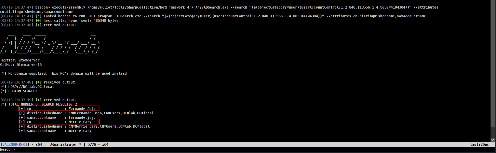
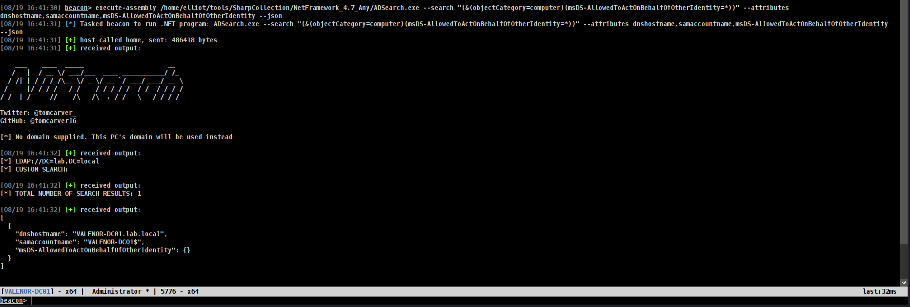
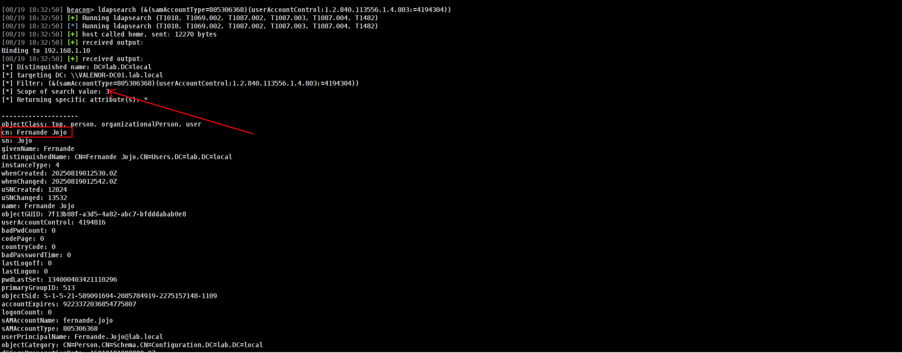

> Author : lineeralgebra
{:.prompt-tip}

The **Domain Controller (DC)** is the core of Active Directory, and at its heart lies **LDAP (Lightweight Directory Access Protocol)**. LDAP is the protocol that clients and services use to **query and modify directory objects**, such as users, groups, computers, and organizational units.

For Red Teamers, LDAP is crucial because it allows **enumeration of users, groups, and domain structure**. Misconfigured permissions or exposed LDAP services can reveal sensitive information without authentication.

So **LDAP** is most important part of Active Directory. If we wanna enumerate depths of Active Directory we need it.

In this section i will try to show everything with [ADSearch.exe](https://github.com/Flangvik/SharpCollection/blob/master/NetFramework_4.7_Any/ADSearch.exe) and powerpick. My first goal was combine Active Directory with Red Teaming so thats why tho.

> **Tip:** You can go **Tools bar** for important tools we used


First of all i wanna start with first access! remote tools i will put later.

# Basics of ADsearch

https://github.com/Flangvik/SharpCollection/blob/master/NetFramework_4.7_Any/ADSearch.exe

The great tool we can always use with basics stuff we can learn important things but for sure later **Bloodhound** will come out and it took huge weight to us.

## Enumerate Groups

Before enum whole domain or DC we can start with Groups. Cause most important things in LDAP is generally groups we may wanna know which ones exist. 

- Im using `execute-assembly` here because of do not put ADSearch in disk otherwise AV/EDR will eat it and be sure where did u put ur files so we can do it fast. mines is below

### 1.Enumerate Groups of all

```
execute-assembly /home/elliot/tools/SharpCollection/NetFramework_4.7_Any/ADSearch.exe --search "(&(objectCategory=group))"
```


Here is we can see all groups exist of DC but its too huge right? so we may wanna modify our command a bit.

### **2. Enumerate Groups with Specific Properties**

```
execute-assembly /home/elliot/tools/SharpCollection/NetFramework_4.7_Any/ADSearch.exe --search "(&(objectCategory=group))" --attributes cn,distinguishedName,member,description
```


or we can check only by name of name

### **3. Search for Groups by Name Pattern**

```
execute-assembly /home/elliot/tools/SharpCollection/NetFramework_4.7_Any/ADSearch.exe --search "(&(objectCategory=group)(cn=*Admin*))"
```


`*admin` is good choice tho.

### **4. Get All Properties for Groups**

```
execute-assembly /home/elliot/tools/SharpCollection/NetFramework_4.7_Any/ADSearch.exe --search "(&(objectCategory=group))" --attributes *
```


### **5. Enumerate Domain Admins Group Specifically**

if we wanan sure there is only 1 Administrator group we can check wih

```
execute-assembly /home/elliot/tools/SharpCollection/NetFramework_4.7_Any/ADSearch.exe --search "(&(objectCategory=group)(cn=Domain Admins))"
```


Okey in the end if we wanna summary

- Use `-search` for LDAP filter queries
- Use `-attributes` to specify which properties to return (comma-separated)
- Use  wildcard in search filters
- Enclose your LDAP filter in quotes

For example at bonus if we wanna get all groups with their members.

### Bonus : **Example to get all groups with their members:**

```
execute-assembly /home/elliot/tools/SharpCollection/NetFramework_4.7_Any/ADSearch.exe --search "(&(objectCategory=group))" --attributes cn,member --json
```


We used `--json` here because of ADsearch.exe is not support print it directly.

I think thats enough for basics of Groups!

| Group | Description | Attack Vectors / Risks |
|---|---|---|
| **Domain Admins** | The most powerful group in the domain. Members have administrative control over all domain controllers and, by inheritance, all domain-joined machines. | Full domain compromise: dump NTDS.dit, modify any AD object, control infrastructure. |
| **Enterprise Admins** | Exists only in the forest root domain. Members have administrative rights across all domains in the AD forest. | Forest-wide compromise: change forest settings and trust relationships, persist everywhere. |
| **Schema Admins** | Can modify the Active Directory schema (object classes & attributes). | Schema backdoors: change default security descriptors to add backdoor accounts — persistent across objects. |
| **Administrators** | Local Administrators group on domain controllers; typically contains Domain Admins and built-in Administrator. | Equivalent to Domain Admin on DCs — full local control of domain controllers. |
| **Server Operators** | Can administer domain controllers: log on locally, create/delete shares, start/stop services, backup/restore files. | Replace service binaries, install malicious services, access sensitive files via shares, abuse backup tools to read locked files. |
| **Backup Operators** | Allowed to log on to DCs and bypass file permissions to perform backups. | Tier-0 risk: use VSS or backup tools to extract NTDS.dit + SYSTEM for credential dumping. |
| **Account Operators** | Can create/modify many account types (users, groups) but cannot modify admin groups or log on to DCs by default. | Create accounts, modify attributes (e.g., `scriptPath`) to execute code, or seed accounts for later escalation. |
| **Print Operators** | Can log on to DCs locally and install printer drivers. | Abuse driver install flow to load malicious DLLs (driver replacement) → code execution as SYSTEM on DCs. |
| **DNS Admins** | Manage DNS server/service and DNS zones. | Configure DNS service to load a malicious DLL or change zone data for spoofing; may lead to SYSTEM code execution on DNS servers. |
| **Group Policy Creator Owners** | Can create new Group Policy Objects (GPOs). | If combined with rights to link GPOs, they can deploy malicious policies to users/computers (command execution via startup/logon scripts or scheduled tasks). |
| **Remote Desktop Users** | Granted "Allow log on through Remote Desktop Services". Not privileged by itself. | If granted on high-value hosts/DCs, enables direct RDP access for lateral movement and persistence. |
| **Remote Management Users** | Granted rights to use WinRM / PowerShell Remoting (PSRemoting). | Enables lateral movement and remote code execution via PowerShell; dangerous if applied to admin hosts or DCs. |
| **Hyper-V Administrators** | Full control over Hyper-V management and VMs on Hyper-V hosts. | Control of VMs can lead to host compromise (VM escape/credential exposure), snapshot/backup theft, and ability to tamper with VM disks for persistence or data exfiltration. |


## Enumerate Users

### 1. Enumerate All users

```
execute-assembly /home/elliot/tools/SharpCollection/NetFramework_4.7_Any/ADSearch.exe --search "(&(objectCategory=user)(objectClass=user))"
```


we can list whole users with it but again its too huge so we may wanna modify it also

### 2. Enumerate Kerberoastable users

```
execute-assembly /home/elliot/tools/SharpCollection/NetFramework_4.7_Any/ADSearch.exe --search "(&(objectCategory=user)(servicePrincipalName=*))" --attributes cn,servicePrincipalName,samAccountName
```


### 3. Enumerate Asreproastable users

```
execute-assembly /home/elliot/tools/SharpCollection/NetFramework_4.7_Any/ADSearch.exe --search "(&(objectCategory=user)(userAccountControl:1.2.840.113556.1.4.803:=4194304))" --attributes cn,distinguishedname,samaccountname
```



### 4. **Password Never Expires Accounts**

```
execute-assembly /home/elliot/tools/SharpCollection/NetFramework_4.7_Any/ADSearch.exe --search "(&(objectCategory=user)(objectClass=user)(userAccountControl:1.2.840.113556.1.4.803:=65536))" --attributes samaccountname,displayname,pwdlastset
```


### 5. **Sensitive Accounts (AdminCount=1)**

```
execute-assembly /home/elliot/tools/SharpCollection/NetFramework_4.7_Any/ADSearch.exe --search "(&(objectCategory=user)(objectClass=user)(admincount=1))" --attributes samaccountname,displayname,memberof
```


### 6. **Accounts with Descriptions (Often Contain Passwords) - ONE OF THE MOST IMPORTANT**

```
execute-assembly /home/elliot/tools/SharpCollection/NetFramework_4.7_Any/ADSearch.exe --search "(&(objectCategory=user)(objectClass=user)(description=*))" --attributes samaccountname,description
```


This is the one of the most important because its really common at **PENTESTS**

### 7. Constrained Delegation **- ONE OF THE MOST IMPORTANT**

```
execute-assembly /home/elliot/tools/SharpCollection/NetFramework_4.7_Any/ADSearch.exe --search "(&(objectCategory=user)(msds-allowedtodelegateto=*))" --attributes
```


Unconstrained Delegation

### 8. UnConstrained Delegation **- ONE OF THE MOST IMPORTANT**

```
execute-assembly /home/elliot/tools/SharpCollection/NetFramework_4.7_Any/ADSearch.exe --search "(&(objectCategory=user)(userAccountControl:1.2.840.113556.1.4.803:=524288))" --attributes samaccountname,dnshostname
```


Okey if we wanna summarize

1. **Use `-json` flag** for better output formatting of array attributes like `memberOf`
2. **Combine filters** to find the most valuable targets
3. **Always check enabled status** with `(!(userAccountControl:1.2.840.113556.1.4.803:=2))`
4. **Sort by last logon/password last set** to find active accounts
5. **Look for service accounts** with `svc_`, `srv_`, `service` prefixes in samaccountname

## Enumerate Computers

Computers also so important to enumerate cause some misconfiguration like **RBCD** is very common.!!!!!

### **1. Enumerate All Computer Accounts (Basic)**

```
execute-assembly /home/elliot/tools/SharpCollection/NetFramework_4.7_Any/ADSearch.exe --search "(&(objectCategory=computer)(objectClass=computer))"
```


we have 4 computers!!!

### **2. Find Unconstrained Delegation Computers**

```
execute-assembly /home/elliot/tools/SharpCollection/NetFramework_4.7_Any/ADSearch.exe --search "(&(objectCategory=computer)(objectClass=computer)(userAccountControl:1.2.840.113556.1.4.803:=524288))" --attributes samaccountname,dnshostname
```


we can see `APP-01$` cann unconstrained delegation.

### **3. Find Constrained Delegation Computers**

```
execute-assembly /home/elliot/tools/SharpCollection/NetFramework_4.7_Any/ADSearch.exe -search "(&(objectCategory=computer)(objectClass=computer)(msDS-AllowedToDelegateTo=*))" --attributes samaccountname,dnshostname,msds-allowedtodelegateto --json
```

if its not work we can use 

```
powerpick  Get-ADComputer CLIENT-01 -Properties userAccountControl, msDS-AllowedToDelegateTo | Select-Object Name, userAccountControl, msDS-AllowedToDelegateTo
```


### **4. Find Resource-Based Constrained Delegation(RBCD) Computers - So important**

```
execute-assembly /home/elliot/tools/SharpCollection/NetFramework_4.7_Any/ADSearch.exe --search "(&(objectCategory=computer)(msDS-AllowedToActOnBehalfOfOtherIdentity=*))" --attributes dnshostname,samaccountname,msDS-AllowedToActOnBehalfOfOtherIdentity --json
```



Okey its fairly enough tbh cause i will summarize something

1. **Focus on high-value targets**: Domain Controllers, servers with unconstrained delegation,constrained delegation and RBCD
2. **Check enabled status**: Use `(!(userAccountControl:1.2.840.113556.1.4.803:=2))` to filter out disabled computers.
3. **Look for patterns**: Servers often have naming conventions like `SRV-`, `APP-`, `SQL-`, `WEB-`.
4. **Prioritize**: Domain Controllers → Servers with delegation → Workstations with LAPS  etc → Other workstations

---

---

## Bofs

Okey so we learnt great things so far but there is also some BOFs (Beacon Object Files) at Cobalt Strike and other C2’s. there is a small **bof** we can use with also Linux Tool **LDAPSearc** bof!!!

https://github.com/fortalice/bofhound

For example for ASResproastable users

```
ldapsearch (&(samAccountType=805306368)(userAccountControl:1.2.840.113556.1.4.803:=4194304))
```



i wanna keep it easy cause for other commands we can done with `--help`

# Remote Tools

## ldapsearch

As we saw at **BOFs** section we can use `ldapsaerch`  on kali also.

### ldapsearch without creds

First of all lets start with if we dont have password or creds yet.

```
ldapsearch -x -H ldap://192.168.1.10 -b "dc=lab,dc=local" > ldapsearch.txt
```

here is the command but i will try to explain well.


First of all lets start with why we give DC=lab,DC=local it came from **domain name**

### ldapsearch with creds

Second → We dont have **Guest** access on ldap so our results gave us nothing!!! Lets find someone who has access on **ldap**

```
Attention : If u have Guest access on LDAP just try with that command.

```

Now lets do with creds!!!!!

```
ldapsearch -H ldap://VALENOR-DC01.lab.local -D 'nicole.aurea@lab.local' -w 'D4T!w/+aCxH-' -b 'DC=lab,DC=local' > ldapsearch.txt
```


We found creds which match with **LDAP** and we done!!! there is too much info we got its impossible the analyze one of one.

```
➜  LDAP cat ldapsearch.txt | wc -l
9032
➜  LDAP cat ldapsearch.txt | wc -c
284673
```

U feel me? Lets do some modify with `bash` and grab only important data.

```
cat ldapsearch.txt | grep -i "Password"  
```


we can also check

```
cat ldapsearch.txt | grep -i "description"
```


so we can use words like **history, info, default,202X** etc etc.

### Username list create with ldapsearch

I wanna end with Bonus we can craete username list with ldapsearch results just need really basic bash command.

```
cat ldapsearch.txt | grep -i "sAMAccountName" | awk '{print $2}'
```

Here is the explain.

